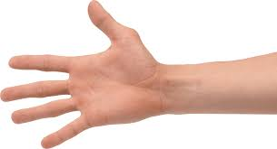
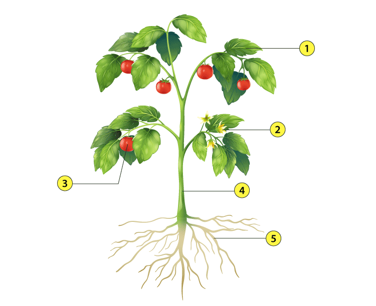
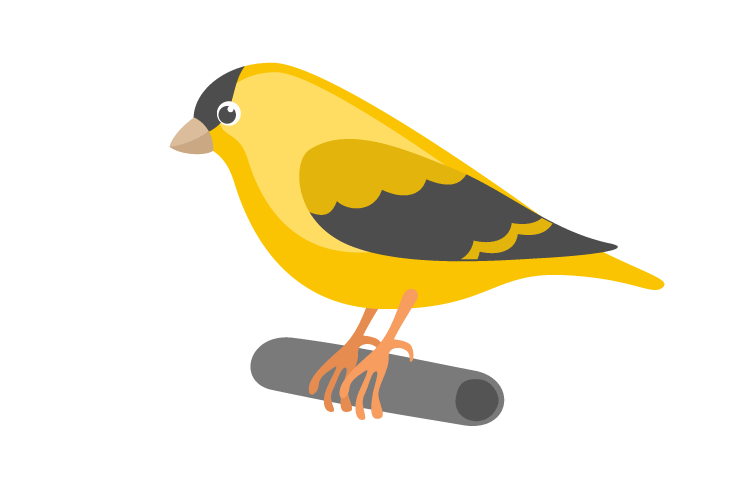
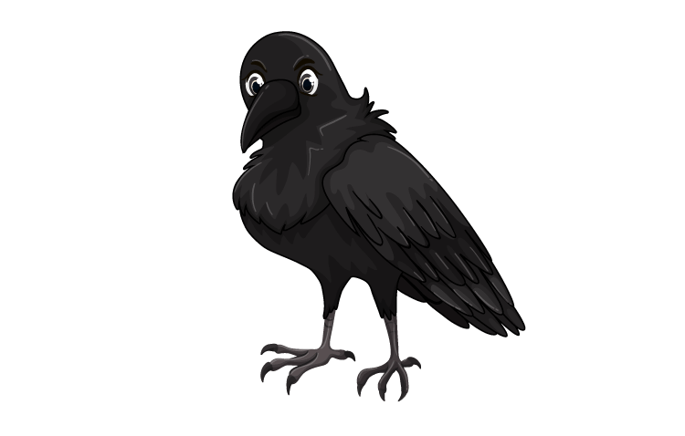
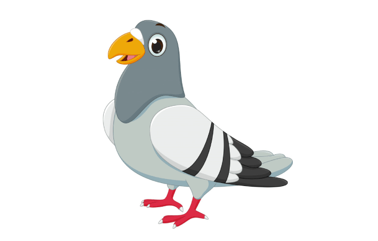
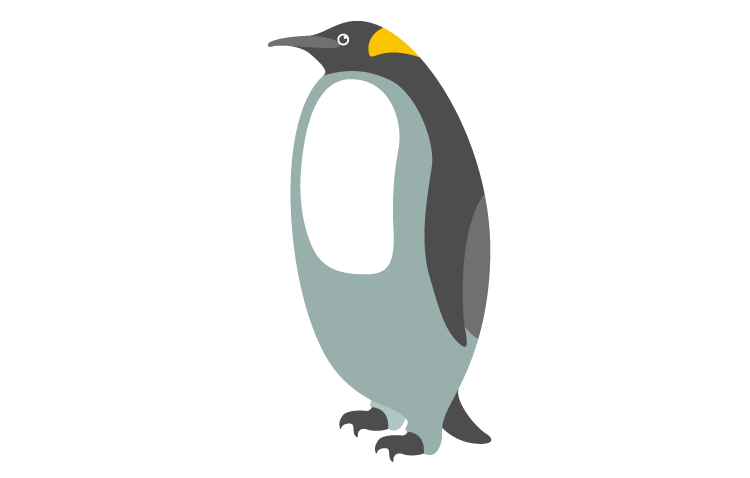
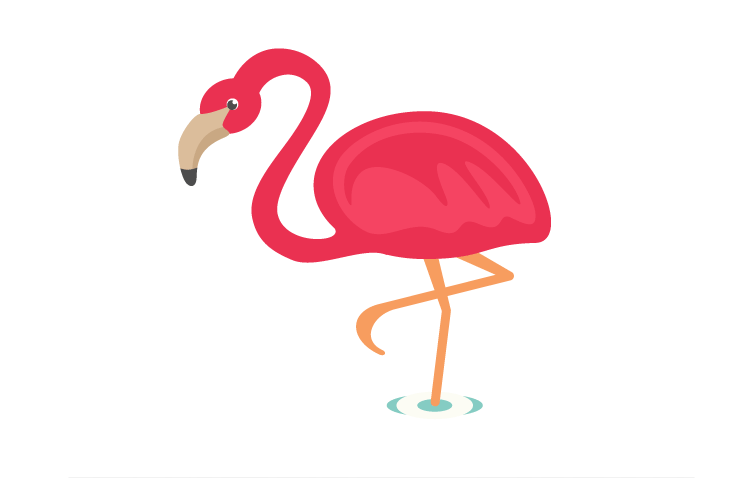
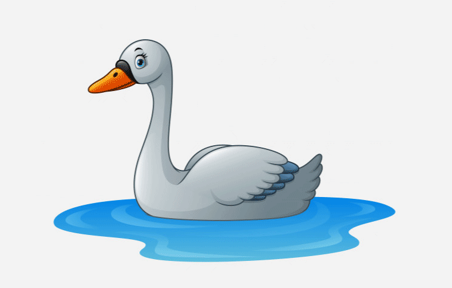

# 1. About Myself

1. My name is ......
2. I am a Boy/Girl.
3. I am ....... years old.
4. My father's name is ......
5. My mother's name is ......
6. I live in ...... city
7. My birthday is on ......
8. I have ...... brothers and ...... sisters.
9. My father works in ......
10. My school name is ......
11. My favourite colour is ......
12. My favourite food is ......
13. I love to play ...... game.
14. I study in ...... Class.
15. My class teacher's name is ......
16. My best friend's name is ......
17. My favourite fruit is ......
18. I get up at ...... in the morning.
19. My favourite subject is ......

# 2. Human Body Parts

1. Ears are used to ......?
   1. See
   2. Talk
   3. Hear
   4. Taste
2. A human body has ...... hands?
   1. 1
   2. 2
   3. 3
   4. 4
3. This is the image of ......? 
   1. Nose
   2. Eyes
   3. Legs
   4. Hands
4. We chew food through our ......?
   1. Teeth
   2. Eyes
   3. Foot
   4. Head
5. Our both hands have ......fingers?
   1. 4
   2. 6
   3. 10
   4. 8
6. We smell food with .......?
   1. Ear
   2. Nose
   3. Eyes
   4. Tongue
7. A human body has ...... legs?
   1. 4
   2. 2
   3. 1
   4. 3
8. We use our neck to move ......?
   1. Hand
   2. Foot
   3. Head
   4. Finger
9. We taste our food with ......?
   1. Tongue
   2. Head
   3. Nose
   4. Eye
10. A human body has ...... Eyebrows?
    1. 1
    2. 2
    3. 3
    4. 4
11. We walk with our ......?
    1. Hand
    2. Foot
    3. Ear
    4. Head
12. The colour of our hair is ......?
    1. Red
    2. Green
    3. Black
    4. Blue
13. Identify the image. 
    1. Nose
    2. Face
    3. Toes
    4. Hand
14. We have ...... nose?
    1. 1
    2. 2
    3. 4
    4. 3
15. We see objects with our ......?
    1. Hands
    2. Legs
    3. Nose
    4. Eyes

# 3. Plants

Q1) I am 1, who am I?
a) Root

b) Stem

c) Leaf

d) Fruit

Q2) I am 2, find me?

a) Flower

b) Stem

c) Leaf

d) Fruit

Q3) I am 3, tell my name?

a) Root

b) Flower

c) Leaf

d) Fruit

Q4) I am 4, guess my name?

a) Root

b) Stem

c) Leaf

d) Fruit

Q5) I am 5, what's my name?

a) Root

b) Stem

c) Leaf

d) Flower

Which part of plant am I?

Q6) I am below the ground and brown.

a) Leaf

b) Flower

c) Fruit

d) Root

Q7) I am green in colour.

a) Flower

b) Stem

c) Leaf

d) Root

Q8) I am colourful and beautiful.

a) Flower

b) Root

c) Seed

d) Stem

Q9) I protect seeds within me.

a) Stem

b) Root

c) Fruit

d) Leaf

Q10) I soak up water and nutrients from the soil.

a) Fruit

b) Stem

c) Flower

d) Root

# 4. Birds

Q1) I am 

a) Parrot

b) Sparrow

c) Swan

d) Owl

Q2) I am 

a) Pigeon

b) Ostrich

c) Robin

d) Crow

Q3) I am 

a) Pigeon

b) Duck

c) Sparrow

d) Peacock

Q4) I am 

a) Parrot

b) Owl

c) Penguin

d) Ostrich

Q5) I am 

a) Parrot

b) Cuckoo

c) Flamingo

d) Sparrow

Q6) I am 

a) Owl

b) Crow

c) Pigeon

d) Swan

Which bird am I?

Q7) I can fly in the sky. I can whistle and talk. I eat green chilly. I am covered in colourful feathers and have a tail.

a) Owl

b) Parrot

c) Penguin

d) Crow

Q8) I am black in colour and can fly. I have a melodious voice and sing during the spring season.

a) Parrot

b) Cuckoo

c) Owl

d) Peacock

Q9) I am the national bird of India. I dance during the rainy season. I have beautiful feathers.

a) Peacock

b) Crow

c) Pigeon

d) Sparrow

Q10) I don't sleep at night. I have a far sight and can turn my head almost all the way around.

a) Owl

b) Pigeon

c) Cuckoo

d) Crow

# 5. Animals
Q1) I eat grass and I provide milk to human beings. I have 4 legs.

a) Dog

b) Cow

c) Money

d) Cat

Q2) I am a soft and furry pet. I have sharp teeth and claws. I like to eat mice.

a) Ox

b) Bear

c) Cat

d) Elephant

Q3) I can smell things and have 4 legs. I can wag my tail and like to play.

a) Tiger

b) Goat

c) Elephant

d) Dog

Q4) I am very big and heavy. I have 4 legs and 2 big ears. My long nose is known as a trunk.

a) Zebra

b) Tiger

c) Elephant

d) Monkey

Q5) I have 2 legs, 2 wings and a tail. I eat worms and insects. I lay eggs.

a) Beer

b) Hen

c) Cow

d) Lion

Q6) I am very big and furry. I live in the woods. I have a big nose, 4 legs and a tail.

a) Bear

b) Tiger

c) Dog

d) Spider

Q7) I am the tallest animal but not the heaviest. I have a long neck to pluck leaves from long tress.

a) Ox

b) Goat

c) Cockroach

d) Giraffe

Q8) I am the king of the forest and stay in a den. When I roar, everyone gets scared.

a) Donkey

b) Bear

c) Lion

d) Snake

Q9) I am the national animal of India. I have stripes on my body.

a) Fox

b) Tiger

c) Deer

d) Money

Q10) I have 2 horns and my body is covered with a thick coat. My hairs are used for making wool.

a) Cat

b) Sheep

c) Deer

d) Lion

