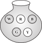

# 1. परिमेय संख्याएँ

## प्रयास कीजिए

निम्नलिखित सारणी में रिक्त स्थानों की पूर्ति कीजिए:

# 2. एक चर वाले रैखिक समीकरण

## प्रयास कीजिए

2x – 3 = 7. इस समीकरण का हल है–

x = 5 क्योंकि x = 5 होने पर बाएँ पक्ष का मान होगा 2 × 5 – 3 = 7 जो दाएँ पक्ष का मान है लेकिनx = 10 इसका हल नहीं है, क्योंकि x = 10 होने पर बाएँ पक्ष का मान होगा, 2 × 10 –3 = 17 जो दाएँ पक्ष के बराबर नहीं है।

## प्रश्‍नावली 2.1

निम्न समीकरणों को हल कीजिए:

## प्रश्‍नावली 2.2

1. अगर आपको किसी संख्या से घटाने और परिणाम को से गुणा करने पर प्राप्त होता है तो वह संख्या क्या है?
2. एक आयताकार तरण-ताल (swimming pool) की लंबाई उसकी चौड़ाई के दुगुने से 2 मीटर अधिक है। यदि इसका परिमाप 154 मीटर है तो इसकी लंबाई व चौड़ाई ज्ञात कीजिए।
3. एक समद्विबाहु त्रिभुज का आधार cm तथा उसका परिमाप cm है। उसकी दो बराबर भुजाओं की माप ज्ञात कीजिए।
4. दो संख्याओं का योग 95 है। यदि एक संख्या दूसरी से 15 अधिक है तो दोनों संख्याएँ ज्ञात कीजिए।
5. दो संख्याओं में अनुपात 5 : 3 है। यदि उनमें अंतर 18 है तो संख्याएँ ज्ञात कीजिए।
6. तीन लगातार पूर्णांकों का योग 51 है। पूर्णांक ज्ञात कीजिए।
7. 8 के तीन लगातार गुणजों का योग 888 है। गुणजों को ज्ञात कीजिए।
8. तीन लगातार पूर्णांक बढ़ते क्रम में लेकर उन्हें क्रमशः 2, 3 तथा 4 से गुणा कर योग करने पर योगफल 74 प्राप्त होता है। तीनों पूर्णांक ज्ञात कीजिए।
9. राहुल और हारुन की वर्तमान आयु में अनुपात 5 : 7 है। 4 वर्ष बाद उनकी आयु का योग 56 वर्ष हो जाएगा। उनकी वर्तमान आयु क्या है?
10. किसी कक्षा में बालक और बालिकाओं की संख्याओं में अनुपात 7 : 5 है। यदि बालकों की संख्या बालिकाओं की संख्या से 8 अधिक है तो कक्षा में कुल कितने विद्यार्थी हैं?
11. बाइचुंग के पिताजी उसके दादाजी से 26 वर्ष छोटे हैं और उससे 29 वर्ष बड़े हैं। यदि उन तीनों की आयु का योग 135 वर्ष है तो उनकी आयु अलग-अलग ज्ञात कीजिए।
12. 15 वर्ष बाद रवि की आयु, उसकी वर्तमान आयु से चार गुनी हो जाएगी। रवि की वर्तमान आयु क्या है?
13. एक परिमेय संख्या को से गुणा कर जोड़ने पर प्राप्त होता है। वह संख्या क्या है?
14. लक्ष्मी एक बैंक में खजांची है। उसके पास नगदी के रूप में ₹ 100, ₹ 50 व ₹ 10 वाले नोट हैं। उनकी संख्याओं में क्रमशः 2 : 3 : 5 का अनुपात है और उनका कुल मूल्य ₹ 4,00,000 है। उसके पास प्रत्येक प्रकार के कितने-कितने नोट हैं?
15. मेरे पास ₹ 300 मूल्य के, ₹ 1, ₹ 2 और ₹ 5 वाले सिक्के हैं। ₹ 2 वाले सिक्कों की संख्या ₹ 5 वाले सिक्कों की संख्या की तिगुनी है और सिक्कों की कुल संख्या 160 है। मेरे पास प्रत्येक प्रकार के कितने-कितने सिक्के हैं?
16. एक निबंध प्रतियोगिता में आयोजकों ने तय किया कि प्रत्येक विजेता को ₹ 100 और विजेता को छोड़कर प्रत्येक प्रतिभागी को ₹ 25 पुरस्कार के रूप में दिए जाएँगे। यदि पुरस्कारों में बाँटी गई राशि ₹ 3,000 थी तो कुल 63 प्रतिभागियों में विजेताओं की संख्या ज्ञात कीजिए।

## प्रश्‍नावली 2.3

निम्न समीकरणों को हल कीजिए और अपने उत्तर की जाँच कीजिए।

## प्रश्‍नावली 2.4

1. अमीना एक संख्या सोचती है। वह इसमें से घटाकर परिणाम को 8 से गुणा करती है। अब जो परिणाम मिलता है वह सोची गई संख्या की तिगुनी है। वह सोची गई संख्या ज्ञात कीजिए।
2. दो संख्याओं में पहली संख्या दूसरी की पाँच गुनी है। प्रत्येक संख्या में 21 जोड़ने पर पहली संख्या दूसरी की दुगुनी हो जाती है। संख्याएँ ज्ञात कीजिए।
3. दो अंकों वाली दी गई एक संख्या के अंकों का योग 9 है। इस संख्या के अंकों के स्थान बदलकर प्राप्त संख्या, दी गई संख्या से 27 अधिक है। दी गई संख्या ज्ञात कीजिए।
4. दो अंकों वाली दी गई एक संख्या में एक अंक दूसरे का तीन गुना है। इसके अंकों के स्थान बदलकर प्राप्त संख्या को, दी गई संख्या में जोड़ने पर 88 प्राप्त होता है। दी गई संख्या ज्ञात कीजिए।
5. शोबो की माँ की आयु, शोबो की आयु की छः गुनी है। 5 वर्ष बाद शोबो की आयु, उसकी माँ की वर्तमान आयु की एक तिहाई हो जाएगी। उनकी आयु ज्ञात कीजिए।
6. महूली गाँव में, एक तंग आयताकार भूखंड विद्यालय बनाने के लिए सुरक्षित है। इस भूखंड की लंबाई और चौड़ाई में 11 : 4 का अनुपात है। गाँव पंचायत को इस भूखंड की बाड़ (fence) कराने में, ₹ 100 प्रति मीटर की दर से ₹ 75000 व्यय करने होंगे। भूखंड की माप (dimension) ज्ञात कीजिए।
7. हसन, स्कूल वर्दी बनाने के लिए दो प्रकार का कपड़ा खरीदता है। इसमें कमीज़ के कपड़े का भाव ₹ 50 प्रति मीटर तथा पतलून के कपड़े का भाव ₹ 90 प्रति मीटर है। वह कमीज़ के प्रत्येक 3 मीटर कपड़े के लिए पतलून का 2 मीटर कपड़ा खरीदता है। वह इस कपड़े को क्रमशः 12% तथा 10% लाभ पर बेचकर ₹ 36,600 प्राप्त करता है। उसने पतलूनों के लिए कितना कपड़ा खरीदा?
8. हिरणों के एक झुंड का आधा भाग मैदान में चर रहा है और शेष का तीन चौथाई पड़ोस में ही खेलकूद रहा है। शेष बचे 9 हिरण एक तालाब में पानी पी रहे हैं। झुंड में हिरणों की संख्या ज्ञात कीजिए।
9. दादाजी की आयु अपनी पौत्री की आयु की दस गुनी है। यदि उनकी आयु पौत्री की आयु से 54 वर्ष अधिक है तो उन दोनों की आयु ज्ञात कीजिए।
10. अमन की आयु उसके पुत्र की आयु की तीन गुनी है। 10 वर्ष पहले उसकी आयु पुत्र की आयु की पाँच गुनी थी। दोनों की वर्तमान आयु ज्ञात कीजिए।

## प्रश्‍नावली 2.5

निम्न रैखिक समीकरणों को हल कीजिए:

निम्न समीकरणों को सरल रूप में बदलते हुए हल कीजिए:

## प्रश्‍नावली 2.6

निम्न समीकरणों को हल कीजिए:

6. हरी और हैरी की वर्तमान आयु का अनुपात 5 : 7 है। अब से 4 वर्ष बाद उनकी आयु का अनुपात 3 : 4 हो जाएगा। उनकी वर्तमान आयु ज्ञात कीजिए।
7. एक परिमेय संख्या का हर उसके अंश से 8 अधिक है। यदि अंश में 17 जोड़ दिया जाए तथा हर में से 1 घटा दिया जाए तब हमें प्राप्त होता है। वह परिमेय संख्या ज्ञात कीजिए।

# 3. चतुर्भुजों को समझना

## प्रश्‍नावली 3.1

1. यहाँ पर कुछ आकृतियाँ दी गई हैं:
   (a) 
   (b) 
   (c) 
   (d) 
   (e) 
   (f) 
   (g) 
   (h) 
   प्रत्येक का वर्गीकरण निम्नलिखित आधार पर कीजिए:
   (a) साधारण वक्र
   (b) साधारण बंद वक्र
   (c) बहुभुज
   (d) उत्तल बहुभुज
   (e) अवतल बहुभुज
2. निम्नलिखित प्रत्येक में कितने विकर्ण हैं?
   (a) एक उत्तल चतुर्भुज
   (b) एक समषड्भुज
   (c) एक त्रिभुज
3. उत्तल चतुर्भुज के कोणों के मापों का योगफल क्या है? यदि चतुर्भुज, उत्तल न हो तो क्या यह गुण लागू होगा? (एक चतुर्भुज बनाइए जो उत्तल न हो और प्रयास कीजिए।)
4. तालिका की जाँच कीजिए: (प्रत्येक आकृति को त्रिभुजों में बाँटिए और कोणों का योगफल ज्ञात कीजिए)

   | आकृति                                            | भुजा | कोणों का योगफल            |
   | ------------------------------------------------ | ---- | ------------------------- |
   |  | 3    | 180º                      |
   |  | 4    | 2 × 180° = (4 – 2) × 180° |
   |  | 5    | 3 × 180° = (5 – 2) × 180° |
   |  | 6    | 4 × 180° = (6 – 2) × 180° |

   एक बहुभुज के कोणों के योग के बारे में आप क्या कह सकते हैं जिसकी भुजाओं की संख्या निम्नलिखित हो?
   (a) 7
   (b) 8
   (c) 10
   (d) n

5. सम बहुभुज क्या है?
   एक सम बहुभुज का नाम बताइए जिसमें
   (a) 3 भुजाएँ
   (b) 4 भुजाएँ
   (c) 6 भुजाएँ हों।
6. निम्नलिखित आकृतियों में x (कोण की माप) ज्ञात कीजिए:
   (a) 
   (b) 
   (c) 
   (d) 
7. (a)    x + y + z ज्ञात कीजिए।
   (b)    x + y + z + w ज्ञात कीजिए।

## प्रयास कीजिए

एक सम षड्भुज लीजिए।

(a) बाह्य कोणों x, y, z, p, q तथा r के मापों का योग क्या है?
(b) क्या x = y = z = p = q = r है? क्यों?
(c) प्रत्येक का माप क्या है?
(i) बाह्य कोण
(ii) अंत: कोण
(d) इस क्रियाकलाप को निम्नलिखित के लिए दोहराएँ
(i) एक सम अष्टभुज (ii) एक सम 20 भुज

## प्रश्‍नावली 3.2

1. निम्नलिखित आकृतियों में x का मान ज्ञात कीजिए:
   (a) 
   (b) 
2. एक सम बहुभुज के प्रत्येक बाह्य कोण का माप ज्ञात कीजिए जिसकी
   (a) 9 भुजाएँ
   (b) 15 भुजाएँ हों।
3. एक सम बहुभुज की कितनी भुजाएँ हाेंगी यदि एक बाह्य कोण का माप 24° हो?
4. एक सम बहुभुज की भुजाओं की संख्या ज्ञात कीजिए यदि इसका प्रत्येक अंत:कोण 165° का हो?
5. (a) क्या ऐसा सम बहुभुज संभव है जिसके प्रत्येक बाह्य कोण का माप 22° हो?
   (b) क्या यह किसी सम बहुभुज का अंत:कोण हो सकता है? क्यों?
6. (a) किसी सम बहुभुज में कम से कम कितने अंश का अंत:कोण संभव है? क्यों?
   (b) किसी सम बहुभुज में अधिक से अधिक कितने अंश का बाह्य कोण संभव है?

## प्रयास कीजिए

30° – 60° – 90° कोणों वाले दो समान सेट-स्क्वेयर लेकर पहले की तरह ही एक समांतर चतुर्भुज बनाइए। क्या प्राप्त आकृति ऊपर बताए गए गुण की पुष्टि करने में आपकी सहायता करती है?

## प्रश्‍नावली 3.3

1. ABCD एक समांतर चतुर्भुज है। प्रत्येक कथन को परिभाषा या प्रयोग किए गए गुण द्वारा पूरा कीजिए: 
   (a) AD = ......
   (b) ∠ DCB = ......
   (c) OC = ......
   (d) m∠DAB + m∠CDA = ......
2. निम्न समांतर चतुर्भुजों में अज्ञात x, y, z के मानों को ज्ञात कीजिए:
   (a) 
   (b) 
   (c) 
   (d) 
   (e) 
3. क्या एक चतुर्भुज ABCD समांतर चतुर्भुज हो सकता है यदि
   (a) ∠D + ∠B = 180°?
   (b) AB = DC = 8 cm, AD = 4 cm और BC = 4.4 cm?
   (c) ∠A = 70° और ∠C = 65°?
4. एक चतुर्भुज की कच्ची (Rough) आकृति खींचिए जो समांतर चतुर्भुज न हो परंतु जिसके दो सम्मुख कोणों के माप बराबर हों।
5. किसी समांतर चतुर्भुज के दो आसन्न कोणों का अनुपात 3: 2 है। समांतर चतुर्भुज के सभी कोणों की माप ज्ञात कीजिए।
6. किसी समांतर चतुर्भुज के दो आसन्न कोणों के माप बराबर हैं। समांतर चतुर्भुज के सभी कोणों की माप ज्ञात कीजिए।
7. संलग्न आकृति HOPE एक समांतर चतुर्भुज है। x, y और z कोणों की माप ज्ञात कीजिए। ज्ञात करने में प्रयोग किए गए गुणों को बताइए।
   
8. निम्न आकृतियाँ GUNS और RUNS समांतर चतुर्भुज हैं। x तथा y ज्ञात कीजिए (लंबाई cm में है):
   (a) 
   (b) 
9. दी गई आकृति में RISK तथा CLUE दोनों समांतर चतुर्भुज हैं, x का मान ज्ञात कीजिए।
   
10. बताइए कैसे यह आकृति एक समलंब है। इसकी कौन सी दो भुजाएँ समांतर हैं? (आकृति 3.32)
    
11. आकृति 3.33 में m∠C ज्ञात कीजिए यदि है।
    
12. आकृति 3.34 में ∠P तथा ∠S की माप ज्ञात कीजिए यदि है। (यदि आप m∠R, ज्ञात करते हैं, तो क्या m∠P को ज्ञात करने की एक से अधिक विधि है?)
    

## प्रश्‍नावली 3.4

1. बताइए, कथन सत्य है या असत्य :
   (a) सभी आयत वर्ग होते हैं
   (e) सभी पतंगें सम चतुर्भुज होती हैं
   (b) सभी सम चतुर्भुज समांतर चतुर्भुज होते हैं
   (f) सभी सम चतुर्भुज पतंग होते हैं
   (c) सभी वर्ग सम चतुर्भुज और आयत भी होते हैं
   (g) सभी समांतर चतुर्भुज समलंब होते हैं
   (d) सभी वर्ग समांतर चतुर्भुज नहीं होते।
   (h) सभी वर्ग समलंब होते हैं।
2. उन सभी चतुर्भुजों की पहचान कीजिए जिनमें
   (a) चारों भुजाएँ बराबर लंबाई की हों
   (b) चार समकोण हों
3. बताइए कैसे एक वर्ग
   (a) एक चतुर्भुज
   (b) एक समांतर चतुर्भुज
   (c) एक समचतुर्भुज
   (d) एक आयत है।
4. एक चतुर्भुज का नाम बताइए जिसके विकर्ण
   (a) एक दूसरे को समद्विभाजित करते हैं
   (b) एक दूसरे पर लंब समद्विभाजक हो
   (c) बराबर हों।
5. बताइए एक आयत उत्तल चतुर्भुज कैसे है।
6. ABC एक समकोण त्रिभुज है और 'O' समकोण की सम्मुख भुजा का मध्य-बिंदु है। बताइए कैसे 'O' बिंदु A, B तथा C से समान दूरी पर स्थित है। (बिंदुओं से चिह्नित अतिरिक्त भुजाएँ आपकी सहायता के लिए खींची गई हैं) 

## हमने क्या चर्चा की?

### चतुर्भुज

1. समांतर चतुर्भुज : एक चतुर्भुज जिसमें सम्मुख भुजाओं का प्रत्येक युग्म समांतर होता है।
   गुण :
   (a) सम्मुख भुजाएँ बराबर होती हैं।
   (b) सम्मुख कोण बराबर होते हैैं।
   (c) विकर्ण एक दूसरे को समद्विभाजित करते हैैं।
2. समचतुर्भुज :
   गुण :
   एक चतुर्भुज जिसकी सभी भुजाएँ बराबर माप की होती हैं।
   (a) समांतर चतुर्भुज के सभी गुण होते हैं।
   (b) विकर्ण परस्पर लंब होते हैैं।
3. आयत :एक समांतर चतुर्भुज जिसमें एक कोण समकोण होता है।
   गुण :
   (a) समांतर चतुर्भुज के सभी गुण होते हैैं।
   (b) प्रत्येक कोण समकोण होता हैं।
   (c) विकर्ण बराबर माप के होते हैैं।
4. वर्ग :एक आयत जिसकी सभी भुजाएँ बराबर होती हैं।
   गुण :
   समांतर चतुर्भुज, समचतुर्भुज तथा आयत सभी के गुण होते हैं।
5. पतंग :
   गुण :
   एक चतुर्भुज जिसमें दो आसन्न भुजाओं के युग्म बराबर होते
   (a) विकर्ण एक दूसरे पर लंब होते हैं।
   (b) एक विकर्ण दूसरे विकर्ण को समद्विभाजित करता है।
   (c) आकृति में, m∠B = m∠D परंतु

# 4. प्रायोगिक ज्यामिति

## प्रश्‍नावली 4.1

1. निम्नलिखित चतुर्भुजों की रचना कीजिए:
   (a) चतुर्भुज ABCD जिसमें AB = 4.5 cm, BC = 5.5 cm, CD = 4 cm, AD = 6 cm और AC = 7 cm है।
   (b) चतुर्भुज JUMP जिसमें JU = 3.5 cm, UM = 4 cm, MP = 5 cm, PJ = 4.5 cm और PU = 6.5 cm है।
   (c) समांतर चतुर्भुज MORE जिसमें OR = 6 cm, EO = 7.5 cm और MO = 7.5 cm है।
   (d) सम चतुर्भुज BEST जिसमें BE = 4.5 cm और ET = 6 cm है।

## प्रश्‍नावली 4.2

1. निम्नलिखित चतुर्भुजों की रचना कीजिए:
   (a) चतुर्भुज LIFT जिसमें LI = 4 cm, IF = 3 cm, TL = 2.5 cm, LF = 4.5 cm और IT = 4 cm है।
   (b) चतुर्भुज GOLD जिसमें OL = 7.5 cm, GL = 6 cm, GD = 6 cm, LD = 5 cm और OD = 10 cm है।
   (c) समचतुर्भुज BEND जिसमें BN = 5.6 cm और DE = 6.5 cm है।

## प्रश्‍नावली 4.3

1. निम्नलिखित चतुर्भुजों की रचना कीजिए:
   (a) चतुर्भुज MORE जिसमें MO = 6 cm, OR = 4.5 cm, ∠M = 60°, ∠O = 105° और ∠R = 105° है।
   (b) चतुर्भुज PLAN जिसमें PL = 4 cm, LA = 6.5 cm, ∠P = 90°, ∠A = 110° और ∠N = 85° है।
   (c) समांतर चतुर्भुज HEAR जिसमें HE = 5 cm, EA = 6 cm और ∠R = 85° है।
   (d) आयत OKAY जिसमें OK = 7 cm और KA = 5 cm है।

## प्रश्‍नावली 4.4

1. निम्नलिखित चतुर्भुजों की रचना कीजिए:
   (a) चतुर्भुज DEAR जिसमें DE = 4 cm, EA = 5 cm, AR = 4.5 cm, ∠E = 60° और ∠A = 90° है।
   (b) चतुर्भुज TRUE जिसमें TR = 3.5 cm, RU = 3 cm, UE = 4 cm, ∠R = 75° और ∠U = 120° है।

## प्रश्‍नावली 4.5

निम्नलिखित की रचना कीजिए:

1. एक वर्ग READ जिसमें RE = 5.1 cm है।
2. एक सम चतुर्भुज जिनके विकर्णों की लंबाई 5.2 cm और 6.4 cm हैै।
3. एक आयत जिसकी आसन्न भुजाओं की लंबाइयाँ 5 cm और 4 cm है।
4. एक समांतर चतुर्भुज OKAY जहाँ OK = 5.5 cm और KA = 4.2 cm है। क्या यह अद्वितीय है?

## हमने क्या चर्चा की?

1. पाँच मापों से एक अद्वितीय चतुर्भुज प्राप्त हो सकता है।
2. एक अद्वितीय चतुर्भुज की रचना की जा सकती है यदि उसकी चार भुजाओं की लंबाइयाँ और एक विकर्ण दिया हुआ हो।
3. एक अद्वितीय चतुर्भुज की रचना की जा सकती है यदि उसके दो विकर्ण और तीन भुजाएँ दी हों।
4. एक अद्वितीय चतुर्भुज की रचना की जा सकती है यदि उसकी दो आसन्न भुजाएँ और तीन कोणों की माप ज्ञात हो।
5. एक अद्वितीय चतुर्भुज की रचना की जा सकती है यदि उसकी तीन भुजाएँ और दो बीच के कोण दिए हुए हों।

# 5. आँकड़ों का प्रबंधन

## प्रयास कीजिए

दी हुई सूचना को निरूपित करने के लिए एक उपयुक्त आलेख खींचिए।

1.  | महिना   | बेची गई घड़ियों की संख्या |
    | ------- | ------------------------ |
    | जुलाई   | 1000                     |
    | अगस्त   | 1500                     |
    | सितंबर  | 1500                     |
    | अक्टुबर | 2000                     |
    | नवंबर   | 2500                     |
    | दिसंबर  | 1500                     |
2.  | बच्चों की संख्या जिन्हें पसंद है | स्कूल A | स्कूल B | स्कूल C |
    | -------------------------------- | ------- | ------- | ------- |
    | पैदल चलना                        | 40      | 55      | 15      |
    | साइकिल चलाना                     | 45      | 25      | 35      |
3.  8 सर्वश्रेष्ठ क्रिकेट टीमों द्वारा ODI में जीतने का प्रतिशत

    | टीम            | चैंपियन ट्राफी से वर्ल्ड कप 2006 तक | 2007 में पिछले 10 ODI |
    | -------------- | ----------------------------------- | --------------------- |
    | दक्षिण अफ्रीका | 75%                                 | 78%                   |
    | ऑस्ट्रेलिया    | 61%                                 | 40%                   |
    | श्रीलंका       | 54%                                 | 38%                   |
    | न्यूज़ीलैंड     | 47%                                 | 50%                   |
    | इंग्लैंड       | 46%                                 | 50%                   |
    | पाकिस्तान      | 45%                                 | 44%                   |
    | वेस्टइंडीज़     | 44%                                 | 30%                   |
    | भारत           | 43%                                 | 56%                   |

## प्रयास कीजिए

विद्यार्थियों के एक समूह से यह बताने को कहा गया कि वे किस पशु को सबसे अधिक घर में पालना पसंद करेंगे। इसके परिणाम नीचे दिए गए हैं:

कुत्ता, बिल्ली, बिल्ली, मछली, बिल्ली, खरगोश, कुत्ता, बिल्ली, खरगोश, कुत्ता, बिल्ली, कुत्ता, कुत्ता, कुत्ता, बिल्ली, गाय, मछली, खरगोश, कुत्ता, बिल्ली, कुत्ता, बिल्ली, बिल्ली, कुत्ता, खरगोश, बिल्ली, मछली, कुत्ता।

उपरोक्त के लिए एक बारंबारता बंटन सारणी बनाइए।

## प्रयास कीजिए

1. निम्नलिखित बारंबारता बंटन सारणी का अध्ययन कीजिए और उसके नीचे दिए हुए प्रश्‍नों के उत्तर दीजिए:

   | वर्ग अंतराल (रुपयों में दैनिक आय) | बारंबारता (श्रमिकों की संख्या) |
   | :-------------------------------: | :----------------------------: |
   |              100-125              |               45               |
   |              125-150              |               25               |
   |              150-175              |               55               |
   |              175-200              |              125               |
   |              200-225              |              140               |
   |              225-250              |               55               |
   |              250-275              |               35               |
   |              275-300              |               50               |
   |              300-325              |               20               |
   |                योग                |              550               |

   (a) वर्ग अंतरालों की माप क्या है?
   (b) किस वर्ग की सबसे अधिक बारंबारता है?
   (c) किस वर्ग की सबसे कम बारंबारता है?
   (d) वर्ग अंतराल 250-275 की उच्च सीमा क्या है?
   (e) किन दो वर्गों की बारंबारता एक ही है?

2. अंतरालों 30-35, 35-40 इत्यादि का प्रयोग करते हुए, एक कक्षा के 20 विद्यार्थियों के भारों (kg में) के निम्नलिखित आँकड़ों के लिए एक बारंबारता बंटन सारणी बनाइए:
   
40, 38, 33, 48, 60, 53, 31, 46, 34, 36, 49, 41, 55, 49, 65, 42, 44, 47, 38, 39

## प्रयास कीजिए

1. आयतचित्र (आकृति 5.3) को देखिए और उसके नीचे दिए गए प्रश्‍नों के उत्तर दीजिए:
   
   (i) इस आयतचित्र द्वारा क्या सूचना दी जा रही है?
   (ii) किस वर्ग में अधिकतम लड़कियाँ हैं?
   (iii) कितनी लड़कियों की लंबाई 145 cm या उससे अधिक है?
   (iv) यदि हम लड़कियों को निम्नलिखित तीन श्रेणियों में विभाजित करें, तो प्रत्येक में कितनी लड़कियाँ होंगी?
   150 cm या उससे अधिक — समूह A
   140 cm या उससे अधिक परंतु 150 cm से कम — समूह B
   140 cm से कम — समूह C

## प्रश्‍नावली 5.1

1. निम्नलिखित में से किन आँकड़ों को दर्शाने के लिए आप एक आयतचित्र का प्रयोग करेंगे?
   (a) एक डाकिए के थैले में विभिन्न क्षेत्रों के पत्रों की संख्या।
   (b) किसी खेलकूद प्रतियोगिता में प्रत्याशियों की ऊँचाइयाँ।
   (c) 5 कंपनियों द्वारा निर्मित कैसेटों की संख्या।
   (d) किसी स्टेशन पर प्रात: 7 बजे से सायं 7 बजे तक रेलगाड़ियों से जाने वाले यात्रियों की संख्या।
   प्रत्येक के लिए, कारण भी दीजिए।
2. किसी विभागीय स्टोर पर खरीदारी करने आए व्यक्तियों को इस प्रकार अंकित किया जाता है : पुरुष (M), महिला (W), लड़का (B) या लड़की (G)। निम्नलिखित सूची उन खरीदारों को दर्शाती है, जो प्रात:काल पहले घंटे में आए हैं :
   
W W W G B W W M G G M M W W W W G B M W B G G M W W M M W W W M W B W G M W W W W G W M M W W M W G W M G W M M B G G W

   मिलान चिह्नों का प्रयोग करते हुए एक बारंबारता बंटन सारणी बनाइए। इसे प्रदर्शित करने के लिए एक दंड आलेख खींचिए।
3. किसी फैक्ट्री के 30 श्रमिकों की साप्ताहिक मजदूरी (रुपयों में) निम्नलिखित है :
   
830, 835, 890, 810, 835, 836, 869, 845, 898, 890, 820, 860, 832, 833, 855, 845, 804, 808, 812, 840, 885, 835, 835, 836, 878, 840, 868, 890, 806, 840

   मिलान चिह्नों का प्रयोग करते हुए, अंतरालों 800-810, 810-820 इत्यादि वाली एक बारंबारता सारणी बनाइए।
4. प्रश्‍न 3 में दिए आँकड़ों से प्राप्त सारणी के लिए एक आयतचित्र बनाइए और निम्नलिखित प्रश्‍नों के उत्तर दीजिए :
   (a) किस समूह में श्रमिकों की संख्या सबसे अधिक है?
   (b) कितने श्रमिक ₹ 850 या उससे अधिक अर्जित करते हैं?
   (c) कितने श्रमिक ₹ 850 से कम अर्जित करते हैं?
5. अवकाश के दिनों में एक विशिष्ट कक्षा के विद्यार्थियों द्वारा प्रतिदिन टेलीविज़न (टी.वी.) देखने के समय (घंटों में), दिए हुए आलेख में दर्शाए गए हैं :
   निम्नलिखित प्रश्‍नों के उत्तर दीजिए :
   
   (a) अधिकतम विद्यार्थियों ने कितने घंटों तक टी.वी. देखा?
   (b) 4 घंटों से कम समय तक कितने विद्यार्थियों ने टी.वी. देखा?
   (c) कितने विद्यार्थियों ने टी.वी. देखने में 5 घंटे से अधिक का समय व्यतीत किया?

## प्रयास कीजिए

1. निम्नलिखित पाई चार्टों में से प्रत्येक (आकृति 5.5) आपकी कक्षा के बारे में एक भिन्न प्रकार की सूचना देता है। इनमें से प्रत्येक सूचना को निरूपित करने वाला वृत्त का भाग ज्ञात कीजिए।
   (a) 
   (b) 
   (c) 
2. दिए हुए पाई चार्ट (आकृति 5.6) के आधार पर निम्नलिखित प्रश्‍नों के उत्तर दीजिए :
   
   (a) किस प्रकार के कार्यक्रम सबसे अधिक देखे जाते हैं?
   (b) किन दो प्रकार के कार्यक्रमों को देखने वालों की कुल संख्या खेलों के कार्यक्रमों को देखने वालों की संख्या के बराबर है?

## प्रयास कीजिए

नीचे दिए आँकड़ों के लिए एक पाई चार्ट खींचिए :
एक बच्चे द्वारा एक दिन में व्यतीत किया गया समय इस प्रकार है:

- सोना — 8 घंटे
- स्कूल — 6 घंटे
- गृह कार्य — 4 घंटे
- खेल — 4 घंटे
- अन्य — 2 घंटे

## प्रश्‍नावली 5.2

1. किसी शहर के युवा व्यक्तियों के एक समूह का यह जानने के लिए एक सर्वे किया गया कि वे किस प्रकार का संगीत पसंद करते हैं। इनसे प्राप्त आँकड़ों को संलग्न पाई चार्ट में दर्शाया गया है। इस पाई चार्ट से निम्नलिखित प्रश्‍नों के उत्तर दीजिए :
   
   (a) यदि 20 व्यक्ति शास्त्रीय संगीत पसंद करते हैं, तो कुल कितने युवा व्यक्तियों का सर्वे किया गया था?
   (b) किस प्रकार का संगीत सबसे अधिक व्यक्तियों द्वारा पसंद किया जाता है?
   (c) यदि कोई कैसेट कंपनी 1000 सी.डी. (C.D.) बनाए, तो वह प्रत्येक प्रकार की कितनी सी.डी. बनाएगी?
2. 360 व्यक्तियों के एक समूह से तीन ऋतुओं – वर्षा, सर्दी और गर्मी में से अपनी मनपसंद ऋतु के लिए मतदान करने को कहा गया। इनसे प्राप्त आँकड़ों को संलग्न चित्र में दर्शाया गया है :

   |      ऋतु       | ग्रीष्म | वर्षा | शीत |
   | :------------: | :-----: | :---: | :-: |
   | मतों की संख्या |   90    |  120  | 150 |

   (a) किस ऋतु को सबसे अधिक मत मिले?
   (b) प्रत्येक त्रिज्यखंड का केंद्रीय कोण ज्ञात कीजिए।
   (c) इस सूचना को दर्शाने के लिए, एक पाई चार्ट खींचिए।

3. निम्नलिखित सूचना को दर्शाने वाला एक पाई चार्ट खींचिए। यह सारणी व्यक्तियों के एक समूह द्वारा पसंद किए जाने वाले रंगों को दर्शाती है।

   |         रंग          | नीला | हरा | लाल | पीला | योग |
   | :------------------: | :--: | :-: | :-: | :--: | :-: |
   | व्यक्तियों की संख्या |  18  |  9  |  6  |  3   | 36  |

4. संलग्न पाई चार्ट एक विद्यार्थी द्वारा किसी परीक्षा में हिंदी, अंग्रेज़ी, गणित, सामाजिक विज्ञान और विज्ञान में प्राप्त किए गए अंकों को दर्शाता है। यदि उस विद्यार्थी द्वारा प्राप्त किए गए कुल अंक 540 थे, तो निम्नलिखित प्रश्‍नों के उत्तर दीजिए :
   
   (a) किस विषय में उस विद्यार्थी ने 105 अंक प्राप्त किए?
   (**संकेत** : 540 अंकों के लिए केंद्रीय कोण 360° है। अत:, 105 अंकों के लिए केंद्रीय कोण क्या होगा?)
   (b) उस विद्यार्थी ने गणित में हिंदी से कितने अधिक अंक प्राप्त किए?
   (c) जाँच कीजिए कि क्या सामाजिक विज्ञान और गणित में प्राप्त किए गए अंकों का योग विज्ञान और हिंदी में प्राप्त किए गए अंकों के योग से अधिक है। (**संकेत** : केवल केंद्रीय कोणों पर ध्यान दीजिए।)
5. किसी छात्रावास में, विभिन्न भाषाएँ बोलने वाले विद्यार्थियों की संख्या नीचे दी गई है। इन आँकड़ों को एक पाई चार्ट द्वारा प्रदर्शित कीजिए।

   |          भाषा           | हिंदी | अंग्रेज़ी | मराठी | तमिल | बंगाली | योग |
   | :---------------------: | :---: | :------: | :---: | :--: | :----: | :-: |
   | विद्यार्थियों की संख्या |  40   |    12    |   9   |  7   |   4    | 72  |

## प्रयास कीजिए

1. यदि आप एक स्कूटर चलाना प्रारंभ करें, तो संभव परिणाम क्या हैं?
2. जब एक पासे (die) को फेंका जाता है, तो संभव छह परिणाम क्या हैं?
3. जब आप पहिए को घुमाएँगे, तो संभावित परिणाम क्या होंगे (आकृति 5.9)? इनकी सूची बनाइए।
   
   (यहाँ परिणाम का अर्थ है कि वह त्रिज्यखंड जहाँ पर सूचक (pointer) घुमाने पर रुकेगा।)
4. आपके पास एक थैला है और उसमें भिन्न-भिन्न रंगों की पाँच एक जैसी गेंदें हैं (आकृति 5.10)। आप बिना देखे इसमें से एक गेंद निकालते हैं। प्राप्त होने वाले परिणामों को लिखिए।
   

## प्रयास कीजिए

1. मान लीजिए कि आप पहिए को घुमाते हैं (आकृति 5.11)।
   
   (a) इस पहिए पर एक हरा त्रिज्यखंड प्राप्त करने के परिणामों की संख्या और हरा त्रिज्यखंड प्राप्त न होने के परिणामों की संख्या लिखिए।
   (b) एक हरा त्रिज्यखंड प्राप्त करने की प्रायिकता ज्ञात कीजिए।
   (c) एक हरा त्रिज्यखंड प्राप्त न होने की प्रायिकता ज्ञात कीजिए।

## प्रश्‍नावली 5.3

1. इन प्रयोगों में आप जो परिणाम देख सकते हैं उन्हें लिखिए :
   (a) पहिए को घुमाना 
   (b) दो सिक्कों को एक साथ उछालना
2. जब एक पासे को फेंका जाता है, तब निम्नलिखित प्रत्येक घटना से प्राप्त होने वाले परिणामों को लिखिए :
   1. (a) एक अभाज्य संख्या
      (b) एक अभाज्य संख्या नहीं
   2. (a) 5 से बड़ी एक संख्या
      (b) 5 से बड़ी संख्या नहीं
3. ज्ञात कीजिए :
   (a) (प्रश्‍न 1(a) में) सूचक के D पर रुकने की प्रायिकता।
   (b) अच्छी प्रकार से फेटी हुई 52 ताशों की एक गड्डी में से 1 इक्का प्राप्त करने की प्रायिकता।
   (c) एक लाल सेब प्राप्त करने की प्रायिकता (दी हुई आकृति से देखिए)। 
4. 10 पृथक् पर्चियों पर 1 से 10 तक संख्याएँ लिखी हुई हैं (एक पर्ची पर एक संख्या), उन्हें एक बक्स में रखकर अच्छी प्रकार से मिला दिया जाता है। बक्स के अंदर से बिना देखे एक पर्ची निकाली जाती है। निम्नलिखित की प्रायिकता क्या है?
   (a) संख्या 6 प्राप्त करना।
   (b) 6 से छोटी एक संख्या प्राप्त करना।
   (c) 6 से बड़ी एक संख्या प्राप्त करना।
   (d) 1 अंक की एक संख्या प्राप्त करना।
5. यदि आपके पास 3 हरे त्रिज्यखंड, 1 नीला त्रिज्यखंड और 1 लाल त्रिज्यखंड वाला एक घूमने वाला पहिया है तो एक हरा त्रिज्यखंड प्राप्त करने की प्रायिकता क्या है? ऐसा त्रिज्यखंड प्राप्त करने की प्रायिकता क्या है, जो नीला न हो?
6. प्रश्‍न 2 में दी हुई घटनाओं की प्रायिकताएँ ज्ञात कीजिए।

## हमने क्या चर्चा की?

1. हमारे पास अधिकतर उपलब्ध आँकड़े जो असंगठित रूप में होते हैं जिन्हें **यथाप्राप्त आँकड़े** कहा जाता है।
2. किन्हीं भी आँकड़ों से अर्थपूर्ण निष्कर्ष निकालने के लिए हमें उन्हें क्रमबद्ध रूप में संगठित करने की आवश्यकता पड़ती है।
3. बारंबारता वह संख्या दर्शाती है जितनी बार कोई एक विशिष्ट प्रविष्टि आँकड़ों में आती है।
4. यथाप्राप्त आँकड़ों के समूह बनाए जा सकते हैं और उन्हें एक क्रमबद्ध प्रकार से 'वर्गीकृत बारंबारता बंटन' के रूप में प्रस्तुत किया जा सकता है।
5. वर्गीकृत आँकड़ों को आयतचित्र का प्रयोग करते हुए प्रदर्शित किया जा सकता है। आयतचित्र एक प्रकार का दंड आलेख है, जिसमें क्षैतिज अक्ष पर वर्ग अंतरालों को दर्शाया जाता है तथा दंडों की लंबाइयाँ वर्ग अंतरालों की बारंबारताएँ दर्शाती हैं। साथ ही, दंडों के बीच में कोई रिक्तता नहीं होती, क्योंकि वर्ग अंतरालों के बीच में कोई रिक्तता नहीं है।
6. आँकड़ों को वृत्त आलेख या पाई चार्ट का प्रयोग करके भी प्रस्तुत किया जा सकता है। एक वृत्त आलेख एक संपूर्ण और उसके भागों में संबंध को दर्शाता है।
7. कुछ ऐसे प्रयोग होते हैं जिनमें परिणामों के आने के संयोग बराबर होते हैं।
8. एक यदृच्छ प्रयोग वह प्रयोग है जिसमें परिणामों की ठीक-ठीक प्रागुक्ति (भविष्यवाणी) पहले से नहीं की जा सकती है।
9. किसी प्रयोग के परिणाम सम संभावित या समप्रायिक कहलाते हैं, यदि उनके आने के संयोग बराबर हों।
   जब परिणाम समप्रायिक हैं।
10. किसी प्रयोग के एक या अधिक परिणामों से एक घटना बनती है।
11. संयोग और प्रायिकता वास्तविक जीवन से संबंधित हैं।

# 6. वर्ग और वर्गमूल

## प्रयास कीजिए

1. दी गई संख्याओं के बीच की पूर्ण वर्ग संख्याएँ ज्ञात कीजिए।
   (a) 30 और 40
   (b) 50 और 60

## प्रयास कीजिए

1. क्या हम कह सकते हैं कि निम्न संख्याएँ पूर्ण वर्ग संख्याएँ हैं? हम कैसे जानते हैं?
   (a) 1057
   (b) 23453
   (c) 7928
   (d) 222222
   (e) 1069
   (f) 2061

   पाँच ऐसी संख्याएँ लिखिए जिनके इकाई स्थान को देखकर आप बता सकें कि ये संख्याएँ वर्ग संख्याएँ नहीं हैं।

2. पाँच ऐसी संख्याएँ लिखिए जिनके इकाई स्थान को देखकर आप नहीं बता सकते कि वे वर्ग संख्याएँ हैं या नहीं।

## प्रयास कीजिए

123^2^, 77^2^, 82^2^, 161^2^, 109^2^ में से कौन-सी संख्या अंक 1 पर समाप्त होगी?

## प्रयास कीजिए

निम्नलिखित में से कौन सी संख्याओं के इकाई स्थान पर 6 अंक होगा :
(a) 19^2^
(b) 24^2^
(c) 26^2^
(d) 36^2^
(e) 34^2^

## प्रयास कीजिए

निम्नलिखित संख्याओं के वर्ग करने पर उनके इकाई स्थान पर क्या होगा?
(a) 1234
(b) 26387
(c) 52698
(d) 99880
(e) 21222
(f) 9106

## प्रयास कीजिए

1. निम्नलिखित में से किन संख्याओं के वर्ग विषम संख्या/सम संख्या होंगे। क्यों?
   (a) 727
   (b) 158
   (c) 269
   (d) 1980
2. निम्नलिखित संख्याओं के वर्ग में शून्यों की संख्या क्या होगी?
   (a) 60
   (b) 400

## प्रयास कीजिए

1. 9^2^ और 10^2^ के बीच कितनी प्राकृत संख्याएँ हैं? 11^2^ और 12^2^ के बीच भी प्राकृत संख्याओं की संख्या बताइए।
2. निम्नलिखित संख्याओं के युग्मों के बीच की संख्या बताइए जो वर्ग संख्याएँ नहीं हैं।
   (a) 100^2^ और 101^2^
   (b) 90^2^ और 91^2^
   (c) 1000^2^ और 1001^2^

## प्रयास कीजिए

निम्नलिखित संख्याओं में प्रत्येक पूर्ण वर्ग संख्याएँ हैं या नहीं?
(a) 121
(b) 55
(c) 81
(d) 49
(e) 69

## प्रयास कीजिए

1. निम्नलिखित संख्याओं को दो क्रमागत पूर्णांकों के योग के रूप में लिखिए:
   (a) 21^2^
   (b) 13^2^
   (c) 11^2^
   (d) 19^2^
2. क्या आप सोचते हैं कि इसका विलोम सत्य है अर्थात् क्या दो क्रमागत धनात्मक पूर्णांकों का योग एक पूर्ण वर्ग होता है? अपने उत्तर के पक्ष में अपने एक उदाहरण दीजिए।

## प्रयास कीजिए

उपरोक्त प्रतिरूप का उपयोग करते हुए वर्ग संख्याएँ लिखिए:
(a) 111111^2^
(b) 1111111^2^

## प्रयास कीजिए

उपरोक्त प्रतिरूप का उपयोग करते हुए क्या आप निम्नलिखित संख्याओं का वर्ग ज्ञात कर सकते हैं?
(a) 6666667^2^
(b) 66666667^2^

## प्रश्‍नावली 6.1

1. निम्नलिखित संख्याओं के वर्गों के इकाई के अंक क्या होंगे?
   (a) 81
   (b) 272
   (c) 799
   (d) 3853
   (e) 1234
   (f) 26387
   (g) 52698
   (h) 99880
   (i) 12796
   (j) 55555
2. निम्नलिखित संख्याएँ स्पष्ट रूप से पूर्ण वर्ग संख्याएँ नहीं हैं, इसका कारण दीजिए।
   (a) 1057
   (b) 23453
   (c) 7928
   (d) 222222
   (e) 64000
   (f) 89722
   (g) 222000
   (h) 505050
3. निम्नलिखित संख्याओं में से किस संख्या का वर्ग विषम संख्या होगा?
   (a) 431
   (b) 2826
   (c) 7779
   (d) 82004
4. निम्न प्रतिरूप का अवलोकन कीजिए और रिक्त स्थान भरिए।
   - 11^2^ = 121
   - 101^2^ = 10201
   - 1001^2^ = 1002001
   - 100001^2^ = 1………2………1
   - 10000001^2^ = ……………
5. निम्न प्रतिरूप का अवलोकन कीजिए और रिक्त स्थान भरिए:
   - 11^2^ = 121
   - 101^2^ = 10201
   - 10101^2^ = 102030201
   - 1010101^2^ = ………………
   - ……………^2^ = 10203040504030201
6. दिए गए प्रतिरूप का उपयोग करते हुए लुप्त संख्याओं को प्राप्त कीजिए:
   - 1^2^ + 2^2^ + 2^2^ = 3^2^
   - 2^2^ + 3^2^ + 6^2^ = 7^2^
   - 3^2^ + 4^2^ + 12^2^ = 13^2^
   - 4^2^ + 5^2^ + …^2^ = 21^2^
   - 5^2^ + …^2^ + 30^2^ = 31^2^
   - 6^2^ + 7^2^ + …^2^ = ……^2^
7. योग संक्रिया किए बिना योगफल ज्ञात कीजिए:
   (a) 1 + 3 + 5 + 7 + 9
   (b) 1 + 3 + 5 + 7 + 9 + 11 + 13 + 15 + 17 + 19
   (c) 1 + 3 + 5 + 7 + 9 + 11 + 13 + 15 + 17 + 19 + 21 + 23
8. (a) 49 को 7 विषम संख्याओं के योग के रूप में लिखिए।
   (b) 121 को 11 विषम संख्याओं के योग के रूप में लिखिए।
9. निम्नलिखित संख्याओं के वर्ग के बीच में कितनी संख्याएँ हैं?
   (a) 12 और 13
   (b) 25 और 26
   (c) 99 और 100

## प्रयास कीजिए

निम्नलिखित संख्याओं के वर्ग ज्ञात कीजिए जिनके इकाई अंक 5 हैं।

(a) 15
(b) 95
(c) 105
(d) 205

## प्रश्‍नावली 6.2

1. निम्न संख्याओं का वर्ग ज्ञात कीजिए।
   (a) 32
   (b) 35
   (c) 86
   (d) 93
   (e) 71
   (f) 46
2. पाइथागोरस त्रिक लिखिए जिसका एक सदस्य है,
   (a) 6
   (b) 14
   (c) 16
   (d) 18

## प्रयास कीजिए

(a) 112 = 121. 121 का वर्गमूल क्या है?
(b) 142 = 196. 196 का वर्गमूल क्या है?

## प्रयास कीजिए

1 से प्रारंभ होने वाली विषम संख्याओं को बार-बार घटाने पर प्राप्त निम्नलिखित संख्याएँ पूर्ण वर्ग हैं या नहीं? यदि यह संख्या पूर्ण वर्ग हैं तो इसके वर्गमूल ज्ञात कीजिए।

(a) 121
(b) 55
(c) 36
(d) 49
(e) 90

## प्रश्‍नावली 6.3

1. निम्नलिखित संख्याओं के वर्गमूल ज्ञात करने में इकाई अंक की क्या संभावना है।
   (a) 9801
   (b) 99856
   (c) 998001
   (d) 657666025
2. बिना गणना किए वह संख्या बताएँ जो वास्तव में पूर्ण वर्ग नहीं है।
   (a) 153
   (b) 257
   (c) 408
   (d) 441
3. बार-बार घटाने की विधि से 100 और 169 का वर्गमूल ज्ञात कीजिए।
4. अभाज्य गुणनखंड विधि से निम्न संख्याओं का वर्गमूल ज्ञात कीजिए:
   (a) 729
   (b) 400
   (c) 1764
   (d) 4096
   (e) 7744
   (f) 9604
   (g) 5929
   (h) 9216
   (i) 529
   (j) 8100
5. निम्नलिखित संख्याओं में प्रत्येक के लिए वह सबसे छोटी पूर्ण संख्या ज्ञात कीजिए जिससे इस संख्या को गुणा करने पर यह एक पूर्ण वर्ग संख्या बन जाए। इस पूर्ण वर्ग संख्या का वर्गमूल भी ज्ञात कीजिए।
   (a) 252
   (b) 180
   (c) 1008
   (d) 2028
   (e) 1458
   (f) 768
6. निम्नलिखित संख्याओं में प्रत्येक के लिए वह सबसे छोटी पूर्ण संख्या ज्ञात कीजिए जिससेे इस संख्या को भाग देने पर वह एक पूर्ण वर्ग संख्या बन जाए। इस तरह ज्ञात की गई संख्या का वर्गमूल भी ज्ञात कीजिए।
   (a) 252
   (b) 2925
   (c) 396
   (d) 2645
   (e) 2800
   (f) 1620
7. एक विद्यालय में कक्षा VIII के सभी विद्यार्थियों ने प्रधानमंत्री राष्ट्रीय राहत कोष में 2401 रु दान में दिए। प्रत्येक विद्यार्थी ने उतने ही रुपये दान में दिए जितने कक्षा में विद्यार्थी थे। कक्षा के विद्यार्थियों की संख्या ज्ञात कीजिए।
8. एक बाग में 2025 पौधे इस प्रकार लगाए जाने हैं कि प्रत्येक पंक्ति में उतने ही पौधे हों, जितनी पंक्तियों की संख्या हो। पंक्तियों की संख्या और प्रत्येक पंक्ति में पौधों कि संख्या ज्ञात कीजिए।
9. वह सबसे छोटी वर्ग संख्या ज्ञात कीजिए जो 4, 9 और 10 प्रत्येक से विभाजित हो जाए।
10. वह सबसे छोटी वर्ग संख्या ज्ञात कीजिए जो प्रत्येक 8, 15 और 20 से विभाजित हो जाए।

## प्रयास कीजिए

निम्नलिखित संख्याओं के वर्गमूल में अंकों की संख्या को गणना के बिना ज्ञात कीजिए।
(a) 25600
(b) 100000000
(c) 36864

## प्रयास कीजिए

निम्नलिखित संख्याओं के निकटतम पूर्ण संख्याओं का अनुमान लगाइए:

(a) $\sqrt{80}$
(b) $\sqrt{1000}$
(c) $\sqrt{350}$
(d) $\sqrt{500}$

## प्रश्‍नावली 6.4

1. निम्नलिखित संख्याओं का वर्गमूल, भाग विधि से ज्ञात कीजिए:
   (a) 2304
   (b) 4489
   (c) 3481
   (d) 529
   (e) 3249
   (f) 1369
   (g) 5776
   (h) 7921
   (i) 576
   (j) 1024
   (k) 3136
   (l) 900
2. निम्नलिखित संख्याओं में से प्रत्येक के वर्गमूल के अंको की संख्या ज्ञात कीजिए: (बिना गणना के)
   (a) 64
   (b) 144
   (c) 4489
   (d) 27225
   (e) 390625
3. निम्नलिखित दशमलव संख्याओं के वर्गमूल ज्ञात कीजिए:
   (a) 2.56
   (b) 7.29
   (c) 51.84
   (d) 42.25
   (e) 31.36
4. निम्नलिखित संख्याओं में से प्रत्येक में न्यूनतम संख्या क्या घटाई जाए कि एक पूर्ण वर्ग संख्या प्राप्त हो जाए। इस प्रकार प्राप्त पूर्ण वर्ग संख्याओं का वर्गमूल भी ज्ञात कीजिए:
   (a) 402
   (b) 1989
   (c) 3250
   (d) 825
   (e) 4000
5. निम्नलिखित संख्याओं में से प्रत्येक में कम से कम कितना जोड़ा जाए कि एक पूर्ण वर्ग संख्या प्राप्त हो जाए। इस प्रकार प्राप्त पूर्ण वर्ग संख्याओं का वर्गमूल भी ज्ञात कीजिए:
   (a) 525
   (b) 1750
   (c) 252
   (d) 1825
   (e) 6412
6. किसी वर्ग की भुजा की लंबाई ज्ञात कीजिए जिसका क्षेत्रफल 441 m^2^ है।
7. किसी समकोण त्रिभुज ABC में, ∠B = 90°
   (a) यदि AB = 6 cm, BC = 8 cm, है तो AC ज्ञात कीजिए।
   (b) यदि AC = 13 cm, BC = 5 cm, है तो AB ज्ञात कीजिए।
8. एक माली के पास 1000 पौधे हैं। इन पौधों को वह इस प्रकार लगाना चाहता है कि पंक्तियों की संख्या और कॉलम की संख्या समान रहे। इसके लिए कम से कम पौधों की संख्या ज्ञात कीजिए जिसकी उसे आवश्यकता हो।
9. एक विद्यालय में 500 विद्यार्थी हैं। पी.टी. के अभ्यास के लिए इन्हें इस तरह से खड़ा किया गया कि पंक्तियों की संख्या कॉलम की संख्या के समान रहे। इस व्यवस्था को बनाने में कितने विद्यार्थियों को बाहर जाना होगा?

## हमने क्या चर्चा की?

1. यदि एक प्राकृत संख्या m को n^2^ के रूप में व्यक्त कर सकते हैं, जहाँ n भी एक प्राकृत संख्या है, तब m एक **वर्ग संख्या** है।
2. सभी वर्ग संख्याओं के अंत में इकाई स्थान पर 0, 1, 4, 5, 6 या 9 होता है।
3. वर्ग संख्याओं के अंत में शून्यों की संख्या केवल सम होती है।
4. वर्गमूल, वर्ग की प्रतिलोम संक्रिया है।
5. एक पूर्ण वर्ग संख्या के दो पूर्ण वर्गमूल होते हैं।
   धनात्मक वर्गमूल को संकेत द्वारा व्यक्त किया जाता है।
   उदाहरणार्थ, 32 = 9, होता है।

# 7. घन और घनमूल

## प्रयास कीजिए

निम्नलिखित संख्याओं में से प्रत्येक के घन के इकाई का अंक ज्ञात कीजिए :
(a) 3331
(b) 8888
(c) 149
(d) 1005
(e) 1024
(f) 77
(g) 5022
(h) 53

## प्रयास कीजिए

उपरोक्त प्रतिरूप का प्रयोग करते हुए, निम्नलिखित संख्याओं को विज़म संख्याओं के योग के रूप में व्यक्त कीजिए :
(a) 6^3^
(b) 8^3^
(c) 7^3^
निम्नलिखित प्रतिरूप को देखिए :
2^3^ – 1^3^ = 1 + 2 × 1 × 3
3^3^ – 2^3^ = 1 + 3 × 2 × 3
4^3^ – 3^3^ = 1 + 4 × 3 × 3
उपरोक्त प्रतिरूप का प्रयोग करते हुए, निम्नलिखित के मान ज्ञात कीजिए :
(a) 7^3^ – 6^3^
(b) 12^3^ – 11^3^
(c) 20^3^ – 19^3^
(d) 51^3^ – 50^3^

## प्रयास कीजिए

निम्नलिखित में से कौन सी संख्याएँँ पूर्ण घन हैं?
(a) 400
(b) 3375
(c) 8000
(d) 15625
(e) 9000
(f) 6859
(g) 2025
(h) 10648

## सोचिए, चर्चा कीजिए और लिखिए

जाँच कीजिए कि निम्नलिखित में से कौन सी संख्याएँँ पूर्ण घन हैं :
(a) 2700
(b) 16000
(c) 64000
(d) 900
(e) 125000
(f) 36000
(g) 21600
(h) 10,000
(i) 27000000
(j) 1000

इन पूर्ण घनों में आप क्या प्रतिरूप देखते हैं?

## प्रशनावली 7.1

1. निम्नलिखित में से कौन-सी संख्याएँँ पूर्ण घन नहीं हैं?
   (a) 216
   (b) 128
   (c) 1000
   (d) 100
   (e) 46656
2. वह सबसे छोटी संख्या ज्ञात कीजिए जिससे निम्नलिखित संख्याओं को गुणा करने पर पूर्ण घन प्राप्त हो जाए :
   (a) 243
   (b) 256
   (c) 72
   (d) 675
   (e) 100
3. वह सबसे छोटी संख्या ज्ञात कीजिए जिससे निम्नलिखित संख्याओं को भाग देने पर भागफल एक पूर्ण घन प्राप्त हो जाए :
   (a) 81
   (b) 128
   (c) 135
   (d) 192
   (e) 704
4. परीक्षित प्लास्टिसिन का एक घनाभ बनाता है, जिसकी भुजाएँ 5 cm, 2 cm और 5 cm हैं। एक घन बनाने के लिए ऐसे कितने घनाभों की आवशयकता होगी?

## प्रशनावली 7.2

1. अभाज्य गुणनखंडन विधि द्वारा निम्नलिखित में से प्रत्येक संख्या का घनमूल ज्ञात कीजिए:
   (a) 64
   (b) 512
   (c) 10648
   (d) 27000
   (e) 15625
   (f) 13824
   (g) 110592
   (h) 46656
   (i) 175616
   (j) 91125
2. बताइए सत्य है या असत्य :
   (a) किसी भी विज़म संख्या का घन सम होता है।
   (b) एक पूर्ण घन दो शून्यों पर समाप्त नहीं होता है।
   (c) यदि किसी संख्या का वर्ग 5 पर समाप्त होता है, तो उसका घन 25 पर समाप्त होता है।
   (d) ऐसा कोई पूर्ण घन नहीं है जो 8 पर समाप्त होता है।
   (e) दो अंकों की संख्या का घन तीन अंकों वाली संख्या हो सकती है।
   (f) दो अंकों की संख्या के घन में सात या अधिक अंक हो सकते हैं।
   (g) एक अंक वाली संख्या का घन एक अंक वाली संख्या हो सकती है।
3. आपको यह बताया जाता है कि 1331 एक पूर्ण घन है। क्या बिना गुणनखंड किए आप यह अनुमान लगा सकते हैं कि इसका घनमूल क्या है? इसी प्रकार 4913, 12167 और 32768 के घनमूलों के अनुमान लगाइए।

## हमने क्या चर्चा की?

1. संख्याएँँ, जैसे कि 1729, 4104, 13832 हार्डी-रामानुजन संख्याएँँ कहलाती हैं। इन्हें दो घनों के योग के रूप में दो भिन्न प्रकारों से व्यक्त किया जा सकता है।
2. एक संख्या को स्वयं से ही तीन बार गुणा करने पर प्राप्त संख्या **घन संख्या** कहलाती है। उदाहरणार्थ 1, 8, 27 इत्यादि।
3. यदि किसी संख्या के अभाज्य गुणनखंडन में प्रत्येक अभाज्य गुणनखंड तीन बार आता है, तो वह संख्या एक पूर्ण घन होती है।
4. संकेत '' घनमूल को व्यक्त करता है। उदाहरणार्थ, है।

# 8. राशियों की तुलना

## प्रयास कीजिए

एक प्राथमिक विद्यालय में अभिभावकों से पूछा गया कि वे अपने बच्चों के गृहकार्य में सहायता करने के लिए प्रतिदिन कितने घंटे व्यतीत करते हैं। 90 अभिभावकों ने $\frac{1}{2}$ घंटे से 1$\frac{1}{2}$ घंटे तक सहायता की। जितने समय के लिए अभिभावकों ने अपने बच्चों की सहायता करना बताया उसके अनुसार अभिभावकों का वितरण संलग्न आकृति में दिखाया गया है जो इस प्रकार है : 20\% ने प्रतिदिन 1$\frac{1}{2}$ घंटे से अधिक सहायता की, 30\% ने $\frac{1}{2}$ घंटे से 1$\frac{1}{2}$ घंटे तक सहायता की, 50\% ने बिल्कुल सहायता नहीं की।
इसके आधार पर निम्नलिखित प्रश्‍नों के उत्तर दीजिए:
(i) कितने अभिभावकों का सर्वे किया गया?
(ii) कितने अभिभावकों ने कहा कि उन्होंने सहायता नहीं की?
(iii) कितने अभिभावकों ने कहा कि उन्होंने 1 घंटे से अधिक सहायता की?

## प्रश्‍नावली 8.1

1. निम्नलिखित का अनुपात ज्ञात कीजिए:
   (a) एक साइकिल की 15 km प्रतिघंटे की गति का एक स्कूटर की 30 km प्रतिघंटे की गति से।
   (b) 5 m का 10 km से
   (c) 50 पैसे का ₹ 5 से
2. निम्नलिखित अनुपातों को प्रतिशत में परिवर्तित कीजिए:
   (a) 3 : 4
   (b) 2 : 3
3. 25 विद्यार्थियों में से 72% विद्यार्थी गणित में रुचि रखते हैं। कितने प्रतिशत विद्यार्थी गणित में रुचि नहीं रखते हैं?
4. एक फुटबॉल टीम ने कुल जितने मैच खेले उनमें से 10 में जीत हासिल की। यदि उनकी जीत का प्रतिशत 40 था तो उस टीम ने कुल कितने मैच खेले?
5. यदि चमेली के पास अपने धन का 75% खर्च करने के बाद ₹ 600 बचे तो ज्ञात कीजिए कि उसके पास शुरू में कितने ₹ थे?
6. यदि किसी शहर में 60% व्यक्ति क्रिकेट पसंद करते हैं, 30% फुटबाल पसंद करते हैं और शेष अन्य खेल पसंद करते हैं, तो ज्ञात कीजिए कि कितने प्रतिशत व्यक्ति अन्य खेल पसंद करते हैं? यदि कुल व्यक्ति 50 लाख हैं तो प्रत्येक प्रकार के खेल को पसंद करने वाले व्यक्तियों की यथार्थ संख्या ज्ञात कीजिए।

## प्रयास कीजिए

1. एक दुकान 20% बट्टा देती है। निम्नलिखित में से प्रत्येक का विक्रय मूल्य क्या होगा?
   (a) ₹ 120 अंकित मूल्य वाली एक पोशाक।
   (b) ₹ 750 अंकित मूल्य वाले एक जोड़ी जूते।
   (c) ₹ 250 अंकित मूल्य वाला एक थैला।
2. ₹ 15000 अंकित मूल्य वाली एक मेज ₹ 14,400 में उपलब्ध है। बट्टा और बट्टा प्रतिशत ज्ञात कीजिए।
3. एक अलमारी 5% बट्टे पर ₹ 5225 में बेची जाती है। अलमारी का अंकित मूल्य ज्ञात कीजिए।

## प्रयास कीजिए

1. यदि लाभ की दर 5% है तो निम्नलिखित का विक्रय मूल्य ज्ञात कीजिए :
   (a) ₹ 700 की एक साइकिल जिस पर ऊपरी खर्च ₹ 50 है।
   (b) ₹ 1150 में खरीदा गया एक घास काटने का यंत्र जिस पर ₹ 50 परिवहन व्यय के रूप में खर्च किए गए हैं।
   (c) ₹ 560 में खरीदा गया एक पंखा जिस पर ₹ 40 मरम्मत के लिए खर्च किए गए हैं।

## प्रयास कीजिए

1. एक दुकानदार ने दो टेलीविज़न सेट ₹ 10,000 प्रति सेट की दर से खरीदे। उसने एक को 10% हानि से और दूसरे को 10% लाभ से बेच दिया। ज्ञात कीजिए कि कुल मिलाकर उसे इस सौदे में लाभ हुआ अथवा हानि।

## प्रश्‍नावली 8.2

1. एक व्यक्ति के वेतन में 10% वृद्धि होती है। यदि उसका नया वेतन ₹ 1,54,000 है तो उसका मूल वेतन ज्ञात कीजिए।
2. रविवार को 845 व्यक्ति चिड़ियाघर गए। सोमवार को केवल 169 व्यक्ति गए। चिड़ियाघर की सैर करने वाले व्यक्तियों की संख्या में सोमवार को कितने प्रतिशत कमी हुई?
3. एक दुकानदार ₹ 2400 में 80 वस्तुएँ खरीदता है और उन्हें 16% लाभ पर बेचता है। एक वस्तु का विक्रय मूल्य ज्ञात कीजिए।
4. एक वस्तु का मूल्य ₹ 15,500 था। ₹ 450 इसकी मरम्मत पर खर्च किए गए थे। यदि उसे 15% लाभ पर बेचा जाता है तो उसका विक्रय मूल्य ज्ञात कीजिए।
5. एक VCR और TV में से प्रत्येक को ₹ 8000 में खरीदा गया। दुकानदार को VCR पर 4% हानि और TV पर 8% लाभ हुआ। इस पूरे लेन-देन में लाभ अथवा हानि प्रतिशत ज्ञात कीजिए।
6. सेल के दौरान एक दुकान सभी वस्तुओं के अंकित मूल्य पर 10% बट्टा देती है। ₹ 1450 अंकित मूल्य वाला एक जीन्स और दो कमीजें, जिनमें से प्रत्येक का अंकित मूल्य ₹ 850 है, को खरीदने के लिए किसी ग्राहक को कितना भुगतान करना पड़ेगा?
7. एक दूधवाले ने अपनी दो भैंसों को ₹ 20,000 प्रति भैंस की दर से बेचा। एक भैंस पर उसे 5% लाभ हुआ और दूसरी पर उसे 10% हानि हुई। इस सौदे में उसका कुल लाभ अथवा हानि ज्ञात कीजिए। (संकेत : पहले प्रत्येक का क्रय मूल्य ज्ञात कीजिए)
8. एक टेलीविज़न का मूल्य ₹ 13,000 है। इस पर 12% की दर से बिक्री कर वसूला जाता है। यदि विनोद इस टेलीविज़न को खरीदता है तो उसके द्वारा भुगतान की जाने वाली राशि ज्ञात कीजिए।
9. अरुण एक जोड़ी स्केट्स (पहियेदार जूते) किसी सेल से खरीदकर लाया जिस पर दिए गए बट्टे की दर 20% थी। यदि उसके द्वारा भुगतान की गई राशि ₹ 1600 है तो अंकित मूल्य ज्ञात कीजिए।
10. मैंने एक हेयर ड्रायर 8% वैट सहित ₹ 5400 में खरीदा। वैट को जोड़ने से पहले का उसका मूल्य ज्ञात कीजिए।
11. कोई वस्तु 18% जी.एस.टी. सम्मिलित करने के बाद ₹ 1239 में खरीदी गई। जी.एस.टी. जोड़ने से पहले का उस वस्तु का मूल्य ज्ञात कीजिए।

## प्रयास कीजिए

5% वार्षिक दर से ₹ 15000 का 2 वर्ष के अंत में ब्याज और भुगतान की जाने वाली कुल राशि ज्ञात कीजिए।

## प्रयास कीजिए

1. ₹ 8000 का 2 वर्ष के लिए 5% वार्षिक दर से चक्रवृद्धि ब्याज ज्ञात कीजिए यदि ब्याज वार्षिक संयोजित होता है।

## प्रयास कीजिए

1. निम्नलिखित में ब्याज संयोजन के लिए समय अवधि और दर ज्ञात कीजिए:
(a) 1 वर्ष के लिए 8% वार्षिक दर पर उधार ली गई एक राशि पर ब्याज अर्धवार्षिक संयोजित किया जाता है।
(b) 2 वर्ष के लिए 4% वार्षिक दर पर उधार ली गई एक राशि पर ब्याज अर्धवार्षिक संयोजित किया जाता है।

## प्रयास कीजिए

1. निम्नलिखित के लिए भुगतान की जाने वाली राशि ज्ञात कीजिए:
(a) ₹ 2400 पर 5% वार्षिक दर से ब्याज वार्षिक संयोजन करते हुए 2 वर्ष के अंत में।
(b) ₹ 1800 पर 8% वार्षिक दर से ब्याज तिमाही संयोजन करते हुए 1 वर्ष के अंत में।

## प्रयास कीजिए

1. ₹ 10, 500 मूल्य की एक मशीन का 5% की दर से अवमूल्यन होता है। एक वर्ष पश्चात् इसका मूल्य ज्ञात कीजिए।
2. एक शहर की वर्तमान जनसंख्या 12 लाख है यदि वृद्धि की दर 4% है तो 2 वर्ष पश्चात् शहर की जनसंख्या ज्ञात कीजिए।

## प्रश्‍नावली 8.3

1. निम्नलिखित के लिए कुल राशि एवं चक्रवृद्धि ब्याज ज्ञात कीजिए:
(a) ₹ 10, 800 पर 3 वर्ष के लिए 12$\frac{1}{2}$ % वार्षिक दर से वार्षिक रूप से संयोजित करने पर।
(b) ₹ 18,000 पर 2$\frac{1}{2}$ वर्ष के लिए 10% वार्षिक दर से वार्षिक रूप से संयोजित करने पर।
(c) ₹ 62,500 पर 1$\frac{1}{2}$ वर्ष के लिए 8% वार्षिक दर से अर्धवार्षिक रूप से संयोजित करने पर।
(d) ₹ 8000 पर 1 वर्ष के लिए 9% वार्षिक दर से अर्धवार्षिक रूप से संयोजित करने पर।
(आप सत्यापन करने के लिए साधारण ब्याज के सूत्र का उपयोग करते हुए एक के बाद दूसरे वर्ष के लिए परिकलन कर सकते हैं)
(e) ₹ 10,000 पर 1 वर्ष के लिए 8% वार्षिक दर से अर्धवार्षिक रूप से संयोजित करने पर।
2. कमला ने एक स्कूटर खरीदने के लिए किसी बैंक से ₹ 26400 15% वार्षिक दर से उधार लिए जबकि ब्याज वार्षिक संयोजित होना है। 2 वर्ष और 4 महीने के अंत में उधार चुकता करने के लिए उसे कितनी राशि का भुगतान करना पड़ेगा?
(**संकेत:** ब्याज को वार्षिक संयोजित करते हुए पहले 2 वर्ष के लिए A ज्ञात कीजिए और दूसरे वर्ष की कुल राशि पर $\frac{4}{12}$ वर्ष का साधारण ब्याज ज्ञात कीजिए।)
3. फैबिना ने ₹ 12,500 3वर्ष के लिए 12% वार्षिक दर से साधारण ब्याज पर उधार लिए और राधा ने उतनी ही राशि उतने ही समय के लिए 10% वार्षिक दर से चक्रवृद्धि ब्याज पर उधार ली जबकि ब्याज वार्षिक रूप से संयोजित होना है। किसे अधिक ब्याज का भुगतान करना है और कितना अधिक करना है?
4. मैंने जमशेद से ₹ 12,000 2 वर्ष के लिए 6% वार्षिक दर से साधारण ब्याज पर उधार लिए। यदि मैंने यह राशि 6% वार्षिक दर से चक्रवृद्धि ब्याज पर उधार ली हुई होती तो मुझे कितनी अतिरिक्त राशि का भुगतान करना पड़ता?
5. वासुदेवन ने 12% वार्षिक दर पर ₹ 60,000 का निवेश किया। यदि ब्याज अर्धवार्षिक संयोजित होता है तो ज्ञात कीजिए कि वह (i) 6 महीने के अंत में (ii) एक वर्ष के अंत में, कुल कितनी राशि प्राप्त करेगा?
6. आरिफ ने एक बैंक से ₹ 80,000 का कर्ज लिया। यदि ब्याज की दर 10% वार्षिक है तो 1$\frac{1}{2}$ वर्ष पश्चात् उसके द्वारा भुगतान की जाने वाली राशियों में अंतर ज्ञात कीजिए। यदि ब्याज (i) वार्षिक संयोजित होता है (ii) अर्धवार्षिक संयोजित होता है।
7. मारिया ने किसी व्यापार में ₹ 8000 का निवेश किया। उसे 5% वार्षिक दर से चक्रवृद्धि ब्याज का भुगतान किया जाएगा। यदि ब्याज वार्षिक रूप से संयोजित होता है तो
(i) दो वर्ष के अंत में उसके नाम से जमा की गई राशि ज्ञात कीजिए।
(ii) तीसरे वर्ष का ब्याज ज्ञात कीजिए।
8. ₹ 10,000 पर 1$\frac{1}{2}$ वर्ष के लिए 10% वार्षिक दर से चक्रवृद्धि ब्याज और कुल राशि ज्ञात कीजिए जबकि ब्याज अर्धवार्षिक संयोजित होना है। क्या यह ब्याज उस ब्याज से अधिक होगा जो उसे वार्षिक रूप से संयोजित करने पर प्राप्त होगा?
9. यदि राम ₹ 4096 18 महीने के लिए 12$\frac{1}{2}$% वार्षिक दर पर उधार देता है और ब्याज अर्धवार्षिक संयोजित होता है तो ज्ञात कीजिए कि राम कुल कितनी राशि प्राप्त करेगा।
10. 5% वार्षिक दर से बढ़ते हुए वर्ष 2003 के अंत में एक स्थान की जनसंख्या 54, 000 हो गई। निम्नलिखित को ज्ञात कीजिए:
(i) वर्ष 2001 में जनसंख्या
(ii) वर्ष 2005 में कितनी जनसंख्या होगी?
11. एक प्रयोगशाला में, किसी निश्चित प्रयोग में बैक्टीरिया की संख्या 2.5% प्रति घंटे की दर से बढ़ रही है। यदि प्रयोग के शुरू में बैक्टीरिया की संख्या 5,06,000 थी तो 2 घंटे के अंत में बैक्टीरिया की संख्या ज्ञात कीजिए।
12. एक स्कूटर ₹ 42, 000 में खरीदा गया। 8% वार्षिक दर से इसके मूल्य का अवमूल्यन हो गया। 1 वर्ष के बाद स्कूटर का मूल्य ज्ञात कीजिए।

# 9. बीजीय व्यंजक एवं सर्वसमिकाएँ

## प्रयास कीजिए

• एक चर वाले और दो चरों वाले व्यंजकों के पाँच-पाँच उदाहरण दीजिए।

• x, x – 4, 2x + 1, 3x – 2 को संख्या रेखा पर दर्शाइए।

## प्रयास कीजिए

व्यंजक x2y2 – 10x2y + 5xy2 – 20 के प्रत्येक पद के गुणांक को पहचानिए।

## प्रयास कीजिए

1. निम्नलिखित बहुपदों को एकपद, द्विपद एवं त्रिपद के रूप में वर्गीकृत कीजिए:

– z + 5, x + y + z, y + z + 100, ab – ac, 17

2. बनाइए:

(a) तीन ऐसे द्विपद जिनमें केवल एक चर x हो।
(b) तीन ऐसे द्विपद जिनमें x और y चर हों।

(c) तीन एकपद जिनमें x और y चर हों।

(d) चार अथवा अधिक पदों वाले 2 बहुपद।

## प्रयास कीजिए

निम्नलिखित में से प्रत्येक के दो समान पद लिखिए:

(i) 7xy (ii) 4mn2 (iii) 2l

## प्रश्‍नावली 9.1

1. निम्नलिखित व्यंजकों में से प्रत्येक के पदों एवं गुणांकों को पहचानिए:

(i) 5xyz2 – 3zy (ii) 1 + x + x2 (iii) 4x2y2 – 4x2y2z2 + z2

(iv) 3 – pq + qr – rp (v) (vi) 0.3a – 0.6ab + 0.5b

2. निम्नलिखित बहुपदों को एकपदी, द्विपद एवं त्रिपद के रूप में वर्गीकृत कीजिए। कौन-सा बहुपद इन तीन श्रेणियों में से किसी में भी नहीं है?

x + y, 1000, x + x2 + x3 + x4, 7 + y + 5x, 2y – 3y2, 2y – 3y2 + 4y3, 5x – 4y + 3xy, 4z – 15z2, ab + bc + cd + da, pqr, p2q + pq2, 2p + 2q

3. निम्नलिखित का योग ज्ञात कीजिए:

(i) ab – bc, bc – ca, ca – ab (ii) a – b + ab, b – c + bc, c – a + ac

(iii) 2p2q2 – 3pq + 4, 5 + 7pq – 3p2q2 (iv) l2 + m^2^, m^2^ + n2, n2 + l2,

2lm + 2mn + 2nl

4. (a) 12a – 9ab + 5b – 3 में से 4a – 7ab + 3b + 12 को घटाइए।
   (b) 5xy – 2yz – 2zx + 10xyz में से 3xy + 5yz – 7zx को घटाइए।

(c) 18 – 3p – 11q + 5pq – 2pq2 + 5p2q में से 4p2q – 3pq + 5pq2 – 8p + 7q – 10 को घटाइए।

## प्रयास कीजिए

क्या आप ऐसी और दो परिस्थितियों के बारे में सोच सकते हैं जहाँ हमें बीजीय व्यंजकों को गुणा करना पड़ सकता है?
[नोट : • चाल और समय के बारे में सोचिए।

• साधारण ब्याज, मूलधन और साधारण ब्याज की दर इत्यादि के बारे में सोचिए।

## प्रयास कीजिए

4x × 5y × 7z ज्ञात कीजिए:

सर्वप्रथम 4x × 5y ज्ञात कीजिए और फिर उसे 7z से गुणा कीजिए,

अथवा सर्वप्रथम 5y × 7z ज्ञात कीजिए और इसे 4x से गुणा कीजिए।

क्या परिणाम एक जैसा है? आप क्या विचार करते हैं?

क्या गुणा करते समय क्रम का महत्त्व है?

## प्रश्‍नावली 9.2

1. निम्नलिखित एकपदी युग्मों का गुणनफल ज्ञात कीजिए:
   (i) 4, 7p (ii) – 4p, 7p (iii) – 4p, 7pq (iv) 4p3, – 3p

(v) 4p, 0 2. निम्नलिखित एकपदी युग्मों के रूप में लंबाई एवं चौड़ाई रखने वाले आयतों का क्षेत्रफल ज्ञात कीजिए:

(p, q); (10m, 5n); (20x2, 5y2); (4x, 3x2); (3mn, 4np)

3. गुणनफलों की सारणी को पूरा कीजिए:

प्रथम एकपदी →

---

द्वितीय एकपदी↓
2x –5y 3x2 – 4xy 7x2y –9x2y2
2x 4x2 ... ... ... ... ...
–5y ... ... –15x2y ... ... ...
3x2 ... ... ... ... ... ...
– 4xy ... ... ... ... ... ...
7x2y ... ... ... ... ... ...
–9x2y2 ... ... ... ... ... ...

4. ऐसे घना आकार बक्सों का आयतन ज्ञात कीजिए जिनकी लंबाई, चौड़ाई और ऊँचाई क्रमश: निम्नलिखित हैं:

(i) 5a, 3a2, 7a4 (ii) 2p, 4q, 8r (iii) xy, 2x2y, 2xy2 (iv) a, 2b, 3c

5. निम्नलिखित का गुणनफल ज्ञात कीजिए:

(i) xy, yz, zx (ii) a, – a2, a3 (iii) 2, 4y, 8y2, 16y3

(iv) a, 2b, 3c, 6abc (v) m, – mn, mnp

## प्रयास कीजिए

गुणनफल ज्ञात कीजिए: (i) 2x (3x + 5xy) (ii) a2 (2ab – 5c)

## प्रयास कीजिए

विचार कीजिए वितरण नियम के उपयोग से हम एक पद का एक पद के साथ गुणन करने में सक्षम हैं।

## प्रयास कीजिए

(4p2 + 5p + 7) × 3p का गुणनफल ज्ञात कीजिए।

## प्रश्‍नावली 9.3

1. निम्नलिखित युग्मों में प्रत्येक के व्यंजकों का गुणन कीजिए:

(i) 4p, q + r (ii) ab, a – b (iii) a + b, 7a2b2 (iv) a2 – 9, 4a

(v) pq + qr + rp, 0

2. सारणी पूरा कीजिए :

प्रथम व्यंजक द्वितीय व्यंजक गुणनफल
(i)
(ii)
(iii)
(iv)
(v)
a
x + y – 5
p
4p2q2
a + b + c
b + c + d
5xy
6p2 – 7p + 5
p2 – q2
abc

3. गुणनफल ज्ञात कीजिए:

(i) (a2) × (2a22) × (4a26) (ii) d1

(iii) (iv) x × x2 × x3 × x4

4. (a) 3x (4x – 5) + 3 को सरल कीजिए और (i) x = 3 एवं (ii) x = के लिए इसका मान ज्ञात कीजिए।

(b) a (a2 + a + 1) + 5 को सरल कीजिए और (i) a = 0, (ii) a = 1 एवं (iii) a = – 1

के लिए इसका मान ज्ञात कीजिए।

5. (a) p ( p – q), q ( q – r) एवं r ( r – p) को जोड़िए।

(b) 2x (z – x – y) एवं 2y (z – y – x) को जोड़िए।

(c) 4l ( 10n – 3m + 2 l ) में से 3l (l – 4m + 5n) को घटाइए।

(d) 4c ( – a + b + c ) में से 3a (a + b + c ) – 2 b (a – b + c) को घटाइए।

## प्रश्‍नावली 9.4

1. द्विपदों को गुणा कीजिए:
   (i) (2x + 5) और (4x – 3) (ii) (y – 8) और (3y – 4)

(iii) (2.5l – 0.5m) और (2.5l + 0.5m) (iv) (a + 3b) और (x + 5)

(v) (2pq + 3q2) और (3pq – 2q2)
(vi) d3

2. गुणनफल ज्ञात कीजिए:

(i) (5 – 2x) (3 + x) (ii) (x + 7y) (7x – y)

(iii) (a2 + b) (a + b2) (iv) (p2 – q2) (2p + q)

3. सरल कीजिए:

(i) (x2 – 5) (x + 5) + 25 (ii) (a2 + 5) (b3 + 3) + 5

(iii) (t + s2) (t2 – s)

(iv) (a + b) (c – d) + (a – b) (c + d) + 2 (ac + bd)

(v) (x + y)(2x + y) + (x + 2y)(x – y) (vi) (x + y)(x2 – xy + y2)

(vii) (1.5x – 4y)(1.5x + 4y + 3) – 4.5x + 12y

(viii) (a + b + c)(a + b – c)

## प्रयास कीजिए

1. सर्वसमिका (I) में b के स्थान पर – b रखिए। क्या आपको सर्वसमिका (II) प्राप्तहोती है?

• अब हम एक और अधिक उपयोगी सर्वसमिका का अध्ययन करते हैं।

(x + a) (x + b) = x (x + b) + a (x + b)

= x2 + bx + ax + ab

## प्रयास कीजिए

1. a = 2, b = 3, x = 5 के लिए सर्वसमिका (IV) का सत्यापन कीजिए।

2. सर्वसमिका (IV) में a = b लेने पर, आप क्या प्राप्त करते हैं? क्या यह सर्वसमिका (I) से संबंधित है?

3. सर्वसमिका (IV) में a = – c तथा b = – c लेने पर, आप क्या प्राप्त करते हैं? क्या यह सर्वसमिका(II) से संबंधित हैं?

4. सर्वसमिका (IV) में b = – a लीजिए। आप क्या पाते हैं? क्या यह सर्वसमिका (III) से संबंधित है?

## प्रश्‍नावली 9.5

1. निम्नलिखित गुणनफलों में से प्रत्येक को प्राप्त करने के लिए उचित सर्वसमिका का उपयोग कीजिए:

(i) (x + 3) (x + 3) (ii) (2y + 5) (2y + 5) (iii) (2a – 7) (2a – 7)

(iv) (3a – ) (3a – ) (v) (1.1m – 0.4) (1.1m + 0.4)

(vi) (a2 + b2) (– a2 + b2) (vii) (6x – 7) (6x + 7) (viii) (– a + c) (– a + c)

(ix)d7 (x) (7a – 9b) (7a – 9b)

2. निम्नलिखित गुणनफलों को ज्ञात करने के लिए, सर्वसमिका (x + a) (x + b) = x2 +
   (a + b) x + ab का उपयोग कीजिए:

(i) (x + 3) (x + 7) (ii) (4x + 5) (4x + 1)

(iii) (4x – 5) (4x – 1) (iv) (4x + 5) (4x – 1)

(v) (2x + 5y) (2x + 3y) (vi) (2a2 + 9) (2a2 + 5)

(vii) (xyz – 4) (xyz – 2)

3. सर्वसमिका का उपयोग करते हए निम्नलिखित वर्गों को ज्ञात कीजिए:

(i) (b – 7)2 (ii) (xy + 3z)2 (iii) (6x2 – 5y)2

(iv) d8(v) (0.4p – 0.5q)2 (vi) (2xy + 5y)2

4. सरल कीजिए:

(i) (a2 – b2)2 (ii) (2x + 5)2 – (2x – 5)2

(iii) (7m – 8n)2 + (7m + 8n)2 (iv) (4m + 5n)2 + (5m + 4n)2

(v) (2.5p – 1.5q)2 – (1.5p – 2.5q)2

(vi) (ab + bc)2 – 2ab2c (vii) (m^2^ – n2m)2 + 2m^3^n^2^

5. दर्शाइए कि:

(i) (3x + 7)2 – 84x = (3x – 7)2 (ii) (9p – 5q)2 + 180pq = (9p + 5q)2

(iii) + 2mn =

(iv) (4pq + 3q)2 – (4pq – 3q)2 = 48pq2

(v) (a – b) (a + b) + (b – c) (b + c) + (c – a) (c + a) = 0

6. सर्वसमिकाओं के उपयोग से निम्नलिखित मान ज्ञात कीजिए:

(i) 712 (ii) 992 (iii) 1022 (iv) 9982

(v) 5.22 (vi) 297 × 303 (vii) 78 × 82 (viii) 8.92

(ix) 10.5 × 9.5 7. a2 – b2 = (a + b) (a – b) का उपयोग करते हुए, निम्नलिखित मान ज्ञात कीजिए:

(i) 512 – 492 (ii) (1.02)2 – (0.98)2 (iii) 1532 – 1472

(iv) 12.12 – 7.92

8. (x + a) (x + b) = x2 + (a + b) x + ab का उपयोग करते हुए निम्नलिखित मान
   ज्ञात कीजिए:

(i) 103 × 104 (ii) 5.1 × 5.2 (iii) 103 × 98 (iv) 9.7 × 9.8

# 10. ठोस आकारों का चित्रण

## प्रश्‍नावली 10.1

1. दिए हुए प्रत्येक ठोस के लिए, दो दृश्य दिए गए हैं। प्रत्येक ठोस के लिए संगत, ऊपर से दृश्य और सामने से दृश्य का मिलान कीजिए। इनमें से एक आपके लिए किया गया है।

d14

2. दिए हुए प्रत्येक ठोस के लिए, तीन दृश्य दिए गए हैं। प्रत्येक ठोस के संगत, ऊपर से दृश्य, सामने से दृश्य और पार्श्व दृश्य की पहचान कीजिए।
3. दिए हुए प्रत्येक ठोस के लिए, ऊपर से दृश्य, सामने से दृश्य और पार्श्व दृश्य की पहचान कीजिए:

d16

4. दी हुई वस्तुओं के, सामने से दृश्य, पार्श्व दृश्य और ऊपर से दृश्य खींचिए:

## प्रश्‍नावली 10.2

1. एक नगर के दिए हुए मानचित्र को देखिए। निम्नलिखित प्रश्‍नों के उत्तर दीजिए:

(a) इस मानचित्र में इस प्रकार रंग भरिए:

नीला – जल; लाल – फायर-स्टेशन; नारंगी – लाइब्रेरी; पीला – स्कूल; हरा – पार्क; गुलाबी – कॉलेज; बैंगनी – अस्पताल; भूरा – कब्रिस्तान।

(b) सड़क C और नेहरू रोड के प्रतिच्छेदन पर एक हरा 'X' तथा गांधी रोड और सड़क A के प्रतिच्छेदन पर एक हरा 'Y' खींचिए।

(c) लाइब्रेरी से बस डिपो तक एक छोटा सड़क मार्ग लाल रंग से खींचिए।

(d) कौन अधिक पूर्व में है – सिटी पार्क या बाज़ार?
(e) कौन अधिक दक्षिण में है – प्राइमरी स्कूल या सीनियर सैकेंडरी स्कूल?

2. उचित पैमाने और विभिन्न वस्तुओं के लिए संकेतों का प्रयोग करते हुए, अपनी कक्षा के कमरे का एक मानचित्र खींचिए।

3. उचित पैमाने और विभिन्न विशेषताओं (वस्तुओं) जैसे खेल का मैदान, मुख्य भवन, बगीचा इत्यादि के लिए संकेतों का प्रयोग करते हुए, अपने विद्यालय परिसर (compound) का एक मानचित्र खींचिए।

4. अपने मित्र के मार्गदर्शन के लिए एक मानचित्र खींचिए ताकि वह आपके घर बिना किसी कठिनाई के पहुँच जाए।

## प्रश्‍नावली 10.3

1. क्या किसी बहुफलक के फलक नीचे दिए अनुसार हो सकते हैं?

(i) 3 त्रिभुज (ii) 4 त्रिभुज (iii) एक वर्ग और चार त्रिभुज

2. क्या ऐसा बहुफलक संभव है जिसके फलकों की संख्या कोई भी संख्या हो?
   (संकेत: एक पिरामिड के बारे में सोचिए।)

3. निम्नलिखित में से कौन-कौन प्रिज़्म हैं?

(i)

एक कील

(ii)

बिना छिली हुई पेंसिल
(iii)

कागज़ों पर रखने का भार

(iv)

एक बॉक्स

4. (i) प्रिज़्म और बेलन किस प्रकार एक जैसे हैं?

(ii) पिरामिड और शंकु किस प्रकार एक जैसे हैं?

5. क्या एक वर्ग प्रिज़्म और एक घन एक ही होते हैं? स्पष्ट कीजिए।

6. इन ठोसों के लिए ऑयलर सूत्र का सत्यापन कीजिए:

(i)

7. ऑयलर सूत्र का प्रयोग करते हुए, अज्ञात संख्या को ज्ञात कीजिए:

फलक? 5 20
शीर्ष 6? 12
किनारे 12 9? 8. क्या किसी बहुफलक के 10 फलक, 20 किनारे और 15 शीर्ष हो सकते हैं?

## हमने क्या चर्चा की?

1. 2D और 3D वस्तुओं को पहचानना।
2. संयोजित या वस्तुओं के मेल में विभिन्न आकारों को पहचानना।
3. भिन्न-भिन्न स्थानों से 3D वस्तुओं के भिन्न-भिन्न दृश्य मिलते हैं।
4. एक मानचित्र एक चित्र से भिन्न होता है।
5. एक मानचित्र एक विशेष वस्तु/ स्थान की अन्य वस्तुओं/ स्थानों के संदर्भ में सही-सही स्थितियाँदर्शाता है।
6. विभिन्न वस्तुओं/ स्थानों को दर्शाने के लिए, मानचित्र में संकेतों का प्रयोग किया जाता है।
7. एक मानचित्र में कोई संदर्भ या परिप्रेक्ष्य नहीं होता है।
8. प्रत्येक मानचित्र में एक पैमाना संबद्ध होता है, जो एक विशेष मानचित्र के लिए एक ही रहता है।
9. किसी भी बहुफलक के लिए सूत्र F + V – E = 2 सत्य होता है, जहाँ F फलकों की संख्या, Vशीर्षों की संख्या तथा E किनारों की संख्या को प्रदर्शित करता है। यह संबंध ऑयलर सूत्र कहलाता है।

# 11. क्षेत्रमिति

## प्रयास कीजिए

1. निम्नलिखित आकृतियों का क्षेत्रफल और परिमाप ज्ञात कीजिए:

(a) निम्नलिखित आकृतियों का उनके क्षेत्रफलों से मिलान कीजिए:

(a) 
(b) 
(c) 
(d) 
(e) 

(b) प्रत्येक आकार का परिमाप लिखिए।

## प्रश्‍नावली 11.1

1. जैसा कि संलग्न आकृति में दर्शाया गया है, एक आयताकार और एक वर्गाकार खेत के माप दिए हुए हैं। यदि इनके परिमाप समान हैं, तो किस खेत का क्षेत्रफल अधिक होगा?
   (a) 
   (b) 
2. श्रीमती कौशिक के पास चित्र में दर्शाए गए मापों वाला एक वर्गाकार प्लाट है। वह प्लॉट के बीच में एक घर बनाना चाहती हैं। घर के चारों ओर एक बगीचा विकसित किया गया है। 55 रु प्रति वर्ग मीटर की दर से इस बगीचे को विकसित करने का व्यय ज्ञात कीजिए। 
3. जैसा कि आरेख में दर्शाया गया है, एक बगीचे का आकार मध्य में आयताकार है और किनारों पर अर्धवृत्त के रूप में है। इस बगीचे का परिमाप और क्षेत्रफल ज्ञात कीजिए [आयत की लंबाई 20 – (3.5 + 3.5) मीटर है।] 
4. फर्श बनाने के लिए उपयोग की जाने वाली एक टाइल का आकार समांतर चतुर्भुज का है जिसका आधार 24 cm और संगत ऊँचाई 10 cm है। 1080 वर्ग मीटर क्षेत्रफल के एक फर्श को ढकने के लिए ऐसी कितनी टाइलों की आवश्यकता है? (फर्श के कोनों को भरने के लिए आवश्यकतानुसार आप टाइलों को किसी भी रूप में तोड़ सकते हैं।
5. एक चींटी किसी फर्श पर बिखरे हुए विभिन्न आकारों के भोज्य पदार्थ के टुकड़ों के चारों ओर घूम रही है। भोज्य पदार्थ के किस टुकड़े के लिए चींटी को लंबा चक्कर लगाना पड़ेगा? स्मरण रखिए, वृत्त की परिधि सूत्र c = 2πr, जहाँ r वृत्त की त्रिज्या है, की सहायता से प्राप्त की जा सकती है। 
   (a) 
   (b) 
   (c) 

## प्रयास कीजिए

1. नज़मा की बहन के पास भी एक समलंब के आकार का प्लॉट है जैसा कि आकृति 11.4 में दर्शाया गया है इसे तीन भागों में बाँटिए। दर्शाइए कि समलंब WXYZ का क्षेत्रफल = $h\frac{(a + b)}{2}$ 
2. यदि h = 10 cm, c = 6 cm, b = 12 cm, d = 4 cm, तो इसके प्रत्येक भाग का मान अलग-अलग ज्ञात कीजिए और WXYZ का क्षेत्रफल ज्ञात करने के लिए इनका योग कीजिए। h, a तथा b का मान व्यंजक $\frac{h(a + b)}{2}$ में रखते हुए इसका सत्यापन कीजिए।

## प्रयास कीजिए

निम्नलिखित समलंबों का क्षेत्रफल ज्ञात कीजिए:

(a) 
(b) 

## प्रयास कीजिए

हम जानते हैं कि समांतर चतुर्भुज भी एक चतुर्भुज है। आइए, इसे भी हम दो त्रिभुजों में विभक्त करते हैं और इन दोनों त्रिभुजों का क्षेत्रफल ज्ञात करते हैं। इस प्रकार समांतर चतुर्भुज का क्षेत्रफल भी ज्ञात करते हैं। क्या यह सूत्र आपको पूर्व में ज्ञात सूत्र से मेल खाता है? 

## प्रयास कीजिए

निम्नलिखित चतुर्भुजों के क्षेत्रफल ज्ञात कीजिए:

(a) 
(b) 
(c) 

## प्रयास कीजिए

1. निम्नलिखित बहुभुजों का क्षेत्रफल ज्ञात करने के लिए इन्हें विभिन्न भागों (त्रिभुजों एवं समलंबों) में विभाजित कीजिए।
   (a)  बहुभुज EFGHI का एक विकर्ण FI है।
   (b)  बहुभुज MNOPQR का एक विकर्ण NQ है।
2. बहुभुज ABCDE को विभिन्न भागों में बाँटा गया है जैसा कि आकृति 11.18 में दर्शाया गया है। यदि AD = 8 cm, AH = 6 cm, AG = 4 cm, AF = 3 cm और लंब BF = 2 cm, CH = 3 cm, EG = 2.5 cm तो इसका क्षेत्रफल ज्ञात कीजिए। 
     बहुभुज ABCDE का क्षेत्रफल = ∆ AFB का क्षेत्रफल + ....  
   ∆ AFB का क्षेत्रफल = $\frac{1}{2}$ × AF × BF = $\frac{1}{2}$ × 3 × 2 = ....  
   समलंब FBCH का क्षेत्रफल = FH × $\frac{(\text{BF} + \text{CH})}{2}$ = 3 × $\frac{(2 + 3)}{2}$ [FH = AH – AF]  
   ∆CHD का क्षेत्रफल = $\frac{1}{2}$ × HD × CH = ....; ∆ADE का क्षेत्रफल = $\frac{1}{2}$ × AD × GE = ....  
   इसलिए बहुभुज ABCDE का क्षेत्रफल = ....
3. यदि MP = 9 cm, MD = 7 cm, MC = 6 cm, MB = 4 cm, MA = 2 cm तो बहुभुज MNOPQR का क्षेत्रफल ज्ञात कीजिए। NA, OC, QD एवं RB विकर्ण MP पर खींचे गए लंब हैं। 

## प्रश्‍नावली 11.2

1. एक मेज़ के ऊपरी पृष्ठ (सतह) का आकार समलंब जैसा है। यदि इसकी समांतर भुजाएँ 1 m और 1.2 m हैं तथा इन समांतर भुजाओं के बीच की दूरी 0.8 m है, तो इसका क्षेत्रफल ज्ञात कीजिए। 
2. एक समलंब का क्षेत्रफल 34 cm^2^ है और इसकी ऊँचाई 4 cm है। समांतर भुजाओं में से एक की 10 cm लंबाई है। दूसरी समांतर भुजा की लंबाई ज्ञात कीजिए।
3. एक समलंब के आकार के खेत ABCD की बाड़ की लंबाई 120 m है। यदि BC = 48 m, CD = 17 m और AD = 40 m है, तो इस खेत का क्षेत्रफल ज्ञात कीजिए। भुजा AB समांतर भुजाओं AD तथा BC पर लंब है। 
4. एक चतुर्भुज आकार के खेत का विकर्ण 24 m है और शेष सम्मुख शीर्षों से इस विकर्ण पर खींचे गए लंब 8 m एवं 13 m हैं। खेत का क्षेत्रफल ज्ञात कीजिए। 
5. किसी समचतुर्भुज के विकर्ण 7.5 cm एवं 12 cm हैं। इसका क्षेत्रफल ज्ञात कीजिए।
6. एक समचतुर्भुज का क्षेत्रफल ज्ञात कीजिए जिसकी भुजा 6 cm और शीर्षलंब 4 cm है। यदि एक विकर्ण की लंबाई 8 cm है तो दूसरे विकर्ण की लंबाई ज्ञात कीजिए।
7. किसी भवन के फर्श में समचतुर्भुज के आकार की 3000 टाइलें हैं और इनमें से प्रत्येक के विकर्ण 45 cm एवं 30 cm लंबाई के हैं। 4 रुपये प्रति वर्ग मीटर की दर से इस फर्श को पॉलिश करने का व्यय ज्ञात कीजिए।
8. मोहन एक समलंब के आकार का खेत खरीदना चाहता है। इस खेत की नदी के साथ वाली भुजा सड़क के साथ वाली भुजा के समांतर हैं और लंबाई में दुगुनी है। यदि इस खेत का क्षेत्रफल 10,500 m^2^ हैं और दो समांतर भुजाओं के बीच की लंबवत् दूरी 100 m है, तो नदी के साथ वाली भुजा की लंबाई ज्ञात कीजिए। 
9. एक ऊपर उठे हुए चबूतरे का ऊपरी पृष्ठ अष्टभुज के आकार का है। जैसा कि आकृति में दर्शाया गया है। अष्टभुजी पृष्ठ का क्षेत्रफल ज्ञात कीजिए। 
10. एक पंचभुज आकार का बगीचा है जैसा कि आकृति में दर्शाया गया है। इसका क्षेत्रफल ज्ञात करने के लिए ज्योति और कविता ने इसे दो विभिन्न तरीकों से विभाजित किया। दोनों तरीकों का उपयोग करते हुए इस बगीचे का क्षेत्रफल ज्ञात कीजिए। क्या आप इसका क्षेत्रफल ज्ञात करने की कोई और विधि बता सकते हैं?
    (a) 
    (b) 
11. संलग्न पिक्चर फ्रेम के आरेख की बाहरी एवं अंतः विमाएँ क्रमशः 24 cm × 28 cm एवं 16 cm × 20 cm हैं। यदि फ्रेम के प्रत्येक खंड की चौड़ाई समान है, तो प्रत्येक खंड का क्षेत्रफल ज्ञात कीजिए। 

## प्रयास कीजिए

निम्नलिखित घनाभों का कुल पृष्ठीय क्षेत्रफल ज्ञात कीजिए।

(a) 
(b) 

## प्रयास कीजिए

घन (a) का पृष्ठीय क्षेत्रफल और घन (b) का पार्श्व पृष्ठीय क्षेत्रफल ज्ञात कीजिए।
(a) 
(b) 

## प्रयास कीजिए

निम्नलिखित बेलनों का कुल पृष्ठीय क्षेत्रफल ज्ञात कीजिए।
(a) 
(b) 

## प्रश्‍नावली 11.3

1. दो घनाभाकार डिब्बे हैं जैसा कि संलग्न आकृति में दर्शाया गया है। किस डिब्बे को बनाने के लिए कम सामग्री की आवश्यकता है?
   (a) 
   (b) 
2. 80 cm × 48 cm × 24 cm माप वाले एक सूटकेस को तिरपाल के कपड़े से ढकना है। ऐसे 100 सूटकेसों को ढकने के लिए 96 cm चौड़ाई वाले कितने मीटर तिरपाल के कपड़े की आवश्यकता है?
3. एक ऐसे घन की भुजा ज्ञात कीजिए जिसका पृष्ठीय क्षेत्रफल 600 cm^2^ है।
4. रूखसार ने 1 m × 2 m × 1.5 m माप वाली एक पेटी को बाहर से पेंट किया। यदि उसने पेटी के तल के अतिरिक्त उसे सभी जगह से पेंट किया हो तो ज्ञात कीजिए कि उसने कितने पृष्ठीय क्षेत्रफल को पेंट किया। 
5. डैनियल एक ऐसे घनाभाकार कमरे की दीवारों और छत को पेंट कर रहा है जिसकी लंबाई, चौड़ाई और ऊँचाई क्रमशः 15 m, 10 m एवं 7 m हैं। पेंट की प्रत्येक कैन की सहायता से 100 m^2^ क्षेत्रफल को पेंट किया जा सकता है। तो उस कमरे के लिए उसे पेंट की कितनी कैनों की आवश्यकता होगी?
6. वर्णन कीजिए कि दाईं तरफ दी गई आकृतियाँ किस प्रकार एक समान हैं और किस प्रकार एक दूसरे से भिन्न हैं? किस डिब्बे का पार्श्व पृष्ठीय क्षेत्रफल अधिक है? 
7. 7 m त्रिज्या और 3 m ऊँचाई वाला एक बंद बेलनाकार टैंक किसी धातु की एक चादर से बना हुआ है। उसे बनाने के लिए वांछित धातु की चादर की मात्रा ज्ञात कीजिए।
8. एक खोखले बेलन का वक्र पृष्ठीय क्षेत्रफल 4224 cm^2^ है। इसे इसकी ऊँचाई के अनुदिश काटकर 32 cm चौड़ाई की एक आयताकार चादर बनाई जाती है। आयताकार चादर का परिमाप ज्ञात कीजिए।
9. किसी सड़क को समतल करने के लिए एक सड़क रोलर को सड़क के ऊपर एक बार घूमने के लिए 750 चक्कर लगाने पड़ते हैं। यदि सड़क रोलर का व्यास 84 cm और लंबाई 1 m है तो सड़क का क्षेत्रफल ज्ञात कीजिए। 
10. एक कंपनी अपने दूध पाउडर को ऐसे बेलनाकार बर्तनों में पैक करती है जिनका व्यास 14 cm और ऊँचाई 20 cm है। कंपनी बर्तन के पृष्ठ के चारों ओर एक लेबल लगाती है (जैसा कि आकृति में दर्शाया गया है)। यदि यह लेबल बर्तन के तल और शीर्ष दोनों से 2 cm की दूरी पर चिपकाया जाता है तो लेबल का क्षेत्रफल क्या है? 

## प्रयास कीजिए

निम्नलिखित घनाभों का आयतन ज्ञात कीजिए:
(a) 
(b) 

## प्रयास कीजिए

निम्नलिखित घनों का आयतन ज्ञात कीजिए:
(a) 4 cm भुजा वाला
(b) 1.5 m भुजा वाला

## प्रयास कीजिए

संलग्न बेलनों का आयतन ज्ञात कीजिए:
(a) 
(b) 

## प्रश्‍नावली 11.4

1. आपको एक बेलनाकार टैंक दिया हुआ है, निम्नलिखित में से किस स्थिति में आप उसका पृष्ठीय क्षेत्रफल ज्ञात करेंगे और किस स्थिति में आयतन: 
   (a) यह ज्ञात करने के लिए कि इसमें कितना पानी रखा जा सकता है।
   (b) इसका प्लास्टर करने के लिए वांछित सीमेंट बोरियों की संख्या।
   (c) इसमें भरे पानी से भरे जाने वाले छोटे टैंकों की संख्या।
2. बेलन A का व्यास 7 cm और ऊँचाई 14 cm है। बेलन B का व्यास 14 cm और ऊँचाई 7 cm है। परिकलन किए बिना क्या आप बता सकते हैं कि इन दोनों में किसका आयतन अधिक है। दोनों बेलनों का आयतन ज्ञात करते हुए इसका सत्यापन कीजिए। जाँच कीजिए कि क्या अधिक आयतन वाले बेलन का पृष्ठीय क्षेत्रफल भी अधिक है। 
3. एक ऐसे घनाभ की ऊँचाई ज्ञात कीजिए जिसके आधार का क्षेत्रफल 180 cm^2^ और जिसका आयतन 900 cm^3^ है?
4. एक घनाभ की विमाएँ 60 cm × 54 cm × 30 cm हैं। इस घनाभ के अंदर 6 cm भुजा वाले कितने छोटे घन रखे जा सकते हैं।
5. एक ऐसे बेलन की ऊँचाई ज्ञात कीजिए जिसका आयतन 1.54 m^3^ और जिसके आधार का व्यास 140 cm है?
6. एक दूध का टैंक बेलन के आकार का है जिसकी त्रिज्या 1.5 m और लंबाई 7 m है। इस टैंक में भरे जा सकने वाले दूध की मात्रा लीटर में ज्ञात कीजिए। 
7. यदि किसी घन के प्रत्येक किनारे को दुगुना कर दिया जाए, तो
   (i) इसके पृष्ठीय क्षेत्रफल में कितने गुना वृद्धि होगी?
   (ii) इसके आयतन में कितने गुना वृद्धि होगी?
8. एक कुंड के अंदर 60 लीटर प्रति मिनट की दर से पानी गिर रहा है। यदि कुंड का आयतन 108 m^3^ है, तो ज्ञात कीजिए कि इस कुंड को भरने में कितने घंटे लगेंगे? 

## हमने क्या चर्चा की?

1. समलंब का क्षेत्रफल
   (i) समलंब का क्षेत्रफल = समांतर भुजाओं की लंबाइयों के योग का आधा × उनके बीच की लंबवत् दूरी।
   (ii) समचतुर्भुज का क्षेत्रफल = विकर्णों के गुणनफल का आधा
2. एक ठोस का पृष्ठीय क्षेत्रफल इसके फलकों के क्षेत्रफलों के योग के समान होता है।
3. 
   घनाभ का पृष्ठीय क्षेत्रफल = 2(lb + bh + hl)
   घन का पृष्ठीय क्षेत्रफल = 6l^2^
   बेलन का पृष्ठीय क्षेत्रफल = 2πr(r + h)
4. किसी ठोस द्वारा घिरी हुई जगह की मात्रा इसका आयतन कहलाती है।
5. 
   
   घनाभ का आयतन = l × b × h
   घन का आयतन = l^3^
   बेलन का आयतन = πr^2^h
6. (i) 1 cm^3^ = 1 mL
   (ii) 1L = 1000 cm^3^
   (iii) 1 m^3^ = 1000000 cm^3^ = 1000 L

# 12. घातांक और घात

## प्रयास कीजिए

गुणात्मक प्रतिलोम लिखिए:
(i) 2^–4^
(ii) 10^–5^
(iii) 7^–2^
(iv) 5^–3^
(v) 10^–100^

## प्रयास कीजिए

घातांकों का उपयोग करते हुए निम्न को विस्तारित रूप में लिखिए।

(i) 1025.63
(ii) 1256.249

## प्रयास कीजिए

घातांक रूप को सरल कीजिए और लिखिए:

(i) (–2)^–3^ × (–2)^– 4^
(ii) p^3^ × p^–10^
(iii) 3^2^ × 3^–5^ × 3^6^

## प्रश्‍नावली 12.1

1. मान ज्ञात कीजिए:
   (i) 3^–2^
   (ii) (–4)^–2^
   (iii) $\Big(\frac{1}{2}\Big)^{-5}$
1. सरल कीजिए और उत्तर को धनात्मक घातांक के रूप में व्यक्त कीजिए।
   (i) (–4)^5^ ÷ (– 4)^8^
   (ii) $\Big(\frac{1}{2^3}\Big)^2$
   (iii) (−3)^4^ × $\Big(\frac{5}{3}\Big)^4$
   (iv) (3^−7^ ÷ 3^–10^) × 3^–5^
   (v) 2^–3^ × (–7)^–3^
1. मान ज्ञात कीजिए:
   (i) (3^0^ + 4^–1^) × 2^2^
   (ii) (2^–1^ × 4^–1^) ÷ 2^–2^
   (iii) $\Big(\frac{1}{2}\Big)^{-2}$ + $\Big(\frac{1}{3}\Big)^{-2}$ + $\Big(\frac{1}{4}\Big)^{-2}$
   (iv) (3^–1^ + 4^–1^ + 5^–1^)^0^
   (v) $\Bigg\lbrace\Big(\frac{-2}{3}\Big)^{-2}\Bigg\rbrace^2$
1. मान ज्ञात कीजिए:
   (i) $\frac{8^{-1} \times 5^3}{2^{-4}}$
   (ii) (5^–1^ × 2^–1^) × 6^–1^
1. m का मान ज्ञात कीजिए जिसके लिए 5^m^ ÷ 5^–3^ = 5^5^
1. मान ज्ञात कीजिए:
   (i) $\Bigg\lbrace\Big(\frac{1}{3}\Big)^{-1} - \Big(\frac{1}{4}\Big)^{-1}\Bigg\rbrace^{-1}$
   (ii) $\Big(\frac{5}{8}\Big)^{-1} \times \Big(\frac{8}{5}\Big)^{-4}$
1. सरल कीजिए।
   (i) $\frac{25 \times t^{-4}}{5^{-3} \times 10 \times t^{-8}}$ (t &ne; 0)
   (ii) $\frac{3^{-5} \times 10^{-5} \times 125}{5^{-7} \times 6^{-5}}$

## प्रयास कीजिए

1. निम्न संख्याओं को मानक रूप में लिखिए।
   (i) 0.000000564
   (ii) 0.0000021
   (iii) 21600000
   (iv) 15240000
2. दिए गए तथ्यों को मानक रूप में लिखिए।

## प्रश्‍नावली 12.2

1. निम्न संख्याओं को मानक रूप में व्यक्त कीजिए:
   (i) 0.0000000000085
   (ii) 0.00000000000942
   (iii) 6020000000000000
   (iv) 0.00000000837
   (v) 31860000000
2. निम्न संख्याओं को सामान्य रूप में व्यक्त कीजिए:
   (i) 3.02 × 10^–6^
   (ii) 4.5 × 10^4^
   (iii) 3 × 10^–8^
   (iv) 1.0001 × 10^9^
   (v) 5.8 × 10^12^
   (vi) 3.61492 × 10^6^
3. निम्नलिखित कथनों में जो संख्या प्रकट हो रही है उन्हें मानक रूप में व्यक्त कीजिए:
   (i) 1 माईक्रॉन $\frac{1}{1000000}$m के बराबर होता है।
   (ii) एक इलेक्ट्रॉन का आवेश 0.000,000,000,000,000,000,16 कुलंब होता है।
   (iii) जीवाणु की माप 0.0000005 m है।
   (iv) पौधों की कोशिकाओं की माप 0.00001275 m है।
   (v) मोटे कागज़ की मोटाई 0.07 mm है।
4. एक ढेर में पाँच किताबें हैं जिनमें प्रत्येक की मोटाई 20 mm तथा पाँच कागज़ की शीटें हैं जिनमें प्रत्येक की मोटाई 0.016 mmहै। इस ढेर की कुल मोटाई ज्ञात कीजिए।

# 13. सीधा और प्रतिलोम समानुपात

## प्रयास कीजिए

1. निम्नलिखित सारणियों को देखिए तथा ज्ञात कीजिए कि क्या x और y अनुक्रमानुपाती हैं।

<table>
<tr><td>x</td><td>20</td><td>17</td><td>14</td><td>11</td><td>8</td><td>5</td><td>2</td></tr>
<tr><td>y</td><td>40</td><td>34</td><td>28</td><td>22</td><td>16</td><td>10</td><td>4</td></tr>
</table>

2. मूलधन = 1000 रुपये, ब्याज दर = 8% वार्षिक। निम्नलिखित सारणी को भरिए तथा ज्ञात कीजिए कि, किस प्रकार का ब्याज (साधारण या चक्रवृद्धि) समय अवधि के साथ प्रत्यक्ष अनुपात में बदलता या परिवर्तित होता है।

## प्रश्‍नावली 13.1

1. एक रेलवे स्टेशन के निकट कार पार्किंग शुल्क इस प्रकार हैं–
   4 घंटों तक ₹ 60
   8 घंटों तक ₹ 100
   12 घंटों तक ₹ 140
   24 घंटों तक ₹ 180
   जाँच कीजिए कि क्या कार पार्किंग शुल्क पार्किंग समय के प्रत्यक्ष अनुपात में है।
2. एक पेंट के मूल मिश्रण (base) के 8 भागों में लाल रंग के पदार्थ का 1 भाग मिलाकर मिश्रण तैयार किया जाता है। निम्नलिखित सारणी में, मूल मिश्रण के वे भाग ज्ञात कीजिए जिन्हें मिलाए जाने की आवश्यकता है:
   Screenshot_2019-07-08 Chap 13 pmd - Chapter 13 pdf(9)
3. प्रश्‍न 2 में यदि लाल रंग के पदार्थ के 1 भाग के लिए 75 mL मूल मिश्रण की आवश्यकता है, तो मूल मिश्रण के 1800 mL में हमें कितना लाल रंग का पदार्थ मिलाना चाहिए?
4. किसी सॉफ्ट ड्रिंक फैक्ट्री में एक मशीन 840 बोतलें 6 घंटे में भरती है। वह मशीन पाँच घंटे में कितनी बोतलें भरेगी?
5. एक बैक्टीरिया (bacteria) या जीवाणु के फोटोग्राफ (चित्र) को 50,000 गुना आवर्धित करने पर उसकी लंबाई 5 cm हो जाती है, जैसा कि संलग्न चित्र में दिखाया गया है। इस बैक्टीरिया की वास्तविक लंबाई क्या है? यदि फोटोग्राफ को केवल 20,000 गुना आवर्धित किया जाए, तो उसकी आवर्धित लंबाई क्या होगी?
6. एक जहाज के मॉडल में, उसका मस्तूल (mast) 9 cm ऊँचा है, जबकि वास्तविक जहाज का मस्तूल 12 m ऊँचा है। यदि जहाज की लंबाई 28 m है, तो उसके मॉडल की लंबाई कितनी है?
7. मान लीजिए 2 kg चीनी में क्रिस्टल हैं। निम्नलिखित चीनी में कितने चीनी के क्रिस्टल होंगे?
   (i) 5 kg
   (ii) 1.2 kg
8. रश्मि के पास एक सड़क का मानचित्र है, जिसके पैमाने में 1 cm की दूरी 18 km निरूपित करती है। वह उस सड़क पर अपनी गाड़ी से 72 km की दूरी तय करती है। उसके द्वारा तय की गई दूरी मानचित्र में क्या होगी?
9. एक 5 m 60 cm ऊँचे ऊर्ध्वाधर खंभे की छाया की लंबाई 3 m 20 cm है। उसी समय पर ज्ञात कीजिए–
   (i) 10 m 50 cm ऊँचे एक अन्य खंभे की छाया की लंबाई
   (ii) उस खंभे की ऊँचाई जिसके छाया की लंबाई 5m है।
10. माल से लदा हुआ एक ट्रक 25 मिनट में 14 km चलता है। यदि चाल वही रहे, तो वह 5 घंटे में कितनी दूरी तय कर पाएगा?

## प्रयास कीजिए

निम्नलिखित सारणियों को देखिए तथा ज्ञात कीजिए कि कौन-से चरों (यहाँ x और y) के युग्म परस्पर प्रतिलोम समानुपात में हैं:

## प्रश्‍नावली 13.2

1. निम्नलिखित में से कौन प्रतिलोम अनुपात में हैं?
   (i) किसी कार्य पर लगे व्यक्तियों की संख्या और उस कार्य को पूरा करने में लगा समय।
   (ii) एक समान चाल से किसी यात्रा में लिया गया समय और तय दूरी।
   (iii) खेती की गई भूमि का क्षेत्रफल और काटी गई फसल।
   (iv) एक निश्चित यात्रा में लिया गया समय और वाहन की चाल।
   (v) किसी देश की जनसंख्या और प्रति व्यक्ति भूमि का क्षेत्रफल।
2. एक टेलीविज़न गेम शो (game show) में, ₹ 1,00,000 की पुरस्कार राशि विजेताओं में समान रूप से वितरित की जानी है। निम्नलिखित सारणी को पूरा कीजिए तथा ज्ञात कीजिए कि क्या एक व्यक्तिगत विजेता को दी जाने वाली पुरस्कार की धनराशि विजेताओं की संख्या के अनुक्रमानुपाती है या व्युत्क्रमानुपाती है।
   Screenshot_2019-07-08 Chap 13 pmd - Chapter 13 pdf(19)
3. रहमान तीलियों या डंडियों का प्रयोग करते हुए, एक पहिया बना रहा है। वह समान तीलियाँ इस प्रकार लगाना चाहता है कि किन्हीं भी क्रमागत तीलियों के युग्मों के बीच के कोण बराबर हैं।
   Screenshot_2019-07-08 Chap 13 pmd - Chapter 13 pdf(20)
   निम्नलिखित सारणी को पूरा करके, उसकी सहायता कीजिए :
   Screenshot_2019-07-08 Chap 13 pmd - Chapter 13 pdf(21)
   (i) क्या तीलियों की संख्या और क्रमागत तीलियों के किसी युग्म के बीच का कोण प्रतिलोम समानुपात में है?
   (ii) 15 तीलियों वाले एक पहिए के क्रमागत तीलियों के किसी युग्म का कोण परिकलित कीजिए।
   (iii) यदि क्रमागत तीलियों के प्रत्येक युग्म के बीच का कोण 40° है, तो आवश्यक तीलियों की संख्या कितनी होगी?
4. यदि किसी डिब्बे की मिठाई को 24 बच्चों में बाँटा जाए, तो प्रत्येक बच्चे को 5 मिठाइयाँ मिलती हैं। यदि बच्चों की संख्या में 4 की कमी हो जाए, तो प्रत्येक बच्चे को कितनी मिठाइयाँ मिलेंगी?
5. एक किसान की पशुशाला में 20 पशुओं के लिए 6 दिन का पर्याप्त भोजन है। यदि इस पशुशाला में 10 पशु और आ जाएँ, तो यह भोजन कितने दिन तक पर्याप्त रहेगा?
6. एक ठेकेदार यह आकलन करता है कि जसमिंदर के घर में पुनः तार लगाने का कार्य 3 व्यक्ति 4 दिन में कर सकते हैं। यदि वह तीन के स्थान पर चार व्यक्तियों को इस काम पर लगाता है, तो यह कार्य कितने दिन में पूरा हो जाएगा?
7. बोतलों के एक बैच (batch) को 25 बक्सों में रखा जाता है, जबकि प्रत्येक बक्स में 12 बोतलें हैं। यदि इसी बैच की बोतलों को इस प्रकार रखा जाए कि प्रत्येक बक्स में 20 बोतलें हों, तो कितने बक्स भरे जाएँगे?
8. एक फैक्ट्री को कुछ वस्तुएँ 63 दिन में बनाने के लिए 42 मशीनों की आवश्यकता होती है। उतनी ही वस्तुएँ 54 दिन में बनाने के लिए, कितनी मशीनों की आवश्यकता होगी?
9. एक कार एक स्थान तक पहुँचने में 60 km/h की चाल से चलकर 2 घंटे का समय लेती है। 80 km/h की चाल से उस कार को कितना समय लगेगा?
10. दो व्यक्ति एक घर में नई खिड़कियाँ 3 दिन में लगा सकते हैं।
    (i) कार्य प्रारंभ होने से पहले, एक व्यक्ति बीमार पड़ जाता है। अब यह कार्य कितने दिन में पूरा हो पाएगा?
    (ii) एक ही दिन में खिड़कियाँ लगवाने के लिए, कितने व्यक्तियों की आवश्यकता होगी? 11. किसी स्कूल में, 45 मिनट अवधि के 8 कालांश होते हैं। यह कल्पना करते हुए कि स्कूल का कार्य समय उतना ही रहता है, यदि स्कूल में बराबर अवधि के 9 कालांश हों, तो प्रत्येक कालांश कितने समय का होगा?

# 14. गुणनखंडन

## प्रश्‍नावली 14.1

1. दिए हुए पदों में सार्व गुणनखंड ज्ञात कीजिए :
   (i) 12x, 36
   (ii) 2y, 22xy
   (iii) 14pq, 28p^2^q^2^
   (iv) 2x, 3x2, 4
   (v) 6abc, 24ab^2^, 12a^2^b
   (vi) 16x^3^, – 4x^2^, 32x
   (vii) 10pq, 20qr, 30rp
   (viii) 3x^2^y^3^, 10x^3^y^2^,6x^2^y^2^z
2. निम्नलिखित व्यंजकों के गुणनखंड कीजिए:
   (i) 7x – 42
   (ii) 6p – 12q
   (iii) 7a^2^ + 14a
   (iv) – 16z + 20z^3^
   (v) 20l^2^m + 30alm
   (vi) 5x^2^y – 15xy^2^
   (vii) 10a^2^ – 15b^2^ + 20c^2^
   (viii) –4a^2^ + 4ab – 4ca
   (ix) x^2^yz + xy^2^z + x yz^2^
   (x) ax^2^y + b x y2 + c x y z (तीनों पदों को मिलाने पर)
3. गुणनखंड कीजिए:
   (i) x2 + x y + 8x + 8y
   (ii) 15 xy – 6x + 5y – 2
   (iii) ax + bx – ay – by
   (iv) 15 pq + 15 + 9q + 25p
   (v) z – 7 + 7 x y – x y z

## प्रश्‍नावली 14.2

1. निम्नलिखित व्यंजकों के गुणनखंड कीजिए :
   (i) a2 + 8a + 16
   (ii) p2 – 10 p + 25
   (iii) 25m^2^ + 30m + 9
   (iv) 49y2 + 84yz + 36z2
   (v) 4x2 – 8x + 4
   (vi) 121b2 – 88bc + 16c2
   (vii) (l + m)2 – 4lm (संकेत : पहले ( l + m)2 को प्रसारित कीजिए।)
   (viii) a4 + 2a2b2 + b4
2. गुणनखंड कीजिए :
   (i) 4p2 – 9q2
   (ii) 63a2 – 112b2
   (iii) 49x2 – 36
   (iv) 16x5 – 144x3
   (v) (l + m)2 – (l – m)2
   (vi) 9x2 y2 – 16
   (vii) (x2 – 2xy + y2) – z2
   (viii) 25a2 – 4b2 + 28bc – 49c2
3. निम्नलिखित व्यंजकों के गुणनखंड कीजिए :
   (i) ax2 + bx
   (ii) 7p2 + 21q2
   (iii) 2x3 + 2xy2 + 2xz2
   (iv) am^2^ + bm^2^ + bn2 + an2
   (v) (lm + l) + m + 1
   (vi) y (y + z) + 9 (y + z)
   (vii) 5y2 – 20y – 8z + 2yz
   (viii) 10ab + 4a + 5b + 2
   (ix) 6xy – 4y + 6 – 9x
4. गुणनखंड कीजिए :
   (i) a4 – b4
   (ii) p4 – 81
   (iii) x4 – (y + z)4
   (iv) x4 – (x – z)4
   (v) a4 – 2a2b2 + b4
5. निम्नलिखित व्यंजकों के गुणनखंड कीजिए :
   (i) p2 + 6p + 8
   (ii) q2 – 10q + 21
   (iii) p2 + 6p – 16

## प्रयास कीजिए

भाग दीजिए :

(i) 24xy2z3 को 6yz2 से
(ii) 63a2b4c6 को 7a2b2c3 से

## प्रश्‍नावली 14.3

1. निम्नलिखित विभाजन कीजिए :
   (i) 28x4 ÷ 56x
   (ii) –36y3 ÷ 9y2
   (iii) 66pq2r3 ÷ 11qr2
   (iv) 34x3y3z3 ÷ 51xy2z3
   (v) 12a8b8 ÷ (– 6a6b4)
2. दिए हुए बहुपद को दिए हुए एकपदी से भाग दीजिए ः
   (i) (5x2 – 6x) ÷ 3x
   (ii) (3y8 – 4y6 + 5y4) ÷ y4
   (iii) 8(x3y2z2 + x2y3z2 + x2y2z3) ÷ 4x2y2z2
   (iv) (x3 + 2x2 + 3x) ÷ 2x
   (v) (p3q6 – p6q3) ÷ p3q3
   3.निम्नलिखित विभाजन कीजिए :
   (i) (10x – 25) ÷ 5
   (ii) (10x – 25) ÷ (2x – 5)
   (iii) 10y(6y + 21) ÷ 5(2y + 7)
   (iv) 9x2y2(3z – 24) ÷ 27xy(z – 8)
   (v) 96abc (3a – 12) (5b – 30) ÷ 144(a – 4) (b – 6)
3. निर्देशानुसार भाग दीजिए :
   (i) 5(2x + 1) (3x + 5) ÷ (2x + 1)
   (ii) 26xy(x + 5) (y – 4) ÷ 13x(y – 4)
   (iii) 52pqr (p + q) (q + r) (r + p) ÷ 104pq(q + r) (r + p)
   (iv) 20(y + 4) (y2 + 5y + 3) ÷ 5(y + 4)
   (v) x(x + 1) (x + 2) (x + 3) ÷ x(x + 1)
4. व्यंजक के गुणनखंड कीजिए और निर्देशानुसार भाग दीजिए ः
   (i) (y2 + 7y + 10) ÷ (y + 5)
   (ii) (m^2^ – 14m – 32) ÷ (m + 2)
   (iii) (5p2 – 25p + 20) ÷ (p – 1)
   (iv) 4yz(z2 + 6z – 16) ÷ 2y(z + 8)
   (v) 5pq(p2 – q2) ÷ 2p(p + q)
   (vi) 12xy(9x2 – 16y2) ÷ 4xy(3x + 4y)
   (vii) 39y3(50y2 – 98) ÷ 26y2(5y + 7)

## प्रश्‍नावली 14.4

निम्नलिखित गणितीय कथनों में त्रुटि ज्ञात करके उसे सही कीजिए :

1. 4(x – 5) = 4x – 5 2. x(3x + 2) = 3x2 + 2 3. 2x + 3y = 5xy
2. x + 2x + 3x = 5x 5. 5y + 2y + y – 7y = 0 6. 3x + 2x = 5x2
3. (2x)2 + 4(2x) + 7 = 2x2 + 8x + 7 8. (2x)2 + 5x = 4x + 5x = 9x
4. (3x + 2)2 = 3x2 + 6x + 4
5. x = – 3 प्रतिस्थापित करने पर प्राप्त होता है।
   (a) x2 + 5x + 4 से (– 3)2 + 5 (– 3) + 4 = 9 + 2 + 4 = 15 प्राप्त होता है।
   (b) x2 – 5x + 4 से (– 3)2 – 5 ( – 3) + 4 = 9 – 15 + 4 = – 2 प्राप्त होता है।
   (c) x2 + 5x से (– 3)2 + 5 (–3) = – 9 – 15 = – 24 प्राप्त होता है।
6. (y – 3)2 = y2 – 9
7. (z + 5)2 = z2 + 25
8. (2a + 3b) (a – b) = 2a2 – 3b2
9. (a + 4) (a + 2) = a2 + 8
10. (a – 4) (a – 2) = a2 – 8 16.

# 15. आलेखों से परिचय

## प्रश्‍नावली 15.1

1. निम्न आलेख, किसी अस्पताल में एक रोगी का प्रति घंटे लिया गया तापमान दर्शाता हैः
   (a) रोगी का तापमान 1 बजे दोपहर क्या था?
   (b) रोगी का तापमान 38.5° C कब था?
   (c) इस पूरे अंतराल में रोगी का तापमान दो बार एक समान ही था। ये दो समय, क्या-क्या थे?
   (d) 1.30 बजे दोपहर रोगी का तापमान क्या था? इस निष्कर्ष पर आप कैसे पहुँचे?
   (e) किन अंतरालों में रोगी का तापमान 'बढ़ने का रुझान' दर्शाता है।
2. एक निर्माता कंपनी की विभिन्न वर्षों में की गई बिक्री निम्न आलेख द्वारा दर्शाई गई हैः
   (a) (i) वर्ष 2002 में (ii) वर्ष 2006 में कितनी बिक्री थी?
   (b) (i) वर्ष 2003 में (ii) वर्ष 2005 में कितनी बिक्री थी?
   (c) वर्ष 2002 तथा वर्ष 2006 की बिक्रियों में कितना अंतर था?
   (d) किस अंतराल में बिक्रियों का यह अंतर सबसे अधिक था?
3. वनस्पति-विज्ञान के एक प्रयोग में, समान प्रयोगशाला परिस्थितियों में दो पौधे A तथा B उगाए गए। तीन सप्ताहों तक उनकी ऊँचाइयों को हर सप्ताह के अंत में मापा गया। परिणामों को निम्न आलेख में दर्शाया गया है:
   (a) (i) 2 सप्ताह बाद (ii) 3 सप्ताह बाद पौधे A की ऊँचाई कितनी थी?
   (b) (i) 2 सप्ताह बाद (ii) 3 सप्ताह बाद पौधे B की ऊँचाई कितनी थी?
   (c) तीसरे सप्ताह में पौधे A की ऊँचाई कितनी बढ़ी?
   (d) दूसरे सप्ताह के अंत से तीसरे सप्ताह के अंत तक पौधे B की ऊँचाई कितनी बढ़ी?
   (e) किस सप्ताह में पौधे A की ऊँचाई सबसे अधिक बढ़ी?
   (f) किस सप्ताह में पौधे B की ऊँचाई सबसे कम बढ़ी?
   (g) क्या किसी सप्ताह में दोनों पौधों की ऊँचाई समान थी? पहचानिए।
4. निम्न आलेख, किसी सप्ताह के प्रत्येक दिन के लिए पूर्वानुमानित तापमान तथा वास्तविक तापमान दर्शाता है :
   (a) किस दिन पूर्वानुमानित तापमान व वास्तविक तापमान समान था?
   (b) सप्ताह में पूर्वानुमानित अधिकतम तापमान क्या था?
   (c) सप्ताह में वास्तविक न्यूनतम तापमान क्या था?
   (d) किस दिन वास्तविक तापमान व पूर्वानुमानित तापमान में अंतर सर्वाधिक था?
5. निम्न तालिका प्रयोग कर एक रैखिक आलेख बनाइए :
   (a) विभिन्न वर्षों में किसी पर्वतीय नगर में हिमपात के दिनों की संख्या :
   Screenshot_2019-07-09 Graph pmd - Chapter 15 pdf(3)
   (b) विभिन्न वर्षों में एक गाँव में, पुरुषों व स्त्रियों की संख्या (हज़ारों में)
   Screenshot_2019-07-09 Graph pmd - Chapter 15 pdf(4)
6. एक डाकिया किसी नगर के पास ही स्थित एक उपनगर में एक व्यापारी को पार्सल पहुँचाने के लिए साइकिल पर जाता है। विभिन्न समयों पर नगर से उसकी दूरियाँ निम्न आलेख द्वारा दर्शाई गई हैं।

(a) x-अक्ष पर समय दर्शाने के लिए क्या पैमाना प्रयोग किया गया है?

(b) उसने पूरी यात्रा के लिए कितना समय लिया?

(c) व्यापारी के स्थान की नगर से दूरी कितनी है?

(d) क्या, डाकिया रास्ते में कहीं रुका? विवरण दीजिए।

(e) किस अंतराल में उसकी चाल सबसे अधिक थी?

7. निम्न आलेखों में कौन-कौन से आलेख समय व तापमान के बीच संभव हैं? तर्क के साथ अपने उत्तर दीजिए।

(i)

(ii)

## प्रश्‍नावली 15.2

1. निम्न बिंदुओं को एक वर्गांकित कागज़ (Graph Sheet) पर अंकित कीजिए और जाँचिए कि क्या वे सभी एक सरल रेखा पर स्थित हैं?
   (a) A(4, 0), B(4, 2), C(4, 6), D(4, 2.5)
   (b) P(1, 1), Q(2, 2), R(3, 3), S(4, 4)
   (c) K(2, 3), L(5, 3), M(5, 5), N(2, 5)
2. बिंदुओं (2, 3) तथा (3, 2) में से गुज़रती हुई एक सरल रेखा खींचिए। उन बिंदुओं के निर्देशांक लिखिए जिन पर यह रेखा x-अक्ष तथा y-अक्ष को प्रतिच्छेद करती है।
   (v) बिंदु F के निर्देशांक हैं (5.5, 0)।
   उदाहरण 5 : निम्न बिंदुओं को वर्गांकित कागज़ पर अंकित कीजिए और देखिए कि क्या वे सभी एक ही सरल रेखा में हैं। अगर हैं तो उस रेखा को नाम दीजिए।
   (i) (0, 2), (0, 5), (0, 6), (0, 3.5) (ii) A(1, 1), B(1, 2), C(1, 3), D(1, 4)

(iii) K(1, 3), L(2, 3), M(3, 3), N(4, 3) (iv) W(2, 6), X(3, 5), Y(5, 3), Z(6, 2)

हल :

Screenshot_2019-07-09 Graph pmd - Chapter 15 pdf(9)Screenshot_2019-07-09 Graph pmd - Chapter 15 pdf(8)

ध्यान दीजिए कि ऊपर दिए गए प्रत्येक उदाहरण में अंकित बिंदुओं को मिलाने पर प्राप्त आलेख एक सरल रेखा है। ऐसे आलेखों को रैखिक आलेख कहते हैं।

प्रश्‍नावली 15.2

1. निम्न बिंदुओं को एक वर्गांकित कागज़ (Graph Sheet) पर अंकित कीजिए और जाँचिए कि क्या वे सभी एक सरल रेखा पर स्थित हैं?

(a) A(4, 0), B(4, 2), C(4, 6), D(4, 2.5)

(b) P(1, 1), Q(2, 2), R(3, 3), S(4, 4)

(c) K(2, 3), L(5, 3), M(5, 5), N(2, 5)

2. बिंदुओं (2, 3) तथा (3, 2) में से गुज़रती हुई एक सरल रेखा खींचिए। उन बिंदुओं के निर्देशांक लिखिए जिन पर यह रेखा x-अक्ष तथा y-अक्ष को प्रतिच्छेद करती है।

3. आलेख में बनाई गई आकृतियों में प्रत्येक के शीर्षों के निर्देशांक लिखिए।

4. निम्न कथनों में कौन सा सत्य है तथा कौन सा असत्य? असत्य को ठीक कीजिए।

(i) कोई बिंदु जिसका x-निर्देशांक शून्य है तथा y-निर्देशांक शून्येतर है, y-अक्ष पर स्थित होता है।

(ii) कोई बिंदु जिसका y-निर्देशांक शून्य है तथा x-निर्देशांक 5 है, y-अक्ष पर स्थित होगा।

(iii) मूल बिंदु के निर्देशांक (0, 0) हैं।

## प्रयास कीजिए

क्या उदाहरण 7 एक समानुपात का उदाहरण है?

## प्रश्‍नावली 15.3

1. उपयुक्त पैमाने प्रयोग करते हुए, निम्न तालिकाओं में दी गई राशियों के लिए आलेख बनाइए :

(a) सेबों का मूल्य

Screenshot_2019-07-09 Graph pmd - Chapter 15 pdf(15)

(b) कार द्वारा तय की गई दूरी

Screenshot_2019-07-09 Graph pmd - Chapter 15 pdf(16)

(i) 7.30 बजे प्रातः व 8 बजे प्रातः के अंतराल में कार द्वारा कितनी दूरी तय की गई?

(ii) कार के 100 km दूरी तय कर लेने पर समय क्या था?

(c) जमा धन पर वार्षिक ब्याज

Screenshot_2019-07-09 Graph pmd - Chapter 15 pdf(17)

(i) क्या आलेख मूल बिंदु से गुज़रता है?

(ii) आलेख से ₹ 2500 का वार्षिक ब्याज ज्ञात कीजिए।

(iii) ₹ 280 ब्याज प्राप्त करने के लिए कितना धन जमा करना होगा?

2. निम्न तालिकाओं के लिए आलेख खींचिए।

Screenshot_2019-07-09 Graph pmd - Chapter 15 pdf(18)

क्या यह रैखिक आलेख है?

Screenshot_2019-07-09 Graph pmd - Chapter 15 pdf(19)

क्या यह रैखिक आलेख है?

# 16. संख्याओं के साथ खेलना

## प्रयास कीजिए

1. निम्नलिखित संख्याओं को व्यापक रूप में लिखिए:

(i) 25 (ii) 73 (iii) 129 (iv) 302

2. निम्नलिखित को सामान्य रूप में लिखिए:
   (i) 10 × 5 + 6 (ii) 100 × 7 + 10 × 1 + 8 (iii) 100a + 10c + b

## प्रयास कीजिए

जाँच कीजिए कि यदि सुंदरम ने निम्नलिखित संख्याएँ चुनी होती, तो परिणाम क्या प्राप्त होते:

1. 27 2. 39 3. 64 4. 17

## प्रयास कीजिए

जाँच कीजिए कि यदि सुंदरम ने उपरोक्त के लिए निम्नलिखित संख्या चुनी होती, तो क्या परिणाम प्राप्त होते:

1. 17 2. 21 3. 96 4. 37

## प्रयास कीजिए

जाँच कीजिए कि यदि मीनाक्षी ने निम्नलिखित संख्याएँ चुनी होतीं, तो परिणाम क्या प्राप्त होता? प्रत्येक स्थिति में, अंत में प्राप्त हुए भागफल का एक रिकॉर्ड (record) रखिए।

1. 132 2. 469 3. 737 4. 901

## प्रयास कीजिए

जाँच कीजिए कि यदि सुंदरम ने निम्नलिखित संख्याएँ सोची होती, तो परिणाम क्या प्राप्त होता:

1. 417 2. 632 3. 117 4. 937

क्या यह चतुराई सदैव कार्य करती है?

आइए देखें: abc = 100a + 10b + c

cab = 100c + 10a + b

bca = 100b + 10c + a

abc + cab + bca = 111(a + b + c)

= 37 × 3(a + b + c), जो 37 से विभाज्य है।

## प्रश्‍नावली 16.1

निम्नलिखित में से प्रत्येक में अक्षरों के मान ज्ञात कीजिए तथा संबद्ध चरणों के लिए कारण भी दीजिए:

1.

3 A

- 2 5

  B 2

2.

4 A

- 9 8

C B 3

3.

1 A

× A

9 A

4.

A B

- 3 7

6 A

5.

A B

× 3

C A B

6. A B

× 5

C A B

7.

A B

× 6

B B B

8.  A 1

- 1 B

B 0

9.  2 A B

- A B 1

B 1 8

10. 1 2 A

- 6 A B

A 0 9

## प्रयास कीजिए

(पहला प्रश्‍न आपकी सहायता के लिए किया हुआ है।)

1. यदि विभाजन N ÷ 5 से शेषफल 3 प्राप्त होता है, तो N की इकाई का अंक क्या हो
   सकता है?

(इकाई के अंक को 5 से भाग देने पर शेषफल 3 आना चाहिए। अत: इकाई का अंक 3 या 8 होगा।)

2. यदि विभाजन N ÷ 5 से शेषफल 1 प्राप्त होता है, तो N की इकाई का अंक क्या हो
   सकता है?

3. यदि विभाजन N ÷ 5 से शेषफल 4 प्राप्त होता है, तो N की इकाई का अंक क्या हो सकता है?

## प्रयास कीजिए

(पहला-प्रश्‍न आपकी सहायता के लिए किया हुआ है।)

1. यदि विभाजन N ÷ 2 से शेषफल 1 प्राप्त होता है, तो N की इकाई का अंक क्या हो
   सकता है?

(N विषम है। इसलिए इसकी इकाई का अंक विषम होगा। अत: N की इकाई का अंक 1, 3, 5, 7 या 9 होगा।)

2. यदि विभाजन N ÷ 2 से कोई शेष प्राप्त नहीं होता (अर्थात् शेषफल 0 है), तो N की इकाई का अंकक्या हो सकता है?

3. मान लीजिए कि विभाजन N ÷ 5 से शेषफल 4 और विभाजन N ÷ 2 से शेषफल 1 प्राप्त होता है। Nकी इकाई का अंक क्या होना चाहिए?

## प्रयास कीजिए

निम्नलिखित संख्याओं की 9 से विभाज्यता की जाँच कीजिए:

1. 108 2. 616 3. 294 4. 432 5. 927

## प्रयास कीजिए

निम्नलिखित संख्याओं की 3 से विभाज्यता की जाँच कीजिए।

1. 108 2. 616 3. 294 4. 432 5. 927

## प्रश्‍नावली 16.2

1. यदि 21y 5, 9 का एक गुणज है, जहाँ y एक अंक है, तो y का मान क्या है?

2. यदि 31z 5, 9 का एक गुणज है, जहाँ z एक अंक है, तो z का मान क्या है? आप देखेेंगे कि इसके दो उत्तर हैं। ऐसा क्यों है?

3. यदि 24x, 3 का एक गुणज है, जहाँ x एक अंक है, तो x का मान क्या है?

(क्योंकि 24x, 3 का एक गुणज है, इसलिए इसके अंकों का योग 6 + x, 3 का एक गुणज हैं। अर्थात् 6 + x निम्नलिखित में कोई एक संख्या होगी,

0, 3, 6, 9, 12, 15, 18, ...

परंतु चूँकि x एक अंक है, इसलिए 6 + x = 6 या 6 + x = 9 या 6 + x = 12 या
6 + x = 15 हो सकता है। अत:, x = 0 या 3 या 6 या 9 हो सकता है। इसलिए x का मान इन चारों विभिन्न मानों में से कोई एक हो सकता है।

4. यदि 31z 5, 3 का एक गुणज है, जहाँ z एक अंक है, तो z का मान क्या हो सकता है?
