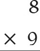
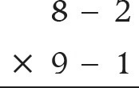
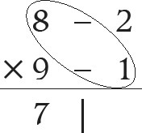
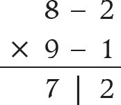

# 1. Multiplication
Case 1: When both the numbers are below the base

## Example 1:

Multiply 8 by 9.

## Solution:

1. Write the multiplicand and the multiplier as shown here.
   
2. Both the numbers are close to the base 10, so take Base = 10.
   - Deviation of 8 = 8 – 10 = – 2
   - Deviation of 9 = 9 – 10 = – 1
     
3. Write the deviations on the right side of the numbers to be multiplied.
   
4. Write the left hand digit by cross operation of any of the two diagonals. Here both of them give us the same answer, as 8 – 1 = 7 and 9 – 2 = 7.
   
5. The right hand digit will be the multiplication of the deviations. The product of the deviations is (– 2) × (– 1) = 2.
   = 72

## Example 2:

Multiply 95 by 91.

## Solution:

# 2. Square
