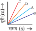

# 1. हमारे आस-पास के पदार्थ

## बहूविकल्पीय प्रश्‍न

1. निम्नलिखित परिघटनाओं का कौन-सा समुच्चय ताप बढ़ाने पर बढेगा–
   (a) विसरण, वाष्पन, गैसों का संपीडन
   (b) वाष्पन, गैसों का संपीडन, विलेयता
   (c) <mark>वाष्पन, विसरण, गैसों का प्रसार</mark>
   (d) वाष्पन, विलेयता, विसरण, गैसों का संपीडन
2. सीमा ने एक प्राकृतिक गैस संपीडन इकाई का निरीक्षण किया तथा पाया कि ताप एवं दाब की विशिष्ट परिस्थितियों में गैस को द्रवित किया जा सकता है। अपने अनुभव को मित्रों के साथ बाँटते हुए वह भ्रमित हो गई। द्रवण के लिए परिस्थितियों के सही समुच्चय को पहचानने में उसकी मदद कीजिए–
   (a) निम्न ताप, निम्न दाब
   (b) उच्च ताप, निम्न दाब
   (c) <mark>निम्न ताप, उच्च दाब</mark>
   (d) उच्च ताप, उच्च दाब
3. तरल में प्रवाह का अद्वितीय गुण होता है। निम्नलिखित में से कौन-सा कथन सही है?
   (a) केवल गैसें तरल के समान व्यवहार करती हैं
   (b) गैस तथा ठोस तरल के समान व्यवहार करते हैं
   (c) <mark>गैस तथा द्रव तरल के समान व्यवहार करते हैं</mark>
   (d) केवल द्रव तरल के समान व्यवहार करते हैं
4. ग्रीष्मकाल में जल को मिट्टी के बर्तन में रखने पर किस परिघटना के कारण वह ठंडा हो जाता है?
   (a) विसरण
   (b) वाष्पोत्सर्जन
   (c) परासरण
   (d) <mark>वाष्पन</mark>
5. कुछ पदार्थों को उनके कणों के मध्य आकर्षण बलों के बढ़ते हुए क्रम में व्यवस्थित किया गया है। निम्नलिखित में से कौन-सा सही व्यवस्था को निरूपित करता है?
   (a) जल, वायु, पवन
   (b) वायु, शर्करा, तेल
   (c) <mark>ऑक्सीजन, जल, शर्करा</mark>
   (d) नमक, रस, वायु
6. 25℃, 38℃ तथा 66℃ को केल्विन मापक्रम में परिवर्तित करने पर इन तापमानों का सही अनुक्रम होगा–
   (a) <mark>298 K, 311 K तथा 339 K</mark>
   (b) 298 K, 300 K तथा 338 K
   (c) 298 K, 278 K तथा 543 K
   (d) 298 K, 310 K तथा 338 K
7. निम्नलिखित में से सही कथन का चयन कीजिए–
   (a) ठोस का द्रव अवस्था से गुजरे बिना वाष्प में रूपांतरण वाष्पन कहलाता है
   (b) <mark>वाष्प का द्रव अवस्था से गुजरे बिना ठोस में रूपांतरण ऊर्ध्वपातन कहलाता है</mark>
   (c) वाष्प का द्रव अवस्था से गुजरे बिना ठोस में रूपांतरण हिमीकरण कहलाता है
   (d) ठोस का द्रव में रूपांतरण ऊर्ध्वपातन कहलाता है
8. डाइएथिल ईथर, एसीटोन तथा n-ब्यूटिल अल्कोहल के क्वथनांक क्रमशः 35℃, 56℃ तथा 118℃ हैं। निम्नलिखित में से कौन-से क्वथनांकोँ का केल्विन मापक्रम में सही निरूपण है?
   (a) 306 K, 329 K, 391 K
   (b) 308 K, 329 K, 392 K
   (c) <mark>308 K, 329 K, 391 K</mark>
   (d) 329 K, 392 K, 308 K
9. निम्नलिखित में से कौन-सी परिस्थिति जल के वाष्पन में वृद्धि करेगी?
   (a) <mark>जल के तापमान में वृद्धि</mark>
   (b) जल के तापमान में कमी
   (c) जल का कम खुला पृष्ठीय क्षेत्रफल
   (d) जल में नमक मिलाना
10. निम्नलिखित में से किन परिस्थितियों में हाइड्रोजन गैस के अणुओं के मध्य दूरी बढ़ेगी?
    i) बंद पात्र में भरी हाइड्रोजन गैस पर दाब बढ़ाकर
    ii) कुछ हाइड्रोजन गैस का पात्र से रिसाव होने पर
    iii) हाइड्रोजन गैस के पात्र का आयतन बढ़ाकर
    iv) पात्र का आयतन बढ़ाये बिना पात्र में अधिक हाइड्रोजन गैस मिलाने पर
    (a) \(i\) तथा \(ii\)
    (b) \(ii\) तथा \(iv\)
    (c) <mark>(ii\) तथा \(iii\)</mark>
    (d) \(ii\) तथा \(iv\)

## लघुउत्तरीय प्रश्‍न

11. किसी विचाराधीन जल के नमूने का क्वथन सामान्य ताप एवं दाब पर 102℃ पर हुआ। क्या जल शुद्ध है? क्या यह जल 0℃ पर जमेगा? टिप्पणी कीजिए।
12. कोई विद्यार्थी बर्फ तथा जल से भरे एक बीकर को गरम करता है। वह बीकर की सामग्री के तापमान को समय के फलन के रूप में मापता है। निम्नलिखित में से कौन सा ग्राफ (चित्र 1.1) परिणाम को सही रूप में दर्शाएगा? अपने उत्तर का औचित्य दीजिए।
13. रिक्त स्थानों को पूर्ति कोजिए-
    (a) कक्ष ताप पर एक द्रव के वाष्पन से <ins>शीतलम</ins> प्रभाव होता है।
    (b) कक्ष ताप पर ठोस के कणों के मध्य आकर्षण बल, गैसीय अवस्था में विद्यमान आकर्षण बलों की तुलना में <ins>प्रबलतर</ins> होते हैं।
    (c) <ins>द्रव</ins> अवस्था में कणों का विन्यासक्रम क्रमित होता है। यद्यपि <ins>गैसीय</ins> अवस्था में कोई क्रम नहीं होता है।
    (d) ठोस अवस्था का <ins>द्रव</ins> अवस्था से गुजरे बिना सीधे गैस अवस्था में परिवर्तन <ins>ऊर्ध्वपातन</ins> है।
    (e) क्वथनांक से कम ताप पर द्रव के वाष्प अवस्था में परिवर्तन को परिघटना <ins>वाष्पन</ins> कहलाती है।
14. कॉलम 'A' में दी गई भौतिक राशियों का सुमेलन कॉलम 'B' में दिये गये SI मात्रकों से कीजिए-

    | \(A\)     | \(B\)                  |
    | --------- | ---------------------- |
    | दाब       | घनमीटर                 |
    | ताप       | किलोग्राम              |
    | घनत्व     | पास्कल                 |
    | द्रव्यमान | केल्विन                |
    | आयतन      | किलोग्राम प्रति घनमीटर |

15. कॉलम 'A' तथा कॉलम 'B' में कुछ भौतिक राशियों के क्रमशः SI रहित तथा SI मात्रक दिये गये हैं। एक समान भौतिक राशि से संबंधित मात्रकों को सुमेलित कीजिए-

    | \(A\)                    | \(B\)                  |
    | ------------------------ | ---------------------- |
    | डिग्री सेल्सियस          | किलोग्राम              |
    | सेंटीमीटर                | पास्कल                 |
    | ग्राम प्रति घन सेंटीमीटर | मीटर                   |
    | बार                      | केल्विन                |
    | मिलीग्राम                | किलोग्राम प्रति घनमीटर |

16. 'परासरण एक विशिष्ट प्रकार का विसरण है'। टिप्पणी कीजिए-
17. निम्नलिखित को परासरण/विसरण में वर्गीकृत
    (a) जल में रखने पर किशमिश का फूलना
    (b) छींकने पर वायरस का फैलना
    (c) नमक के संपक में आने पर केंचुए का मरना
    (d) शक्कर को गाढ़ी चाशनी में रखने पर अंगूर का सिकुड्ना
    (e) लवण में अचार का परिरक्षण
    (f) केक को सेकने पर उसकी गंध का पूरे घर में फेलना
    (g) श्वसन के दौरान, जल में घुलित ऑक्सीजन का जलीय प्राणियों द्वारा उपयोग
18. बर्फ के रूप में जल शीतलन प्रभाव रखता है जबकि भाप के रूप में जल गंभीर जलन कर सकता है। इन प्रेक्षणों को समझाइए।
19. अलका एक केतली में चाय बना रही थी। उसने केतली को टोंटी से निकलती हुई भाप के झोंके से अचानक अत्यधिक ऊष्मा महसूस को। उसे आश्‍चर्य हुआ कि केतली में उबलते हुए जल को तुलना में भाप का तापमान अधिक था। टिप्पणी कोजिए।
20. गरम जल युक्त एक काँच के पात्र को रेफ्रीजरेटर के फ्रीजर प्रभाग (ताप < 0°C) में रखा। यदि आप पात्र की अंतर्वस्तु के ताप का मापन कर सकें तो निम्नलिखित ग्राफ (चित्र 1.2) में से कौन-से समय के फलन के साथ ताप में परिवर्तन को सही निरूपित करता है?
21. चित्र 1.3 को देखिए तथा सुझाव दीजिए कि किस पात्र (a, b, c अथवा d) में वाष्पन को दर सर्वाधिक होगी? समझाइए।
22. (a) ठोस का वाष्प में रूपांतरण ऊर्ध्वपातन कहलाता है। वाष्प के ठोस में रूपांतरण को व्यक्त करने वाले पद का नाम दीजिए।
    (b) ठोस अवस्था का द्रव अवस्था में रूपांतरण गलन कहलाता है। गलन की गुप्त ऊष्मा से क्या तात्पर्य है?

## दीर्घउत्तरीय प्रश्‍न

1. आपके अध्यापक द्वारा आपको नैफ्थलीन तथा अमोनियम क्लोराइड का मिश्रण दिया गया है। इनको पृथक करने को प्रक्रिया को नामांकित चित्र सहित सुझाइए।
2. ग्रीष्मकाल में प्रियांशी तथा अली ने क्रमशः सूती तथा नाइलोन के वस्त्र पहन रखे हैं। आपकी समझ में कोन अधिक आरामदायक होगा तथा क्यों?
3. एक पार्टी में आप अपनी प्रिय शर्ट पहनना चाहते हो, समस्या है कि वह धोने के पश्चात्‌ अभी भी गीली है। इसको शीघ्रता से सुखाने के लिए आप क्या कदम उठाएंगे?
4. निम्नलिखित कथनों पर टिप्पणी कोजिए-
   (a) वाष्पन, शीतलन उत्पच्त करता
   (b) आर्द्रता बढने पर एक जलीय विलयन के वाष्पन की दर घटती है।
   (c) स्पंज यद्यपि संपीड्य है, फिर भी एक ठोस है।
5. गलनांक तथा क्वथनांक पर किसी पदार्थ का ताप स्थिर क्यों रहता है?

# 2. क्या हमारे आस-पास के पदार्थ शुद्ध हैं

## बहूविकल्पीय प्रश्‍न

1. शुद्ध पदार्थों के लिए निम्नलिखित में से कौन-से कथन सत्य हैं?
   i) शुद्ध पदार्थों में केवल एक प्रकार के कण होते हैं
   ii) शुद्ध पदार्थ, यौगिक अथवा मिश्रण हो सकते हैं
   iii) शुद्ध पदार्थों का संघटन सर्वत्र समान रहता है
   iv) निकल के अतिरिक्त अन्य सभी तत्वों द्वारा शुद्ध पदार्थों को दृष्टांतित किया जा सकता है
   (a) \(i\) तथा \(ii\)
   (b) <mark>\(i\) तथा \(iii\)</mark>
   (c) \(iii\) तथा \(iv\)
   (d) \(ii\) तथा \(iii\)
2. लोहै से बनी वस्तु में जंग लगने को कहते हैं
   (a) संक्षारण तथा यह एक भौतिक एवं रासायनिक परिवर्तन भी है
   (b) विलयन तथा यह एक भौतिक परिवर्तन है
   (c) <mark>संक्षारण तथा यह एक रासायनिक परिवर्तन है</mark>
   (d) विलयन तथा यह एक रासायनिक परिवर्तन है
3. सल्फर तथा कार्बन डाइसल्फाइड का एक मिश्रण है
   (a) विषमांगी तथा टिंडल प्रभाव दर्शाता है
   (b) समांगी तथा टिंडल प्रभाव दर्शाता है
   (c) विषमांगी तथा टिंडल प्रभाव नहीं दर्शाता है
   (d) <mark>समांगी तथा टिंडल प्रभाव नहीं दर्शाता है</mark>
4. आयोडीन का टिक्चर पूतिरोधी गुण रखता है। यह विलयन निम्नलिखित में से किसको घोलने पर बनता है?
   (a) पोटेशियम आयोडाइड में आयोडीन
   (b) वैसलीन में आयोडीन
   (c) जल में आयोडीन
   (d) <mark>अल्कोहल में आयोडीन</mark>
5. निम्नलिखित में से कौन समांगी प्रकृति के हैं?
   i) बर्फ
   ii) लकडी
   iii) मृदा
   iv) वायु
   (a) \(i\) तथा \(iii\)
   (b) \(ii\) तथा \(iv\)
   (c) <mark>\(i\) तथा \(iv\)</mark>
   (d) \(iii\) तथा \(iv\)
6. निम्नलिखित में से भौतिक परिवर्तन कौन-से हैं?
   i) लोह धातु का पिघलना
   ii) लौह में जंग लगना
   iii) एक लौह छड को मोडना
   iv) लौह धातु का एक तार खीचना
   (a) \(i\), \(ii\) तथा \(iii\)
   (b) \(i\), \(ii\) तथा \(iv\)
   (c) <mark>\(i\), \(iii\) तथा \(v\)</mark>
   (d) \(ii\), \(iii\) तथा \(v\)
7. निम्नलिखित में से रासायनिक परिवर्तन कौन-से हैं?
   i) लकड़ी का क्षरण
   ii) लकडी का दहन
   iii) लकडी का चीरना
   iv) लकडी के एक टुकड़े में कील ठोंकना
   (a) <mark>\(i\) तथा \(ii\)</mark>
   (b) \(ii\) तथा \(iii\)
   (c) \(iii\) तथा \(iv\)
   (d) \(i\) तथा \(iv\)
8. निम्नलिखित अभिक्रिया अनुसार दो पदार्थ A तथा B अभिक्रिया कर तृतीय पदार्थ A~2~B बनाते हैं 
2A + B ⟶ A~2~B
 निम्नलिखित में से कौन-से कथन इस अभिक्रिया के संदर्भ में सही नहीं हैं?
   i) उत्पाद A~2~B, पदार्थ A तथा B के गुण प्रदर्शित करता है
   ii) उत्पाद का सदैव एक निश्चित संघटन होगा
   iii) इस प्रकार का बना उत्पाद यौगिक के रूप में वर्गीकृत नहीं किया जा सकता है
   iv) इस प्रकार का बना उत्पाद एक तत्व है
   (a) \(i\), \(ii\) तथा \(iii\)
   (b) \(ii\), \(iii\) तथा \(iv\)
   (c) <mark>\(i\), \(ii\) तथा \(iv\)</mark>
   (d) \(ii\), \(iii\) तथा \(iv\)
9. दो रासायनिक स्पीशीज X तथा Y आपस में संयुक्त होकर उत्पाद P बनाती हैं जिसमें दो X तथा Y दोनों उपस्थित हैं। 
X + Y ⟶ P
 X तथा Y को सरल रासायनिक अभिक्रिया द्वारा सरल पदार्थों में नहीं तोड़ा जा सकता है। निम्नलिखित में से कौन-सा X, Y तथा P स्पीशीज के संदर्भ में सत्य है?
   i) P एक यौगिक है
   ii) X तथा Y यौगिक हैं
   iii) X तथा Y तत्व हैं
   iv) P का एक निश्चित संघटन है
   (a) \(i\), \(ii\) तथा \(iii\)
   (b) \(i\), \(ii\) तथा \(iv\)
   (c) \(ii\), \(iii\) तथा \(iv\)
   (d) <mark>\(i\), \(ii\) तथा \(iv\)</mark>

# 3. परमाणु एवं अणु

## बहूविकल्पीय प्रश्‍न

1. निम्नलिखित में से कोन सा 360g जल को सही रूप में प्रदर्शित करता है?
   i) 2 मौल जल
   ii) 20 मोल जल
   iii) जल के 6.022 × 10^23^ अणु
   iv) जल के 1.2044 × 10^25^ अणु
   (a) \(i\)
   (b) \(i\) तथा \(iv\)
   (c) \(ii\) तथा \(iii\)
   (d) <mark>\(ii\) तथा \(iv\)</mark>
2. एक परमाणु के लिए निम्नलिखित में से कौन-सा कथन सत्य नहीं है?
   (a) <mark>परमाणु स्वतंत्र अस्तित्व में नहीं रह पाते हैं।</mark>
   (b) परमाणु मूल इकाइयाँ हैं जिनसे अणुओं और आयनों का निर्माण होता है।
   (c) परमाणु सदैव उदासीन प्रकृति के होते हैं।
   (d) परमाणु बडी संख्या में परस्पर जुड़कर पदार्थ का निर्माण करते हैं, जिसे हम देख, अनुभव या स्पर्श कर सकते
3. नाइट्रोजन गैस का रासायनिक प्रतीक है-
   (a) Ni
   (b) <mark>N~2~</mark>
   (c) N^+^
   (d) N
4. सोडियम का रासायनिक प्रतीक है-
   (a) So
   (b) Sd
   (c) NA
   (d) <mark>Na</mark>
5. निम्नलिखित में किसका भार सबसे अधिक होगा?
   (a) सूक्रोस (C~12~H~22~O~11~) के 0.2 मोल
   (b) CO~2~ के 2 मोल
   (c) <mark>CaCO~3~ के 2 मोल</mark>
   (d) H~2~O के 10 मोल
6. निम्नलिखित में से किसमें परमाणुओं कौ संख्या अधिकतम होगी?
   (a) H~2~O के 18g
   (b) O~2~ के 18g
   (c) CO~2~ के 18g
   (d) <mark>CH~4~ के 18g</mark>
7. निम्नलिखित में से किसमें अणुओं को संख्या अधिकतम होगी?
   (a) 1g CO~2~
   (b) 1g N~2~
   (c) <mark>1g H~2~</mark>
   (d) 1g CH~4~
8. ऑक्सीजन के एक परमाणु का द्रव्यमान होता है-
   (a) <mark>$\frac{16}{6.023 \times 10^{23}}$g</mark>
   (b) $\frac{32}{6.023 \times 10^{23}}$g
   (c) $\frac{1}{6.023 \times 10^{23}}$g
   (d) 8u
9. एक बीकर में 3.42 g सूक्रोस को 18 g जल में विलेय किया जाता है। विलयन में उपस्थित ऑक्सीजन परमाणुओ कौ संख्या है-
   (a) <mark>6.68 × 10^23^</mark>
   (b) 6.09 × 10^22^
   (c) 6.022 × 10^23^
   (d) 6.022 × 10^21^
10. भौतिक अवस्था में परिवर्तन लाया जा सकता है-
    (a) केवल जब तंत्र को ऊर्जा दी जाती है
    (b) केवल जब तंत्र से ऊर्जा ले ली जाती है
    (c) <mark>जब तंत्र को ऊर्जा दी जाती है या ली जाती है</mark>
    (d) बिना किसी ऊर्जा परिवर्तन के

# 4. परमाणु की संरचना

## बहूविकल्पीय प्रश्‍न

1. निम्नलिखित में से कौन-सा Mg परमाणु में इलेक्ट्रॉनिक वितरण को सही प्रदर्शित करता है?
   (a) 3, 8, 1
   (b) <mark>2, 8, 2</mark>
   (c) 1 ,8, 3
   (d) 8, 2, 2
2. रदरफोर्ड के एल्फा (α) कण प्रकौर्णन प्रयोग के परिणामस्वरूप खोज किया गया-
   (a) इलेक्ट्रॉन
   (b) प्रोटॉन
   (c) <mark>परमाणु में नाभिक</mark>
   (d) परमाण्वीय द्रव्यमान
3. एक तत्व X में इलेक्ट्रॉनों की संख्या 15 और न्यूट्रॉनों की संख्या 16 है। निम्नलिखित में से कौन-सा तत्व का सही प्रदर्शन है?
   (a) <mark>$^{31}_{15}X$</mark>
   (b) $^{31}_{16}X$
   (c) $^{16}_{15}X$
   (d) $^{15}_{16}X$
4. डाल्टन के परमाणु सिद्धांत ने सफलतापूर्वक समझाया--
   i) द्रव्यमान संरक्षण का नियम
   ii) स्थिर अनुपात का नियम
   iii) रेडियोएक्टिवता का नियम
   iv) गुणित अनुपात का नियम
   (a) \(i\), \(ii\) और \(iii\)
   (b) \(i\), \(iii\) और \(iv\)
   (c) \(ii\), \(iii\) और \(iv\)
   (d) <mark>\(i\), \(ii\) और (iv\)</mark>
5. रदरफोर्ड के नाभिकीय प्रतिरूप के संबंध में कौन-से कथन सही हैं?
   i) नाभिक को धन आवेशित माना
   ii) रमाणित किया कि α-कण, हाइड्रोजन परमाणु से चार गुना भारी है
   iii) सौर परिवार से तुलना की जा सकती है
   iv) टॉमसन मॉडल से सहमति दर्शाता है
   (a) <mark>\(i\) और \(iii\)</mark>
   (b) \(ii\) और \(iii\)
   (c) \(i\) और \(iv\)
   (d) केवल \(i\)
6. एक तत्व के लिए निम्नलिखित में से कौन-से विकल्प सही हैं?
   i) परमाणु संख्या = प्रोटॉनों की संख्या + इलेक्ट्रॉनों की संख्या
   ii) द्रव्यमान संख्या = प्रोटॉनों की संख्या + न्यूट्रॉनों की संख्या
   iii) परमाणु द्रव्यमान = प्रोटॉनों की संख्या + न्यूट्रॉनों की संख्या
   iv) परमाणु संख्या = प्रोटॉनों की संख्या + इलेक्ट्रॉनों कौ संख्या
   (a) \(i\) और \(ii\)
   (b) \(i\) और \(iii\)
   (c) \(ii\) और \(iii\)
   (d) <mark>\(ii\) और \(iv\)</mark>
7. टॉमसन के परमाणु मॉडल हैतु निम्नलिखित में से कौन-से कथन सत्य हैं?
   i) यह परमाणु में परमाणु द्रव्यमान को समान रूप से वितरित मानता है।
   ii) परमाणु में धनावेश समान रूप से वितरित माना गया।
   iii) धन आवेशित गोले में इलेक्ट्रॉनों का वितरण समान रूप से होता है।
   iv) परमाणु के स्थायित्व के लिए इलेक्ट्रॉन परस्पर एक दूसरे को आकर्षित करते हैं।
   (a) <mark>\(i\), \(ii\) और \(iii\)</mark>
   (b) \(i\) और \(iii\)
   (c) \(i\) और \(iv\)
   (d) \(i\), \(ii\) और \(iv\)
8. रदरफोर्ड के α-कण प्रकोर्णन प्रयोग ने दर्शाया कि–
   i) इलेक्ट्रॉन ऋण आवेशित होते हैं
   ii) नाभिक में परमाणु का द्रव्यमान और धन आवेश केंद्रित रहता है
   iii) नाभिक में न्यूटॉन होते हैं
   iv) परमाणु का अधिकांश स्थान रिक्त होता है
   V) उपरोक्त कथनो में कौन से सही हैं?
   (a) \(i\) और \(iii\)
   (b) <mark>\(ii\) और \(iv\)</mark>
   (c) \(i\) और \(iv\)
   (d) \(iii\) और \(iv\)
9. एक तत्व के आयन पर 3 धन आवेश हैं। परमाणु की द्रव्यमान संख्या 27 और न्यूट्रॉनों की संख्या 14 है। आयन में कितने इलेक्ट्रॉन उपस्थित हैं?
   (a) 13
   (b) <mark>10</mark>
   (c) 14
   (d) 16
10. चित्र में Mg^2+^ आयन को पहचानिए, जहाँ n और p क्रमशः न्यूट्रॉनों और प्रोटॉनों की संख्या प्रदर्शित करते हैं।
    (a) 
    (b) 
    (c) 
    (d) <mark></mark>
11. एथिल एथेनोएट (CH~3~COOC~2~H~5~) के एक नमूने में दो ऑक्सीजन परमाणुं में इलेक्ट्रॉनों की संख्या समान है, परंतु न्यूट्रॉनों की संख्या भिन्न है। इसके लिए निम्नलिखित में से कौन-सा कारण है?
    (a) इनमें से एक ऑक्सीजन परमाणु ने इलेक्ट्रॉन प्राप्त किए हैं
    (b) इनमें से एक ऑक्सीजन परमाणु ने दो न्यूट्रॉन प्राप्त किए हैं
    (c) <mark>दोनों ऑक्सीजन परमाणु समस्थानिक हैं</mark>
    (d) दोनों ऑक्सीजन परमाणु सममारिक हैं
12. 1 संयोजकता वाले तत्व होते हैं
    (a) सदैव धातु
    (b) सदैव उपधातु
    (c) <mark>धातु या अधातु</mark>
    (d) सदैव अधातु
13. परमाणु का प्रथम मॉडल देने वाले का नाम है
    (a) एन. बोर
    (b) ई. गोल्टस्टीन
    (c) रदरफोर्ड
    (d) <mark>जे. जे. टॉमसन</mark>
14. 3 प्रोटॉन और 4 न्यूट्रॉन युक्त परमाणु की संयोजकता होगी–
    (a) 3
    (b) 7
    (c) <mark>1</mark>
    (d) 4
15. एल्युमिनियम के एक परमाणु में इलेक्ट्रॉनों का वितरण होता है–
    (a) <mark>2, 8, 3</mark>
    (b) 2, 8, 2
    (c) 8, 2, 3
    (d) 2, 3, 8
16. चित्र में कौन-सा परमाणु के बोर मॉडल का सही प्रदर्शन नहीं करता?\
    i) 
    ii) 
    iii) 
    iv) 
    (a) \(i\) और \(ii\)
    (b) \(ii\) और \(iii\)
    (c) <mark>\(ii\) और \(iv\)</mark>
    (d) \(i\) और \(iv\)
17. निम्नलिखित में से कौन-सा कथन सर्वदा सही है?
    (a) <mark>एक परमाणु में इलेक्ट्रॉनों और प्रोटॉनों की संख्या समान होती है।</mark>
    (b) एक परमाणु में इलेक्ट्रॉनों और न्यूटॉनों की संख्या समान होती है।
    (c) एक परमाणु में प्रोटॉनों और न्यूट्रॉनों की संख्या समान होती है।
    (d) एक परमाणु में इलेक्ट्रॉनों, प्रोटॉनों और न्यूट्रॉनों की संख्या समान होती है।
18. परमाणु मॉडलों का समय के साथ सुधार होता रहा है। निम्नलिखित परमाणु मॉडलों को उनके कालानुक्रमानुसार व्यवस्थित कीजिए–
    i) रदरफोर्ड का परमाणु मॉडल
    ii) टॉमसन का परमाणु मॉडल
    iii) बोर का परमाणु मॉडल
    (a) \(i\), \(ii\) और \(iii\)
    (b) \(ii\), \(iii\) और \(i\)
    (c) <mark>\(ii\), \(i\) और \(iii\)</mark>
    (d) \(iii\) \(ii\) और \(i\)

# 5. जीवन की मौलिक इकाई

## बहूविकल्पीय प्रश्‍न

1. निम्नलिखित में किसे क्रिस्टल रूप में बनाया जा सकता है?
   (a) जीवाणु
   (b) अमीवा
   (c) <mark>विषाणु</mark>
   (d) शुक्राणु
2. कोशिका फूल जाएगी, यदि-
   (a) कोशिका के भीतर जल के अणुओं की सांद्रता उसके बाहर चारों ओर उपस्थित जल के अणुओं की सांद्रता से अधिक हो
   (b) <mark>कोशिका के बाहर चारों ओर उपस्थित जल के अणुओं कौ सांद्रता कोशिका के भीतर जल के अणुओं की सांद्रता से अधिक हो</mark>
   (c) कोशिका के भीतर तथा उसके बाहर के जल के अणुओं की सांद्रता समान हो
   (d) जल के अणुओं की सांद्रता महत्व नहीं रखती
3. गुणसूत्र बने होते है
   (a) डी.एन.ए. से
   (b) प्रोटीन से
   (c) <mark>डी.एन.ए. एवं प्रोटीन से</mark>
   (d) आर. एन. ए. से
4. इनमें से कौन-सा कार्य राइबोसोम का नहीं है?
   i) यह प्रोटीन अणुओं के निर्माण में सहायता करता है
   ii) यह एंजाइमों के निर्माण में सहायता करता है
   iii) यह हामोंनों के निर्माण में सहायता करता है
   iv) यह मंड (स्टार्च) अणुओं के निर्माण में सहायता करता है
   (a) \(i\) और \(ii\)
   (b) \(ii\) और \(iii\)
   (c) <mark>\(iii\) और \(iv\)</mark>
   (d) \(iv\) और \(i\)
5. इनमें से किसका संबंध अंतर्द्रव्यी जालिका से नहीं है?
   (a) यह केंद्रक एवं कोशिकाद्रव्य के बीच प्रोटीन के लिए अभिगमन चैनल की तरह कार्य करता है
   (b) यह कोशिकाद्रव्य के विभिन्न क्षेत्रों के बीच पदार्थों को पहुँचाता है
   (c) <mark>यह ऊर्जा उत्पादन का स्थल हो सकती है</mark>
   (d) यह कोशिका की कुछ जैव रासायनिक क्रियाओं का स्थल हो सकती है
6. परासरण की कुछ परिभाषाएँ नीचे दी गई हैं। इन्हें सावधानी से पढ़िए और सही परिभाषा चुनिए–
   (a) <mark>अर्धपारगम्य झिल्ली से होकर, जल के अणुओं का अधिक सांद्रता वाले क्षेत्र से निम्न सारता वाले क्षेत्र की ओर जाना</mark>
   (b) विलायक अणुओं का अधिक सांद्रता से निम्न सांद्रता की ओर जाना
   (c) पारगम्य झिल्ली से होकर विलायक अणुओं का अधिक सारता से निम्न साद्रता वाले विलयन की ओर जाना
   (d) अर्धपारगम्य झिल्ली से होकर विलेय अणुओं का निम्न सांद्रता वाले विलयन से अधिक सांद्रता वाले विलयन की ओर जाना
7. पादप कोशिका में जीवद्रव्यकुचन को इस तरह परिभाषित किया जाता है-
   (a) अल्पपरासारी माध्यम में प्रद्रव्य झिल्ली का टूटना (लयन)
   (b) <mark>अल्पपरासारी माध्यम में कोशिकाद्रव्य का सिकुड़ना</mark>
   (c) केंद्रकद्रव्य का सिकुड़ना
   (d) इनमें से कोई नहीं
8. निम्नलिखित में से किसके चारों ओर एकल झिल्ली का आवरण होता है?
   (a) माइटोकॉन्ड्रिया
   (b) <mark>रसधानी</mark>
   (c) लाइसोसोम
   (d) लवक
9. गलत वाक्य को दूँढ़िए–
   (a) गॉल्जी उपकरण, लाइसोसोम के बनने में शामिल होता है
   (b) <mark>केंद्रक, माइटोकॉन्ड्रिया एवं लवक में डी.एन.ए. होता है, इसलिए ये अपनी संरचनात्मक प्रोटीन बनाने में समर्थ हैं</mark>
   (c) माइटोकॉन्ड्रिया को कोशिका का पावर हाउस कहा जाता है क्योंकि इनमें ए.टी.पी. का उत्पादन होता है
   (d) कोशिकाद्रव्य को प्रद्रव्य भी कहा जाता है
10. सही वाक्य को दूँढ़िए-
    (a) <mark>लाइसोसोम में भरे हुए एंजाइम रूक्ष अंतर्द्रव्यी जालिका (RER) से बने होते हैं</mark>
    (b) रूक्ष अंतर्द्रव्यी जालिका एवं चिकनी अंतर्द्रव्यी जालिका क्रमशः लिपिड एवं प्रोटीन बनाती हैं
    (c) अंतर्द्रव्यी जालिका का कोशिका झिल्ली के नष्ट होने से संबंध है
    (d) यूकैरियोटिक केंद्रक के केंद्रकद्रव्य में केंद्रकाभ होता है
11. कौन-सा कोशिकाअंगक कोशिका के अंदर विषैले पदार्थ एवं औषधि (ड्रग्स) को आविष रहित करने में मुख्य भूमिका निभाता है?
    (a) गॉल्जी उपकरण
    (b) लाइसोसोम
    (c) <mark>चिकनी अतर्द्रव्यी जालिका</mark>
    (d) रसधानी
12. कोशिका झिल्ली निर्माण के लिए आवश्यक प्रोटीनों एवं लिपिड का उत्पादन निम्नलिखित द्वारा किया जाता है-
    (a) <mark>रूक्ष अंतर्द्रव्यी जालिका</mark>
    (b) गॉल्जी उपकरण
    (c) कोशिका झिल्ली
    (d) माइटोकॉन्डिया
13. प्रोकैरियोट का अपरिभाषित केंद्रक क्षेत्र कहलाता है-
    (a) केंद्रक
    (b) केंद्रिका
    (c) न्यूक्लीक अम्ल
    (d) <mark>केंद्रकाभ</mark>
14. कोशिका-अंगक जो सरल शर्करा को जटिल शर्करा में बदलने में शामिल है-
    (a) अंतर्द्रव्यी जालिका
    (b) राइबोसोम
    (c) लवक
    (d) <mark>गॉल्जी उपकरण</mark>
15. निम्नलिखित में से कौन-सा रसधानी का कार्य नहीं है?
    (a) संग्रहण
    (b) कोशिका को स्फीति एवं दृढता प्रदान करना
    (c) अपशिष्ट उत्सर्जन
    (d) <mark>गमन</mark>
16. अमीबा जिस प्रक्रिया के द्वारा भोजन प्राप्त करता है, वह कहलाती है-
    (a) बहिःकोशिकता
    (b) <mark>अतःकोशिकता</mark>
    (c) प्रद्रव्यलयन
    (d) बहिःकोशिकता एवं अतःकोशिकता दोनों
17. निम्न में से किसकी कोशिकाभित्ति सेलुलोस से नहीं बनी दै?
    (a) <mark>जीवाणु</mark>
    (b) हाइड्रिला
    (c) आमवृक्ष
    (d) कैक्टस
18. सिल्वर नाइट्रेट का घोल किसी एक के अध्ययन में इस्तेमाल होता है-
    (a) अतर्द्रव्यी जालिका
    (b) <mark>गॉल्जी उपकरण</mark>
    (c) केंद्रक
    (d) माइटोकॉन्ड्या
19. केंद्रक के अलावा वह अंगक जिसमें डी.एन.ए. होता है-
    (a) अतर्द्रव्यी जालिका
    (b) गॉल्जी उपकरण
    (c) <mark>माइटोकॉन्ड्या</mark>
    (d) लाइसोसोम
20. निम्नलिखित में से किसको कोशिका की "रसोई" कहा जाता है?
    (a) माइटोकॉन्ड्या
    (b) अंतर्द्रव्यी जालिका
    (c) <mark>हरितलवक</mark>
    (d) गॉल्जी उपकरण
21. कोशिका में लिपिड अणुओं को निम्न के द्वारा संश्लेषित किया जाता है
    (a) <mark>चिकनी अतर्द्रव्यी जालिका</mark>
    (b) रूक्ष अंतर्ट्रव्यी जालिका
    (c) गॉल्जी उपकरण
    (d) लवक
22. नई कोशिका का निर्माण, पूर्व स्थित कोशिका से होने की बात किसने बताई?
    (a) हेकेल
    (b) <mark>विर्चों</mark>
    (c) हुक
    (d) श्लाइडेन
23. कोशिका सिद्धांत निम्न द्वारा प्रतिपादित किया गया
    (a) <mark>श्लाइडेन एवं श्वान्न</mark>
    (b) विर्चों
    (c) हुक
    (d) हैकेल
24. प्रोकेरियोटिक (प्राकूकेंद्रको) कोशिका में दीखने वाला एकमात्र कोशिका अंगक है-
    (a) माइटोकॉन्ड्या
    (b) <mark>राइबोसोम</mark>
    (c) लवक
    (d) लाइसोसोम
25. वह अंगक जिसमें कोशिका भित्ति नहीं होती है-
    (a) <mark>राइबोसोम</mark>
    (b) गॉल्जी उपकरण
    (c) हरितलवक (क्लोरोप्लास्ट)
    (d) केंद्रक
26. एक माइक्रो मीटर होता है-
    (a) <mark>10^−6^ मीटर</mark>
    (b) 10^−9^ मीटर
    (c) 10^−10^ मीटर
    (d) 10^−3^ मीटर
27. लाइसोसोम उत्पन्न होते हैं-
    (a) अंतर्द्रव्यी जालिका से
    (b) <mark>गाँल्जी उपकरण से</mark>
    (c) केंद्रक से
    (d) माइटोकॉन्ड्या से
28. सजीव कोशिकाएँ निम्न के द्वारा खोजी गई-
    (a) राबर्ट हुक
    (b) पुरकिंजे
    (c) <mark>ल्यूवेनहो</mark>
    (d) राबर्ट ब्राउन
29. निम्नलिखित कथनो में से विसंगत कथन को चुनिए-
    (a) अर्धपारगम्य झिल्ली में से होकर जाने वाले जल की गति उसमें घुले हुए पदार्थों कौ मात्रा से प्रभावित होती है
    (b) झिल्ली, कार्बनिक अणुओं जैसे प्रोटीन और लिपिड से बनी होती है
    (c) कार्बनिक विलायक में घुलनशील अणु झिल्ली में से होकर आसानी से गुजर जाते हैं
    (d) <mark>पादपों में कोशिका झिल्ली में काइटिन शर्करा होती है</mark>

## लघुउत्तरीय प्रश्‍न

30. लाइसोसोम कोशिका को स्वघाती थैली (सुसाइड बैग) क्यों कहा जाता है?
31. कया आप इससे सहमत हैं कि-\*कोशिका जीव की निर्माण इकाई है,' यदि हाँ, तो क्यों? व्याख्या कीजिए।
32. जब आप लंबे समय तक कपड़े थोते हैं तो आपकी अंगुलियों की त्वचा क्यों सिकुड़ जाती है?
33. केवल प्राणियों में ही अंतःकोशिकता (एंडोसाइटोसिस) क्यों पाई जाती है?
34. एक व्यक्ति नमक का सांद्रित घोल पी लेता है और कुछ समय बाद वह उल्टी करना शुरू कर देता है। इस स्थिति के लिए कौन-सा तथ्य उत्तरदायी है? व्याख्या कीजिए।
35. बिना झिल्ली वाली किसी कोशिका अंगक का नाम लिखिए।
36. हम वह भोजन खाते हैं जिसमें सभी पोषक पदार्थ, जैसे कार्बोहाइड्रेट, प्रोटीन, वसा, विटामिन, खनिज और जल, आदि सभी शामिल होते हैं। पाचन के बाद ये सभी ग्लुकोस, अमीनो अम्ल, वसा अम्ल, ग्लिसरोल के रूप में अवशोषित हो जाते हैं। पचे हुए भोजन एवं जल के अवशोषित होने में कौन-सी प्रक्रिया उत्तरदायी है?
37. यदि आपको कुछ सब्जियाँ पकाने के लिए दी जाती हैं तो साधारणतया आप सब्जियाँ पकाने के दौरान उनमें नमक मिलाते हैं। नमक के मिलाने पर कुछ देर बाद सब्जियों से जल निकलता है। इसमें कौन-सी प्रक्रिया उत्तरदायी है?
38. लाल रुधिर कणिकाओं (२) और प्याज के छिलके की कोशिकाओं को यदि अल्पपरासारी विलयन में अलग-अलग रख दें तो उनमें क्या परिवर्तन आएगे? अपने उत्तर को कारण सहित व्याख्या कीजिए।
    (a) दोनों की कोशिकाएँ फूल जाएंगी
    (b) लाल रुधिर कणिकाएँ आसानी से फट जाएंगी जबकि प्याज के छिलके की कोशिकाएँ एक सीमा तक न फटने को कोशिश करेंगी
    (c) '३' और '9' दोनों सही हैं
    (d) लाल रुधिर कणिकाएँ और प्याज के छिलके की कोशिकाएँ समान व्यवहार करेंगी
39. जीवाणुओं में हरितलवक नहीं होता है लेकिन कुछ जीवाणु स्वभाव से प्रकाशस्वपोषी होते हैं और प्रकाशसंश्लेषण की क्रिया करते हैं। इस कार्य को जीवाणु-कोशिका का कौन-सा भाग करता है?
40. 'A' और 'B' में मिलान कौजिए।
41. पादप के उन विभिन्न भागों के नाम लिखिए जिनमें वर्णलवक (क्रोमोप्लास्ट), हरितलवक (क्लोरोप्लास्ट) और अवर्णी लबक (ल्यूकोप्लास्ट) उपस्थित होते हैं।
42. उन अंगकों के नाम लिखिए जो नीचे लिखे वाक्यांशों से संबंध दिखाते हैं-
    (a) कोशिका के अभिगमन चैनल
    (b) कोशिका का पावर हाउस
    (c) कोशिका की पैकिंग और प्रेषित इकाई
    (d) कोशिका की पाचक थैली
    (e) कोशिका की संग्रह थैली
    (f) कोशिका का किचन
    (g) कोशिका का नियंत्रण कक्ष
43. प्याज के छिलके की कोशिका से जीवाणु-कोशिका कैसे भिन्न है?
44. कार्बन डाइऑक्साइड (ट0,) और जल (H,0) जैसे पदार्थ कोशिका के आंदर और बाहर कैसे आते-जाते हैं?
45. अमीबा अपना भोजन कैसे प्राप्त करता है?
46. पादप कोशिका के दो ऐसे अंगकों के नाम बताइए जिनमें अपनी आनुवंशिक सामग्री और राइबोसोम विद्यमान होते हैं
47. लाइसोसोम को कोशिकाओं का अपमार्जक' क्यों कहा जाता है?
48. कौन-सा कोशिका-अंगक कोशिका की अधिकांश गतिविधियों पर नियंत्रण रखता है?
49. कोन-से प्रकार का लवक इनमें सामान्यतया पाया जाता है-
    (a) पादप को जड़
    (b) पादप की पत्तियां
    (c) पुष्प एवं फल
50. पादप कोशिकाओं में बड़े आकार की रसधानी क्यों होती है?
51. क्रोमैटिन, क्रोमैटिड एवं क्रोमोसोम में परस्पर क्या संबंध है?
52. निम्नलिखित अवस्थाओं की स्थिति से क्या निष्कर्ष निकलता है?
    (a) जब बाहरी माध्यम की तुलना में कोशिका के भीतर अधिक सांद्रता वाला जल होता है।
    (b) बाहरी माध्यम की तुलना में कोशिका के भीतर कम सांद्रता वाला जल होता है।
    (c) जब कोशिका के अंदर एवं उसके बाहरी माध्यम में जल की सांद्रता समान होती है।

## दीर्घउत्तरीय प्रश्‍न

53. एक पादप कोशिका का चित्र बनाइए और उन भागों को चिह्ित कीजिए जो-
    (a) कोशिका के विकास एवं कार्यो का निर्धारण करता है।
    (b) अंत्द्रव्यी जालिका से निकलने वाली सामग्री को पैक करता है।
    (c) सूक्ष्मजीवों में ऐसा प्रतिरोध उत्पन्न करता है जिससे वे बाह्य अल्पपरासारी माध्यम में फूटे बगैर अप्रभावित बने रहें।
    (d) जो जीवन को बनाए रखने के लिए आवश्यक बहुत-सी जैव रासायनिक अभिक्रियाओं के लिए स्थल उपलब्ध कराता है।
    (e) एक एसा द्रव जो केंद्रक के अंदर होता है।
54. इलेक्ट्रॉन सूक्ष्मदर्शी द्वारा देखी गई पादप कोशिका का चित्र बनाइए। प्राणी कोशिका से यह किस प्रकार भिन्न है?
55. किसी प्राणी कोशिका का एक स्वच्छ आरेख बनाइए और उसके भागों के नाम लिखिए।
56. यूकैरियोटिक केंद्रक का नामांकित आरेख बनाइए। इसमें और केंद्रकाभ में क्या अंतर होता है?
57. रूक्ष एवं चिकनी अंतद्र॑व्यी जालिका में अंतर बताइए। अंतद्र॑व्यी जालिका झिल्ली के जीवातूजनन के लिए किस तरह महत्वपूर्ण है?
58. संक्षिप्त में बताइए कि क्या होता है जब-
    (a) सूखी खूबानी को कुछ देर के लिए साफ जल में रखा जाए और फिर बाद में इसे शकरा विलयन
    (b) लाल रुधिर कोशिकाओं को सांद्रित लवण विलयन में रखा जाता है?
    (c) कोशिका कौ प्लाज्मा झिल्ली टूट जाए?
    (d) रियो (२०९०) की पत्तियों को पहले जल में उबालते हैं और फिर चीनी की चाशनी की एक बूँद इसके ऊपर रखते हैं?
    (e) कोशिका से गॉल्जी उपकरण को हरा दिया जाए?
59. पादप कोशिका का एक स्वच्छ चित्र बनाइए और इसके किन्हीं तीन भागों को चिह्वित कीजिए जो इसे प्राणी कोशिका से विभेदित करते हैं।

# 6. ऊतक

## बहूविकल्पीय प्रश्‍न

1. निम्नलिखित में से कौन-से ऊतक में मृत कोशिकाएँ पाई जाती हैं?
   (a) मृदूतक
   (b) <mark>दुढोतक</mark>
   (c) स्थूलकोणोतक
   (d) उपकला ऊतक
2. गलत वाक्य को चुनिए-
   (a) मृदूतक ऊतकों में अंतराकौशिक स्थान होते हैं
   (b) <mark>स्थूलकोण ऊतकों की कोशिकाओं के कोने अनियमित रूप से मोटे हो जाते हैं</mark>
   (c) शीर्षस्थ एवं अंतर्विष्ट विभाज्योतक स्थायी ऊतक होते हैं
   (d) विभाज्योतकी कोशिकाओं की प्रारंभिक अवस्था में रसधानियाँ नहीं होती हैं
3. तने की परिधि निम्नलिखित के कारण बढ़ती है-
   (a) शीर्षस्थ विभाज्योतक
   (b) <mark>पार्श्व विभाज्योतक</mark>
   (c) अंतर्विष्ट विभाज्योतक
   (d) ऊर्ध्व विभाज्योतक
4. कोन सी कोशिका में छिद्रिल कोशिकाभित्ति नहीं होती?
   (a) वाहिनिकाएँ
   (b) <mark>सहचर कोशिकाएँ</mark>
   (c) चालनी नलिकाएँ
   (d) वाहिकाएँ
5. आंत्र पचे हुए भोजन को अवशोषित करती हैं। उपकला कोशिकाओं का कौन-सा प्रकार इसके लिए उत्तरदायी है?
   (a) स्तरित शल्की उपकला
   (b) <mark>स्तंभाकार उपकला</mark>
   (c) तर्कु रेशे उपकला
   (d) घनाकार उपकला
6. किसी व्यक्ति की दुर्घटना में हाथ की दोनों बडी हदिया (अस्थियाँ) अपने स्थान से हट गई निम्नलिखित में से कौन-सा संभावित कारण हो सकता है?
   (a) कंडरा का टूटना
   (b) कंकाल पेशी का टूटना
   (c) <mark>स्नायु का टूटना</mark>
   (d) एरियोलर (गर्तिका) ऊतक का टूटना
7. काम करते समय एवं दौडते समय आप अपने हाथ पैर आदि अंगों को हिलाते हैं। निम्नलिखित में कौन-सा कथन सही है?
   (a) चिकनी पेशियाँ संकुचित होकर अस्थियो को चलायमान करने के लिए स्नायु को खीचती हैं
   (b) चिकनी पेशियाँ संकुचित होकर अस्थियों को चलायमान करने के लिए कंडराओं को खींचती हैं
   (c) कंकाल पेशियाँ संकुचित होकर अस्थियों को चलायमान करने के लिए स्नायु को खींचती हैं
   (d) <mark>कंकाल पेशियाँ संकुचित होकर अस्थियों को चलायमान करने के लिए कंडराओं को </mark>खींचती हैं
8. कौन-सा पेशी-युग्म अनैच्छिक पेशियों के रूप में कार्य करता है?
   i) स्तरित पेशियाँ
   ii) चिकनी पेशियाँ
   iii) हृद पेशियाँ
   iv) कंकाल पेशियाँ
   (a) \(i\) तथा \(i\)
   (b) <mark>\(ii\) तथा \(iii\)</mark>
   (c) \(iii\) तथा \(iv\)
   (d) \(i\) तथा \(iv\)
9. पादपों में विभाज्योतक ऊतक-
   (a) स्थानीकृत एवं स्थायी होते हैं
   (b) कुछ भागों तक वे सीमित नहीं होते है
   (c) <mark>स्थानीकृत एवं विभाजनकारी कोशिकाओं के बने होते हैं</mark>
   (d) परिमाण में बढ़ते रहते हैं
10. निम्नलिखित में से बाह्य त्वचा (एपिडर्मिस) का कौन-सा कार्य नहीं है?
    (a) प्रतिकूल परिस्थितियों से बचाव
    (b) गैसीय विनिमय
    (c) <mark>जल संवहन</mark>
    (d) वाष्योत्सर्जन
11. अशुद्ध वाक्य को चुनिए-
    (a) रुधिर के आधात्री (मैट्रिक्स) में प्रोटीन, लवण एवं हार्मोन होते हैं
    (b) दो अस्थियाँ, स्नायु कौ वजह से जुडी होती हैं
    (c) <mark>कंडरा, रेशेहीन एवं कमजोर (फ्रेजाइल) ऊतक होते हैं</mark>
    (d) उपास्थि संयोजी ऊतक का एक प्रकार है
12. निम्न में से किसमें उपास्थि नहीं पाई जाती है-
    (a) नाक
    (b) कान
    (c) <mark>वृक्क</mark>
    (d) कंठ
13. मानव शरीर में वसा निम्नलिखित में भंडारित होती है-
    (a) घनाकार उपकला
    (b) <mark>वसा ऊतक</mark>
    (c) अस्थियाँ
    (d) उपास्थि
14. अस्थि आधात्री में किसकी अधिक मात्रा होती है-
    (a) फ्लुओराइड एवं कैल्सियम की
    (b) <mark>कैल्सियम एवं फॉस्फोरस की</mark>
    (c) कैल्सियम एवं पोटेशियम कौ
    (d) फॉस्फोरस एवं पोटेशियम की
15. संकुचनशील प्रोटीन पाई जाती दै
    (a) अस्थियों में
    (b) रुधिर में
    (c) <mark>पेशियों में</mark>
    (d) उपास्थि में
16. ऐच्छिक पेशी पाई जाती है
    (a) आहार-नाल में
    (b) <mark>पाद में</mark>
    (c) आँख की परितारिका (आइरिस) में
    (d) फेफड़ों (फुफ्फुस) की श्वसनी में
17. तंत्रिका-ऊतक कहाँ नहीं पाए जाते हैं
    (a) मस्तिष्क में
    (b) मेरुरज्जु में
    (c) <mark>कंडराओं में</mark>
    (d) तंत्रिका में
18. तंत्रिका कोशिका में कौन नहीं होता-
    (a) तंत्रिकाक्ष
    (b) तंत्रिका के अंतिम सिरे
    (c) <mark>कंडराएँ</mark>
    (d) द्रुमिका (डेंड्राइट)
19. निम्नलिखित में से कौन-सी संरचना ऊतकों की मरम्मत तथा अग में खाली स्थान को भरने में सहायता करती है?
    (a) कंडरा
    (b) वसा ऊतक
    (c) <mark>गर्तिका (एरियोलर)</mark>
    (d) उपास्थि
20. निम्नलिखित में कौन-सा पेशीय ऊतक है जो विना थके जीवन भर लगातार कार्य करता रहता है?
    (a) कंकाल पेशी
    (b) <mark>हृद पेशी</mark>
    (c) चिकनी पेशी
    (d) ऐच्छिक पेशी
21. निम्नलिखित में से कौन-सी कोशिकाएँ शरीर के उपास्थिमय ऊतकों में पाई जाती हैं?
    (a) मास्ट कोशिकाएँ
    (b) क्षारकरोगी (बेसोफिल)
    (c) ऑस्टियोसाइट
    (d) <mark>उपास्थि अणु</mark>
22. फ्लोएम में पाए जाने वाले निर्जीव पदार्थ हैं-
    (a) सहचर कोशिकाएँ
    (b) <mark>फ्लोएम तंतु</mark>
    (c) फ्लोएम मृदूतक
    (d) चालनी नलिकाएँ
23. निम्नलिखित में से किसमें परिपक्वता के समय केंद्रक लोप नहीं होता है?
    (a) <mark>सहचर कोशिकाएँ</mark>
    (b) लाल रुधिर कणिकाएँ
    (c) वाहिकाएँ
    (d) चालनी नलिका कोशिकाएँ
24. मरुस्थलीय पादपं में, जल- हास की दर में निम्नलिखित में से किसके कारण कमी आती है?
    (a) <mark>उपत्वचा (क्यूटिकल)</mark>
    (b) स्टोमेटा
    (c) लिग्निन
    (d) सुबेरिन
25. एक लंबे वृक्ष में अनेक शाखाएँ होती हैं। इन सभी शाखाओं में जल के पार्श्वीय संवहन में सहायता करने वाले ऊतक हैं
    (a) स्थूलकोणोतक
    (b) जाइलम मृदूतक
    (c) मृदूतक (पैरेंकाइमा)
    (d) <mark>जाइलम वाहिकाएँ</mark>
26. खेत में उगे गन्ने के पौधे के अग्र भाग को यदि काट कर हटा दिया जाए, तो भी यह पौधा लंबाई में बढ़ता रहता है। ऐसा निम्नलिखित में से किस कारण होता है?
    (a) एधा (कैवियम)
    (b) शीर्षस्थ विभाज्योतक
    (c) पार्श्वीय विभाज्योतक
    (d) <mark>अंतर्वेशी विभाज्योतक</mark>
27. एक कील को वृक्ष के तने में भूमि सतह से एक मीटर कौ ऊंचाई पर ठोक दिया गया है। तीन वर्ष के पश्चात्‌ यह कील-
    (a) निचले स्तर पर आ जाएगी
    (b) उच्चतर स्तर पर आ जाएगी
    (c) <mark>उसी स्थान पर बनी रहेगी</mark>
    (d) पार्श्व में पहुँच जाएगी
28. मृदूतक कोशिकाएँ होती हैं-
    (a) <mark>अपेक्षाकृत अविशिष्टीकृत एवं पतली भित्ति वाली</mark>
    (b) मोटी भित्तियुक्त एवं विशिष्टीकृत
    (c) लिग्निनयुक्त
    (d) उपरोक्त में से कोई नहीं
29. पादपों में लचीलापन निम्नलिखित मेँ से किसके कारण होता है?
    (a) <mark>स्थूलकोणोतक</mark>
    (b) दुढोतक
    (c) मृदूतक
    (d) हरित ऊतक
30. कॉर्क कोशिकाओं में निम्नलिखित में से किसकी उपस्थिति होने से उनकी जल तथा गैसों के लिए पारगम्यता समाप्त हौ जाती है?
    (a) सेलुलोस
    (b) लिपिड
    (c) <mark>सुबेरिन</mark>
    (d) लिग्निन
31. स्थलीय पर्यावरण में पादपों की उत्तरजीविता उनमें निम्नलिखित में से किसको उपस्थिति के कारण संभव होती है?
    (a) अंतर्विष्ट विभाज्योतक
    (b) <mark>संवहन ऊतक</mark>
    (c) शीर्षस्थ विभाज्योतक
    (d) मृदूतक
32. गलत वाक्य चुनिए
    (a) मैट्रिक्स का स्वरूप ऊतकों के कार्यों के अनुसार भिन्न-भिन्न प्रकार का होता है।
    (b) वसा का संग्रह त्वचा के नीचे एवं आंतरिक अंगों के मध्य में होता है।
    (c) <mark>उपकला ऊतकों के मध्य अंतरकोशिकीय स्थान होते हैं।</mark>
    (d) रेखित पेशियों कौ कोशिकाएँ बहुकेंद्रकीय एवं अशाखित होती हैं।
33. जिम्नोस्पर्म (अनावृतबीजी पौधों) में जल संवहन ऊतक सामान्यतया निम्नलिखित में से किसमें पाए जाते हैं?
    (a) वाहिकाएँ
    (b) चालनी नलिकाएँ
    (c) <mark>वाहिनिकाएँ</mark>
    (d) जाइलम तंतु

# 7. जीवों में विविधता

## बहूविकल्पीय प्रश्‍न

1. गलत वाक्य चुनिए-
   (a) <mark>एककोशिकीय यूकैरियोटिक जीवों को प्रोटिस्टा जगत के अंतर्गत रखा गया है</mark>
   (b) व्हिटेकर द्वारा कोशिका संरचना, पोषण के स्रोत एवं प्रक्रिया को ध्यान में रखते हुए जीवों को पाँच जगत में वर्गीकृत किया गया है
   (c) मॉनेरा जगत एवं प्रोरिस्टा जगत दोनों स्वपोषी अथवा विषमपोषी हो सकते हैं
   (d) मॉनेरा जगत के जीवों में सुस्पष्ट केंद्रक होता है
2. निम्नलिखित में से किसमें जल-संवहन के लिए विशिष्ट ऊतक पाए जाते हैं?
   (a) थैलोफाइटा
   (b) ब्रायोफाइटा
   (c) <mark>टेरिडोफाइटा</mark>
   (d) जिम्नोस्पर्म (अनावृतबीजी)
3. निम्नलिखित में से कौन बीज उत्पन्न करता है?
   (a) थैलोफाइटा
   (b) ब्रायोफाइटा
   (c) टेरिडोफाइटा
   (d) <mark>जिम्नोस्पर्म</mark>
4. कौन-सी यथार्थ मछली है?
   (a) जेलीफ़िश
   (b) स्टाफ़िरश
   (c) <mark>डॉगफ़िश</mark>
   (d) सिल्वरफ़िश
5. निम्नलिखित में कौन-से प्राणी समुद्रों में पाए जाते हैं?
   (a) पॉरीफेरा
   (b) <mark>एकाइनोडर्मेटा</mark>
   (c) मोलस्क
   (d) पिसीज (मत्स्य वर्ग)
6. निम्नलिखित में से किसमें खुला परिसंचरण तंत्र पाया जाता है?
   i) आर्थोपोडा
   ii) मोलस्क
   iii) ऐनेलिडा
   iv) सीलेन्टेरेटा
   (a) <mark>\(i\) और \(ii\)</mark>
   (b) \(iii\) और \(iv\)
   (c) \(i\) और \(iii\)
   (d) \(ii\) और \(iv\)
7. वह कौन-सा समूह है, जिसके प्राणियों कौ प्रगुहा रुधिर से भरी होती है?
   (a) <mark>आर्श्रोपोडा</mark>
   (b) ऐनेलिडा
   (c) नेमेटोडा
   (d) एकाइनोडर्मेटा
8. श्लीपद अर्थात फीलपांव रोग निम्नलिखित के द्वारा होता है?
   (a) <mark>वुखेरेरिया</mark>
   (b) पिनकृमि
   (c) प्लैनेरियन प्राणी
   (d) यकृत पर्णाभ कृमि
9. कशेरूकियों का निम्नलिखित में से कौन-सा सबसे महत्वपूर्ण अथवा (सामान्य) लक्षण है?
   (a) <mark>पृष्ठरज्जु का पाया जाना</mark>
   (b) त्रिकोरकी अवस्था का पाया जाना
   (c) क्लोम कोष्ठ का पाया जाना
   (d) देहगुहा का पाया जाना
10. निम्नलिखित में से किसमें शल्क होते हैं?
    i) ऐम्फ़िबिया
    ii) पिसीज
    iii) सरीसृप
    iv) स्तनधारी
    (a) \(i\) ओर \(iii\)
    (b) \(ii\) और \(iv\)
    (c) <mark>\(ii\) और \(iii\)</mark>
    (d) \(i\) और \(ii\)
11. गलत वाक्य को चुनिए-
    (a) एवीज वर्ग के पक्षी समतापी, अंडे देने वाले तथा हृदय में चार कक्ष वाले होते है।
    (b) एवीज वर्ग के पक्षियों का शरीर परो से ठका होता है, इनके अग्रपाद रूपांतरित होकर पंख बनाते हैं और ये फेफडों के द्वारा सांस लेते है।
    (c) मछलियाँ, जलस्थली जीव (उभयचर) तथा रेंगने वाले जीव (सरीसृप) सभी अंडे देने वाले (अंडप्रजक) होते हैं।
    (d) <mark>स्तनधारी वर्ग के प्राणी सदैव जरायुज होते हैं अर्थात बच्चे को जन्म देते </mark>है।
12. टेरिडोफाइटा में कौन-सा अंग नहीं होता?
    (a) मूल
    (b) तना
    (c) <mark>पृष्प</mark>
    (d) पत्तियाँ
13. पॉरीफेरा संघ के सदस्य को पहचानिए--
    (a) <mark>स्पांजिला</mark>
    (b) यूग्लीना
    (c) पेनिसिलियम
    (d) हाइड्रा
14. कौन-सा एक जलीय प्राणी नहीं है?
    (a) हाइड्रा
    (b) जेलीफ़िश
    (c) कोरल
    (d) <mark>फाइलेरिया</mark>
15. ऐम्फिबियनों में नहीं होता है-
    (a) तीन प्रकोष्ठ वाला हृदय
    (b) क्लोम या फेफडा
    (c) <mark>शल्क</mark>
    (d) श्लेष्मा ग्रंथि
16. बिना केंद्रक एवं कोशिकांगकों वाले जीव कौन से वर्ग में आते हैं?
    i) कवक
    ii) प्रोटिस्टा
    iii) सायनोबैक्टीरिया
    iv) आर्किबैक्टीरिया
    (a) \(i\) और \(ii\)
    (b) <mark>\(iv\) और \(iv\)</mark>
    (c) \(i\) और \(iv\)
    (d) \(i\) और \(iii\)
17. निम्नलिखित में कौन-सा सजीवों के वर्गीकरण के लिए लक्षण मापदंड नहीं है?
    (a) जीव की देह रचना
    (b) अकेले अपना भोजन बनाने की सामर्थ्य
    (c) झिल्लीयुक्त केंद्रक एवं कोशिकांगक
    (d) <mark>पादप की ऊँचाई</mark>
18. प्रोटोकॉर्डेट का जो विशिष्ट लक्षण नहीं है-
    (a) पृष्ठरज्जु का होना
    (b) द्विपार्श्व सममित एवं प्रगुहा
    (c) <mark>संधिपाद</mark>
    (d) परिसंचारी तंत्र का होना
19. एकाइनोडमेंटा का चलन-अंग है-
    (a) <mark>नाल पाद</mark>
    (b) पेशीय पाद
    (c) संधि पाद
    (d) पार्श्वपाद
20. कोरल (प्रवाल) क्या होते हैं?
    (a) ठोस आधार से चिपके रहने वाले पॉरीफेरा संघ के प्राणी
    (b) अकेले रहने वाले नाइडेरिया संघ के प्राणी
    (c) समुद्री तल पर पाए जाने वाले पॉरीफेरा संघ के प्राणी
    (d) <mark>निबह (कॉलोनी) में रहने वाले नाइडेरिया संघ के प्राणी</mark>
21. जीवों की वैज्ञानिक नाम पद्धति की व्यवस्था किसने प्रस्तुत की?
    (a) रॉबर्ट व्हिटेकर
    (b) <mark>कैरोलस लिनिअस</mark>
    (c) रॉबर्ट हुक
    (d) अर्नेस्ट हेकेल
22. दो प्रकोष्ठ वाला हृदय किसमें पाया जाता है?
    (a) मगरमच्छ में
    (b) <mark>मछली में</mark>
    (c) पक्षी में
    (d) उभयचर में
23. संपूर्ण रूप से उपास्थि का बना कंकाल किसमें होता है?
    (a) <mark>शार्क में</mark>
    (b) ट्यूना में
    (c) रोहू में
    (d) इनमें से किसी में नहीं
24. निम्नलिखित में से कोई एक ऐनेलिड प्राणी नहीं है-
    (a) नेरीस
    (b) केंचुआ
    (c) जोंक
    (d) <mark>अर्चिन</mark>
25. 'सिस्टेमा नेचुरी' नामक पुस्तक निम्नलिखित में से किसके द्वारा लिखी गई थी?
    (a) <mark>लिनिअस</mark>
    (b) हेकेल
    (c) व्हिटेकर
    (d) रॉबर्ट ब्राउन
26. कार्ल वॉन लिने का योगदान विज्ञान की किस शाखा से था?
    (a) आकारिकी से
    (b) <mark>वर्गीकरण से</mark>
    (c) कार्मिकी से
    (d) आयुर्विज्ञान से
27. वास्तविक अंग किस वर्ग में नहीं होते हैं?
    (a) मोलस्क में
    (b) <mark>सीलेंटरेटा में</mark>
    (c) आर्थ्रोपोडा में
    (d) एकाइनोडर्मेटा में
28. कठोर कैल्शियम कार्बोनेट से बनी संरचना का कंकाल के रूप में निम्नलिखित में से किसके द्वारा इस्तेमाल किया जाता है?
    (a) <mark>एकाइनोडर्मेटा</mark>
    (b) प्रोटोकॉर्डेटा
    (c) आर्थ्रोपोडा
    (d) नेमेटोडा
29. निम्नलिखित में से किसकी खंडीय व्यवस्था में विभेदन होता है?
    (a) <mark>जोंक में</mark>
    (b) स्टारफिश में
    (c) घोंघा में
    (d) ऐस्केरिस में
30. वर्गिकीय पदानुक्रम में कुल (फैमिली) कौन से दो के मध्य में आती है?
    (a) वर्ग एवं गण
    (b) <mark>गण एवं वंश</mark>
    (c) वंश एवं जाति
    (d) डिवीज़न और वर्ग
31. पाँच-जगत वर्गीकरण की पद्धति निम्नलिखित में से किसके द्वारा प्रस्तुत की गई?
    (a) मॉरगन
    (b) <mark>आर. व्हिटेकर</mark>
    (c) लिनिअस
    (d) हेकेल
32. सुपरिभाषित केंद्रक किसमें नहीं पाया जाता है-
    (a) <mark>नील-हरित शैवाल में</mark>
    (b) डायटम में
    (c) शैवाल में
    (d) यीस्ट में
33. 'जातियों का उद्भव' नामक पुस्तक निम्नलिखित में से किसके द्वारा लिखी गई-
    (a) लिनिअस
    (b) <mark>डार्विन</mark>
    (c) हेकेल
    (d) व्हिटेकर
34. मीना और हरि ने अपने बगीचे में एक जीव देखा। हरि ने उसे कीट बताया, जबकि मीना ने कहा-यह केंचुआ है। निम्नलिखित में से उस लक्षण को चुनिए जौ उसके कीट होने की पुष्टि करता हो-
    (a) द्विपाश्र्व (द्विपाश्‌र्व) सममिति वाली देह
    (b) <mark>संधित पाद वाला शरीर</mark>
    (c) बेलनाकार शरीर
    (d) खंडयुक्त शरीर

# 8. गति

## बहूविकल्पीय प्रश्‍न

1. कोई कण त्रिज्या (r) के वृत्ताकार पथ में गमन कर रहा है। अर्धवृत्त पूरा करने के पश्चात्‌ इसका विस्थापन होगा
   (a) शून्य
   (b) πr
   (c) <mark>2r</mark>
   (d) 2π r
2. एक पिंड, वेग 'u' से ऊर्ध्वाधर ऊपर फेंका जाता है। इसके ऊपर उठने की अधिकतम ऊँचाई 'h' होगी–
   (a) $\frac{u}{g}$
   (b) <mark>$\frac{u^2}{2g}$</mark>
   (c) $\frac{u^2}{g}$
   (d) $\frac{u}{2g}$
3. किसी गतिमान पिंड के लिए विस्थापन तथा दूरी का आंकिक अनुपात क्या होता है
   (a) सदैव l से कम
   (b) सदैव l के बराबर
   (c) सदैव l अधिक
   (d) <mark>l के बराबर अथवा कम</mark>
4. यदि किसी पिंड का विस्थापन, समय के वर्ग के अनुक्रमानुपाती है, तो वह वस्तु गमन करती है
   (a) एकसमान वेग से
   (b) <mark>एकसमान त्वरण से</mark>
   (c) बढ़ते त्वरण से
   (d) घटते त्वरण से
5. दिए गए v − t ग्राफ (चित्र 8.1) से यह निष्कर्ष निकाल सकते हैं कि पिंड
   
   (a) <mark>एकसमान गति कर रहा है</mark>
   (b) विराम में है
   (c) असमान गति कर रहा है
   (d) एकसमान त्वरण से गति कर रहा है
6. मान लीजिए कोई लड़का 10 m s~−1~ की नियत चाल से चल रहै "मेरी गो राउंड" झूले पर सवारी करने का आनंद ले रहा है। इससे ज्ञात होता है कि वह लड़का-
   (a) विराम में है
   (b) बिना त्वरण के गमन कर रहा है
   (c) <mark>त्वरित गति में है</mark>
   (d) एकसमान वेग से गमन कर रहा है
7. v − t ग्राफ द्वारा घेरा गया क्षेत्रफल किसी भौतिक राशि को निरूपित करता है जिसका मात्रक है
   (a) m~2~
   (b) <mark>m</mark>
   (c) m~3~
   (d) ms~−1~
8. चार कार A, B, C तथा D किसी समतल सडक पर गति कर रही हैं। इनके दूरी-समय ग्राफ चित्र 8.2 में दर्शाए गए हैं। सही कथन चुनिए 
   (a) कार A की चाल कार D से अधिक है
   (b) <mark>कार B सबसे धीमी है</mark>
   (c) कार D की चाल कार C से अधिक है
   (d) कार C सबसे धीमी है
9. चित्र 8.3 का कौन-सा ग्राफ एकसमान गति का सही निरूपण करता है?
   (a) <mark></mark>
   (b) 
   (c) 
   (d) 
10. वेग-समय ग्राफ की प्रवणता से प्राप्त होता है
    (a) दूरी
    (b) विस्थापन
    (c) <mark>त्वरण</mark>
    (d) चाल
11. नीचे दिए गए प्रकरणों में से किसमें, चली गई दूरी तथा विस्थापन के परिमाण समान होते हैं?
    (a) <mark>यदि कार सीधी सडक पर गमन कर रही है</mark>
    (b) यदि कार वृत्ताकार पथ में गमन कर रही है
    (c) लोलक इधर-उधर गति कर रहा है
    (d) पृथ्वी सूर्य कौ परिक्रमा कर रही है।

# 9. बल तथा गति के नियम

## बहूविकल्पीय प्रश्‍न

1. गति के तीसरे नियम के अनुसार क्रिया एवं प्रतिक्रिया
   (a) सदैव एक ही वस्तु पर लगती हैं
   (b) सदैव दो भिन्न वस्तुओं पर विपरीत दिशाओं में कार्य करती हैं
   (c) <mark>के परिमाण एवं दिशाएँ समान होती हैं</mark>
   (d) किसी भी एक वस्तु पर एक दूसरे के अभिलंबवत्‌ कार्य करती हैं
2. फुटबाल के खेल में कोई गोलरक्षक गोल पर तीव्र गति से आती बॉल को पकडने के पश्चात्‌ अपने हाथों को पीछे की ओर खींचता है। ऐसा करके गोल रक्षक
   (a) बॉल पर अधिक बल लगा पाता है
   (b) <mark>बॉल द्वारा हाथों पर लगाए गए बल को कम कर पाता है</mark>
   (c) संवेग-परिवर्तन की दर में वृद्धि कर पाता है
   (d) संवेग परिवर्तन की दर में कमी कर पाता है
3. किसी पिंड का जडत्व
   (a) उसकी चाल बढ़ाता है
   (b) <mark>उसकी चाल कम करता है</mark>
   (c) उसकी गति की अवस्था में परिवर्तन को प्रतिरोधित करता है
   (d) घर्षण के कारण अवमंदित करता है
4. कोई यात्री किसी गतिमान रेलगाडी में एक सिक्का उछालता है जो उसके पीछे गिरता है। इसका यह अर्थ है कि रेलगाड़ी की गति
   (a) त्वरित है
   (b) एकसमान है
   (c) <mark>अवमंदित है</mark>
   (d) वृत्ताकार पथ के अनुदिश है
5. 2 kg द्रव्यमान का कोई पिंड किसी घर्षणहीन क्षैतिज मेज पर 4 ms^−1^ के नियत वेग से फिसल रहा है। इस वस्तु की इसी वेग से गति बनाए रखने के लिए आवश्यक बल है
   (a) <mark>32 N</mark>
   (b) 0 N
   (c) 2 N
   (d) 8 N
6. रॉकेट किस नियम पर कार्य करता है
   (a) द्रव्यमान संरक्षण नियम पर
   (b) <mark>ऊर्जा संरक्षण नियम पर</mark>
   (c) संवेग संरक्षण नियम पर
   (d) वेग संरक्षण नियम पर
7. $\frac{2}{3}$ ऊंचाई तक जल से भरा कोई टैंकर एकसमान चाल से गतिमान है। अचानक ब्रेक लगाने पर टैंक में भरा जल
   (a) पीछे की ओर गति करेगा
   (b) आगे कौ ओर गति करेगा
   (c) <mark>प्रभावित नहीं होगा</mark>
   (d) ऊपर की ओर उठेगा

# 10. गुरुत्वाकर्षण

## बहूविकल्पीय प्रश्‍न

1. चंद्रमा के पृष्ठ के निकट मुक्त रूप से गिरते विभिन्न द्रव्यमानों के दो पिंडों
   (a) <mark>के वेग किसी भी क्षण समान होंगे</mark>
   (b) के विभिन्न त्वरण होंगे
   (c) पर समान परिमाण के बल कार्य करेंगे
   (d) के जडत्वों में परिवर्तन हो जाएँगे
2. गुरुत्वीय त्वरण का मान
   (a) विषुवत वृत्त तथा ध्वँ पर समान होता है
   (b) ध्रुवो पर न्यूनतम होता है
   (c) <mark>विषुवत वृत्त पर न्यूनतम होता है</mark>
   (d) ध्रुवों से विषुवत ga कौ ओर बढ्ता है
3. दो पिंडं के बीच गुरुत्वाकर्षण बल F है। यदि दोनों पिडँ के द्रव्यमान उनके बीच की दूरी को समान रखते हुए आधे कर दिए जाएँ, तो गुरुत्वाकर्षण बल हो जाएगा-
   (a) <mark>F/4</mark>
   (b) F/2
   (c) F
   (d) 2F
4. कोई लड़का डोरी से बंधे पत्थर को किसी क्षेतिज वृत्ताकार पथ में घुमा रहा है। यदि डोरी टूट जाए, तो वह पत्थर
   (a) वृत्ताकार पथ में गति करेगा
   (b) वृत्ताकार पथ के केंद्र की ओर सरल रेखा के अनुदिश गति करेगा
   (c) <mark>वृत्ताकार पथ पर किसी सरल रेखीय स्पर्शी के अनुदिश गति करेगा</mark>
   (d) लड़के से दूर वृत्ताकार पथ के अभिलंबवत्‌ सरल रेखा के अनुदिश गति करेगा
5. किसी पिंड कौ बारी-बारी से विभिन्न घनत्वों के तीन द्रवों में रखा जाता है। वह पिंड d~1~,d~2~ तथा d~3~, घनत्वों के द्रवों में क्रमश; $\frac{1}{9}$, $\frac{2}{11}$ तथा $\frac{3}{7}$ भाग को द्रव से बाहर रखते हुए तैरता है। घनत्वों के विषय में कौन-सा कथन सही है?
   (a) d~1~ > d~2~ > d~3~
   (b) d~1~ > d~2~ < d~3~
   (c) d~1~ < d~2~ > d~3~
   (d) <mark>d~1~ < d~2~ < d~3~</mark>
6. संबंध F=GM m/d^2^ में राशि G
   (a) परीक्षण स्थल पर c के मान पर निर्भर करती है
   (b) का उपयोग दो द्रव्यमानों में से एक पृथ्वी होने पर ही किया जाता है
   (c) पृथ्वी की सतह पर अधिकतम होता है
   (d) <mark>प्रकृति का सार्वत्रिक नियतांक है</mark>
7. गुरुत्वाकर्षण के नियम में गुरुत्वाकर्षण बल
   (a) केवल पृथ्वी तथा बिंदु द्रव्यमान के बीच होता है
   (b) केवल सूर्य तथा पृथ्वी के बीच होता है
   (c) <mark>द्रव्यमान रखने वाले किन्हीं भी दो पिंडों के बीच होता है</mark>
   (d) केवल दो आवेशित पिंडों के बीच होता है
8. गुरुत्वाकर्षण के नियम में राशि G का मान
   (a) केवल पृथ्वी के द्रव्यमान पर निर्भर करता है
   (b) केवल पृथ्वी की त्रिज्या पर निर्भर करता है
   (c) पृथ्वी के द्रव्यमान एवं त्रिज्या दोनों पर निर्भर करता है
   (d) <mark>पृथ्वी के द्रव्यमान एवं त्रिज्या पर निर्भर नहीं करता है</mark>
9. दो कण कुछ दूरी पर रखे हैं। यदि दोनों कणों के द्रव्यमान दोगुने कर दिए जाएँ तथा इनके बीच की दूरी अपरिवर्तित रखें, तो इनके बीच का गुरुत्वाकर्षण बल
   (a) $\frac{1}{4}$ गुना हो जाएगा
   (b) <mark>4 गुना हो जाएगा</mark>
   (c) $\frac{1}{2}$ हो जाएगा
   (d) अपरिवर्तित रहैगा
10. वायुमंडल पृथ्वी से जकडा हुआ है
    (a) <mark>गुरुत्व बल द्वारा</mark>
    (b) पवन द्वारा
    (c) बादलों द्वारा
    (d) पृथ्वी के चुंबकीय क्षेत्र द्वारा
11. एकांक दूरी पर स्थित दो एकांक द्रव्यमानों के बीच आकर्षण बल कहलाता है
    (a) गुरुत्वीय विभव
    (b) गुरुत्वीय त्वरण
    (c) गुरुत्वीय क्षेत्र
    (d) <mark>सार्वत्रिक गुरुत्वीय नियतांक</mark>
12. R त्रिज्या की पृथ्वी के केंद्र पर किसी पिंड का भार
    (a) <mark>शून्य होता है</mark>
    (b) अनंत होता है
    (c) पृथ्वी के पृष्ठ पर भार का R गुना होता है
    (d) पृथ्वी के पृष्ठ पर भार का $\frac{1}{R^2}$ गुना होता है
13. किसी पिंड का वायु में भार 10N है। जल में पूरा डुबाने पर इसका भार केवल 8 N है। पिंड द्वारा विस्थापित जल का भार होगा
    (a) <mark>2 N</mark>
    (b) 8 N
    (c) 10 N
    (d) 12 N
14. कोई लड़की 60 cm लंबे, 40 cm चौड तथा 20 cm ऊँचे किसी बॉक्स पर तीन ढंग से खडी होती है। बॉक्स द्वारा लगाया गया दाब
    (a) तव अधिकतम होगा जब आधार लंबाई व चौडाई से बना है
    (b) <mark>तब अधिकतम होगा जब आधार चौड़ाई व ऊँचाई से बना है</mark>
    (c) तब अधिकतम होगा जब आधार ऊँचाई व लंबाई से बना है
    (d) उपरोक्त तीनों प्रकरणों में समान होगा
15. कोई सेब किसी वृक्ष से पृथ्वी पर पृथ्वी व सेब के बीच गुरुत्वाकर्षण बल के कारण गिरता है। यदि पृथ्वी द्वारा सेब पर आरोपित बल का परिमाण F~1~ है तथा सेब द्वारा पृथ्वी पर आरोपित बल का परिमाण F~2~ है तो
    (a) F~2~ की तुलना में F~1~ बहुत अधिक होता है
    (b) F~1~ की तुलना में F~2~ बहुत अधिक होता है
    (c) F~2~ तुलना में F~1~ केवल थोडा अधिक होता है
    (d) <mark>F~1~ व F~2~ बराबर होते हैं</mark>

# 11. कार्य एवं ऊर्जा

## बहूविकल्पीय प्रश्‍न

1. जब कोई पिंड मुक्त रूप से पृथ्वी की ओर गिरता है, तो इसकी कुल ऊर्जा-
   (a) बढ़ती है
   (b) घटती है
   (c) <mark>अचर रहती है</mark>
   (d) पहले बढ़ती है और फिर घटती है
2. कोई कार किसी समतल सडक पर त्वरित होकर अपने आरंभिक वेग का चार गुना वेग प्राप्त कर लेती है। इस प्रक्रिया में कार की स्थितिज ऊर्जा
   (a) <mark>परिवर्तित नहीं होती</mark>
   (b) आरंभिक ऊर्जा की दोगुनी हो जाती है
   (c) आरंभिक ऊर्जा की चार गुनी हो जाती है
   (d) आरंभिक ऊर्जा की सोलह गुनी हो जाती है
3. ऋणात्मक कार्य के प्रकरण में बल एवं विस्थापन के बीच कोण होता है
   (a) 0°
   (b) 45°
   (c) 90°
   (d) <mark>180°</mark>
4. 10 kg के लोहै तथा 3.5 kg द्रव्यमान के एल्युमिनियम के गोलो के व्यास समान हैं। दोनों गोले किसी मीनार से एक साथ गिराए जाते हैं। जब वे भूतल से 10 m ऊपर होते हैं, तब इनके समान होते/होती हैं
   (a) <mark>त्वरण</mark>
   (b) संवेग
   (c) स्थितिज ऊर्जा
   (d) गतिज ऊर्जा
5. कोई लड़की अपनी पीठ पर 3 kg द्रव्यमान का वस्ता उठाए किसी समतल सड़क पर 300 m की दूरी तय करती है। उसके हारा गुरुत्वाकर्षण बल के विरुद्ध किया जाने वाला कार्य होगा ( g = 10 ms^−2^)
   (a) 6 × 10^3^ J
   (b) 6 J
   (c) 0.63 J
   (d) <mark>शून्य</mark>
6. निम्नलिखित में कौन ऊर्जा का मात्रक नहीं है?
   (a) जूल
   (b) न्यूटन मीटर
   (c) <mark>किलोवाट</mark>
   (d) किलोवाट घंटा
7. किसी पिंड पर किया गया कार्य निम्नलिखित में किस पर निर्भर नहीं करता?
   (a) विस्थापन
   (b) लगाया गया बल
   (c) बल एवं विस्थापन के बीच के कोण
   (d) <mark>पिंड का आरंभिक वेग</mark>
8. बाँध के संग्रहित जल में
   (a) कोई ऊर्जा नहीं होती
   (b) विद्युत ऊर्जा होती है
   (c) गतिज ऊर्जा होती है
   (d) <mark>स्थितिज ऊर्जा होती है ऊँचाई h ऊँचाई</mark>
9. एक पिंड h ऊँचाई से गिर रहा है। $\frac{h}{2}$ ऊँचाई गिरने के पश्चात्‌ इसमें होगी-
   (a) केवल स्थितिज ऊर्जा
   (b) केवल गतिज ऊर्जा
   (c) <mark>आधी स्थितिज और आधी गतिज ऊर्जा</mark>
   (d) अधिक गतिज ऊर्जा और कम स्थितिज ऊर्जा

# 12. ध्वनि

## बहूविकल्पीय प्रश्‍न

1. ऐसी ध्वनि है
   (a) जिसमें कई आवृत्तियाँ होती हैं
   (b) जिसमें केवल दौ आवृत्तियाँ होती हैं
   (c) <mark>जिसमें एकल आवृत्ति होती है</mark>
   (d) जिसको सुनना सदैव दुखद होता है
2. यांत्रिक पियानो की किसी कुंजी को पहले धीरे से और फिर जोर से दबाया गया। दूसरी बार उत्पन्न ध्वनि
   (a) <mark>पहली ध्वनि से प्रबल होगी परंतु इसका तारत्व भिन्न नहीं होगा</mark>
   (b) पहली ध्वनि से प्रबल होगी और इसका तारत्व भी अपेक्षाकृत उच्च होगा
   (c) पहली ध्वनि से प्रबल होगी परंतु इसका तारत्व अपेक्षाकृत निम्न होगा
   (d) प्रबलता और तारत्व दोनों ही प्रभावित नहीं होंगे
3. सोनार (SONAR) में हम उपयोग करते हैं
   (a) <mark>पराश्रव्य तरंगे</mark>
   (b) अवश्रव्य तरंगे
   (c) रेडियो तरंगें
   (d) श्रव्य तरंगे
4. ध्वनि वायु में गमन करती है यदि
   (a) माध्यम के कण एक स्थान से दूसरे स्थान पर गमन कर रहै हों
   (b) वायुमंडल में आर्द्रता न हो
   (c) <mark>विक्षोभ गमन करे</mark>
   (d) कण एवं विक्षोभ दोनों ही एक स्थान से दूसरे स्थान को गमन करें
5. किसी क्षीण ध्वनि को प्रबल ध्वनि में परिवर्तित करने के लिए किसमें वृद्धि करनी होगी?
   (a) आवृत्ति
   (b) <mark>आयाम</mark>
   (c) वेग
   (d) तरंगदैर्घ्य
6. दर्शाए गए वक्र (चित्र) में आधी तरंगदैर्घ्य है
   
   (a) AB
   (b) <mark>BD</mark>
   (c) DE
   (d) AE
7. भूकंप मुख्य प्रघाती तरंगों से पहले किस प्रकार की ध्वनि उत्पन्न करते हैं?
   (a) पराश्रव्य ध्वनि
   (b) <mark>अवश्रव्य ध्वनि</mark>
   (c) श्रव्य ध्वनि
   (d) उपरोक्त में कोई नहीं
8. निम्नलिखित में से कौन अवश्रव्य ध्वनि सुन सकता है?
   (a) कुत्ता
   (b) चमगादड
   (c) <mark>राइनोसेरस (गैंडा)</mark>
   (d) मनुष्य
9. किसी संगीत समारोह में वृंदवाद्य बजाने से पूर्व कोई सितार वादक तनाव कौ समायोजित करते हुए डोरी को उचित प्रकार से झंकृत करने का प्रयास करता है। ऐसा करके वह क्या समायोजित करता दै?
   (a) केवल ध्वनि कौ तीव्रता
   (b) केवल ध्वनि का आयाम
   (c) <mark>सितार कौ डोरी की आवृत्ति को अन्य वाद्य यंत्रों को आवृत्ति के साथ</mark>
   (d) ध्वनि की प्रबलता

# 13. हम बीमार क्यों होते हैं

## बहूविकल्पीय प्रश्‍न

1. निम्नलिखित में से कौन-सा विषाणु रोग नहीं है?
   (a) डेंगू
   (b) एड्स
   (c) <mark>टायफॉइड</mark>
   (d) इंफ्लुएंजा
2. निम्नलिखित में से कौन-सा जीवाणु रोग नहीं है?
   (a) हैजा
   (b) तपेदिक
   (c) एंश्रेक्स
   (d) <mark>इंफ्लुएंजा</mark>
3. निम्नलिखित में से कौन-सा रोग मच्छर से संचरित नहीं होता है?
   (a) मस्तिष्क ज्वर
   (b) मलेरिया
   (c) <mark>टायफॉइड</mark>
   (d) डेंगू
4. निम्नलिखित में से कौन-सा रोग जीवाणु द्वारा होता है?
   (a) टायफॉइड
   (b) एंग्रेक्स
   (c) क्षय रोग (तपेदिक)
   (d) <mark>मलेरिया</mark>
5. निम्नलिखित में से कौन-सा रोग प्रोटोजोआ प्राणियों द्वारा होता है?
   (a) <mark>मलेरिया</mark>
   (b) इंफ्लुएंजा
   (c) एड्स
   (d) हैजा
6. निम्नलिखित में से कौन-सा व्यक्ति के स्वास्थ्य पर दीर्घकालिक प्रभाव डालता है?
   (a) खाँसी जुकाम
   (b) चिकनपाँक्स (छोटी माता)
   (c) <mark>तंबाकू ASHI</mark>
   (d) तनाव
7. निम्नलिखित में से कोन सा संक्रमित व्यक्ति आपके संपर्क में आने पर आपको बीमार कर सकता है?
   (a) उच्च रक्त दाब
   (b) आनुवंशिक अपसामान्यता
   (c) <mark>छींक</mark>
   (d) रुधिर कैंसर
8. निम्नलिखित में से किसके द्वारा एड्स नहीं फैल सकता है?
   (a) लैंगिक संसर्ग
   (b) <mark>गले मिलना</mark>
   (c) स्तनपान
   (d) रक्ताधान
9. प्रतिविषाणुक औषधियाँ बनाना प्रतिजीवाणुक दवाइयों के बनाने की अपेक्षा अधिक कठिन है क्योकि
   (a) विषाणु (वाइरस) परपोषी की मशीनरी का उपयोग करते हैं
   (b) विषाणु (वाइरस) सजीव और निर्जीव की सीमा रेखा पर हैं
   (c) <mark>विषाणु (वादस्स) में अपनी जैवरासायनिक प्रणाली बहुत कम होती है</mark>
   (d) विषाणु (वाइरस) के चारों ओर प्रोटीन से बना कवच होता है
10. निम्नलिखित में से कौन-सा रोगजनक कालाजार का कारण होता है?
    (a) एस्केरिस
    (b) ट्रिपैनोसोमा
    (c) <mark>लीश्मैनिया</mark>
    (d) बैक्टीरिया
11. यदि आप छोटे से भीडभाड वाले तथा कम हवादार घर में रह रहे है, तौ आपको निम्नलिखित में से कौन-से रोग होने की संभावना हो सकती है?
    (a) कैसर
    (b) एड्स
    (c) <mark>वायुवाहित रोग</mark>
    (d) हैजा
12. निम्नलिखित में से कौन-सी बीमारी मच्छर द्वारा नहीं फैलती है?
    (a) डेंगू
    (b) मलेरिया
    (c) मस्तिष्क ज्वर या एनसेफेलिटिस
    (d) <mark>न्यूमोनिया</mark>
13. निम्नलिखित में से कौन-सा व्यक्ति के स्वास्थ्य के लिए प्रमुख नहीं है?
    (a) एक स्वच्छ स्थान में रहना
    (b) अच्छी आर्थिक स्थिति
    (c) सामाजिक समानता तथा मेल-जोल की भावना
    (d) <mark>एक बडे और सुसज्जित भवन में रहना</mark>
14. निम्नलिखित में से गलत कथन का चयन कोजिए-
    (a) उच्च रक्त दाब, अधिक वजन व व्यायाम के न करने के कारण होता है
    (b) आनुवंशिक अपसामान्यताओ के कारण कैंसर होता है
    (c) अम्लीय भोजन खाने के कारण पेप्टिक व्रण (अल्सर) का होना
    (d) <mark>एक्ने (Acne) स्टेफाइलोकोकाई के कारण नहीं होता है</mark>
15. हमें अपने वातावरण में मच्छरों के प्रजनन को रोकना चाहिए क्योकि वे-
    (a) बहुत तीव्र गति से गुणन करते हैं और प्रदूषण फैलाते हैं
    (b) <mark>बहुत सी बीमारियों के रोगवाहक हैं</mark>
    (c) काटते हैं और त्वचा की बीमारियों का कारण बनते हैं
    (d) विशेष कीट नहीं हैं
16. आप अपने शहर में पोलियो उन्मूलन कार्यक्रम के बारे में जागरूक हैं। इसके लिए बच्चों का टीकाकरण किया जाता है क्योकि–
    (a) टीकाकरण, पोलियो फैलाने वाले सूक्ष्मजीवों को नष्ट कर देता है
    (b) पोलियो फैलाने वाले जीवों का प्रवेश रोक देता है
    (c) <mark>यह शरीर में रोग प्रतिरोधकता को उत्पन्न करता है</mark>
    (d) उपरोक्त सभी
17. विषाणुओं से हैपेटाइटिस रोग होता है। यह रोग निम्नलिखित में से किसी एक द्वारा संचरित होता है–
    (a) वायु
    (b) <mark>जल</mark>
    (c) भोजन
    (d) व्यक्तिगत संपर्क
18. वेक्टर (संवाहक) की सही परिभाषा कौन-सी है?
    (a) <mark>वह जीव जो संक्रामक कारकों को एक रोगग्रस्त व्यक्ति से दूसरे स्वस्थ </mark>व्यक्ति तक ले जाता है
    (b) सूक्ष्मजीव जो बहुत से रोगों को फैलाता है
    (c) संक्रमित व्यक्ति
    (d) रोगग्रस्त पादप

# 14. प्राकृतिक संपदा

## बहूविकल्पीय प्रश्‍न

1. पृथ्वी का वायुमंडल जिन विकिरणों द्वारा गर्म होता है वह मुख्यत हैं-
   (a) सूर्य से आने वाला विकिरण
   (b) पृथ्वी से वापस होने वाला विकिरण
   (c) जल से वापस विकिरण
   (d) <mark>पृथ्वी तथा जल में विकिरण</mark>
2. यदि पृथ्वी के चारों ओर वायुमंडल नहीं होता तो पृथ्वी का तापक्रम-
   (a) बढ़ता है
   (b) घटता जाता है
   (c) <mark>दिन के समय बढ़ता तथा रात के समय घटता है</mark>
   (d) अप्रभावित रहता है
3. यदि पर्यावरण में उपस्थित सभी ऑक्सीजन asim में परिवर्तित हो जाए, तो क्या होगा?
   (a) हम अधिक सुरक्षित होंगे
   (b) <mark>यह विषाक्त हो जाएगी तथा जीवों को नष्ट करेगी</mark>
   (c) ओजोन स्थिर नहीं है अतः आविषालु हो जाएगी
   (d) यह हानिकारक सूर्य विकिरणों को पृथ्वी पर पहुँचने में मदद करेगी तथा कई प्रकार के जीवों को नष्ट कर देगी
4. निम्न कारकों में से कौन-सा एक कारक प्रकृति में मृदा-बनावट में पहल नहीं करता?
   (a) सूर्य
   (b) जल
   (c) पवन
   (d) <mark>पॉलिथीन के थेले</mark>
5. वायुमंडल में मिलने वाली ऑक्सीजन के दो रूप कौन-से हैं?
   (a) जल तथा ओजोन
   (b) जल तथा ऑक्सीजन
   (c) <mark>ओजोन तथा ऑक्सीजन</mark>
   (d) जल तथा कार्बन डाइऑक्साइड
6. जीवाणु द्वारा नाइट्रोजन-स्थिरीकरण की क्रिया निम्नलिखित में से किसकी उपस्थिति में नहीं होती है-
   (a) हाइड्रोजन का आण्विक रूप
   (b) <mark>ऑक्सीजन का तत्व रूप</mark>
   (c) जल
   (d) नाइट्रोजन का तत्व रूप
7. वर्षा प्रतिमान किस पर निर्भर करता है-
   (a) भूमिगत जल स्तर
   (b) <mark>किसी क्षेत्र में जलाशयों की संख्या</mark>
   (c) किसी क्षेत्र को मानव-समष्टि का घनत्व प्रतिमान
   (d) किसी क्षेत्र का प्रमुख मौसम
8. उर्वरक और पीडकनाशी की अधिक मात्रा के उपयोग की सलाह नहीं दी जाती क्योकि
   (a) <mark>वे पारि हितैषी हैं</mark>
   (b) कुछ समय वाद खेत को बंजर कर देते हैं
   (c) वे मृदा के लाभदायक अवयवो पर प्रतिकूल असर डालते हैं
   (d) वे मृदा की उर्वरता को नष्ट कर देते हैं
9. वायु में उपस्थित नाइट्रोजन के अणु निम्नलिखित के कारण नाइट्रेट तथा नाइट्राइट में परिवर्तित हो जाते हैं-
   (a) <mark>मृदा में पाए जाने वाले नाइट्रोजन स्थिरीकारी जीवाणु कौ जैविक प्रक्रिया </mark>द्वारा
   (b) मृदा में पाए जाने वाले कार्बन स्थिरीकारी कारक जैविक प्रक्रिया द्वारा
   (c) नाइट्रोजन यौगिक बनाने वाले किसी उद्योग के द्वारा
   (d) उन पौधों के द्वारा जिन्हें खेत में अनाज फसलों के लिए उपयोग में लाते हैं
10. प्रकृति में चल रहे जल-चक्र में निम्नलिखित में से कौन-सी एक क्रिया सम्मिलित नहीं है?
    (a) वाष्पन
    (b) वाष्पोत्सर्जन
    (c) अवक्षेपण
    (d) <mark>प्रकाशसंश्लेषण</mark>
11. "जल-प्रदूषण" शब्द की परिभाषा कई प्रकार से दी जा सकती है। निम्नलिखित में से किस कथन में उचित परिभाषा नहीं है?
    (a) जलाशयों में अवांछित पदार्थों का मिलाया जाना
    (b) जलाशयों से वांछनीय पदार्थों का निकाला जाना
    (c) <mark>जलाशयों के दाब में परिवर्तन होना</mark>
    (d) जलाशयों के तापक्रम में परिवर्तन होना
12. निम्नलिखित में से कौन-सी ग्रीनहाउस गैस नहीं है?
    (a) मीथेन
    (b) कार्बन डाइऑक्साइड
    (c) कार्बन मोनोक्साइड
    (d) <mark>अमोनिया</mark>
13. कार्बन-चक्र में कौन-सा चरण सम्मिलित नहीं है?
    (a) प्रकाशसंश्लेषण
    (b) <mark>वाष्योत्सर्जन</mark>
    (c) श्वसन
    (d) जीवाश्म ईंधन को जलाना
14. ओज़ोन-ढडिद्र का अर्थ है-
    (a) ओज़ोन पर्त में एक बडे आकार का छिद्र
    (b) <mark>ओज़ोन पर्त का पतला होना</mark>
    (c) ओज़ोन पर्त में छितरे हुए छोटे छिद्र
    (d) ओज़ोन पर्त में ओज़ोन का मोटा होना
15. ओजोन पर्त का हास हो रहा है क्योकि
    (a) मोटरगाडियों का अत्यधिक उपयोग
    (b) औद्योगिक इकाइयों का अत्यधिक निर्माण
    (c) <mark>मनुष्य निर्मित यौगिकों का (जिनमें फ्लोरीन और क्लोरीन दोनों के यौगिक </mark>शामिल हैं), अत्यधिक उपयोग होना
    (d) अत्यधिक वनों कौ कटाई
16. निम्नलिखित में से पर्यावरण कौ कौन-सी समस्या हाल ही में उत्पन्न हुई है?
    (a) ओजोन पर्त का हास
    (b) ग्रीनहाउस का प्रभाव
    (c) वैश्विक ऊष्मण
    (d) <mark>उपरोक्त सभी</mark>
17. जब हम साँस लेते समय वायु अंदर लेते हैं तो ऑक्सीजन के साथ नाइट्रोजन भी अंदर जाती दै। इस नाइट्रोजन का क्या होता है?
    (a) यह ऑक्सीजन के साथ कोशिकाओं में भ्रमण करती है
    (b) <mark>यह साँस छोड़ते समय कार्बन डाइऑक्साइड के साथ बाहर आ जाती है</mark>
    (c) यह केवल नासिका कोशिकाओं द्वारा अवशोषित हो जाती है
    (d) कोशिकाओं में नाइट्रोजन का सांद्रण पहले ही इतना अधिक है कि यह अवशोषित नहीं हो पाती
18. उपरिमृदा में निम्नलिखित में से विद्यमान होता है
    (a) केवल ह्यूमस तथा सजीव
    (b) केवल ह्यूमस तथा मृदा कणिकाएँ
    (c) ह्यूमस, सजीव तथा पादप
    (d) <mark>ह्यूमस, सजीव तथा मृदा कणिकाएँ</mark>
19. सही क्रम का चयन कीजिए–
    (a) वायुमंडल में CO~2~ ⟶ अपघटक ⟶ जंतुओं में जैव कार्बन ⟶ पादपों में जैव कार्बन
    (b) <mark>वायुमंडल में CO~2~ ⟶ पादपों में जैव कार्बन --> जंतुओं में जैव कार्बन ⟶ </mark>मृदा में अकार्बनिक कार्बन
    (c) जल में अकार्बनिक कार्बोनेट ⟶ पादपों में जैव कार्बन ⟶ जंतुओं में जैव कार्बन⟶ अपमार्जक
    (d) जंतुओं में जैव कार्बन ⟶ अपघटक ⟶ वायुमंडल में CO~2~ ⟶ पादपों में जैव कार्बन
20. मृदा में खनिज का मुख्य स्रोत कौन-सा है?
    (a) <mark>जनक शैल जिससे मृदा बनती है</mark>
    (b) पादप
    (c) जतु
    (d) जीवाणु
21. पृथ्वी के कुल धरातल का कितना भाग जल से ठका होता है?
    (a) <mark>75%</mark>
    (b) 60%
    (c) 85%
    (d) 50%
22. जेवमंडल के जैविक घटक का निर्माण किसके द्वारा नहीं होता है?
    (a) उत्पादक
    (b) उपभोक्ता
    (c) अपघटक
    (d) <mark>वायु</mark>
23. वायुमंडल में कार्बन डाइआँक्साइड कौ मात्रा कौ वृद्धि से क्या नहीं होगा?
    (a) पर्यावरण में अधिक ऊष्मा को रोका जा सकता है
    (b) पौधों में प्रकाशसंश्लेषण की वृद्धि
    (c) वैश्विक ऊष्मण
    (d) <mark>मरुस्थली पादपों कौ प्रचुरता</mark>
24. ऑक्सीजन मुख्यतः किसके द्वारा वायुमंडल में वापिस होती है-
    (a) जीवाश्म ईधन के जलने से
    (b) श्वसन
    (c) <mark>प्रकाशसंश्लेषण</mark>
    (d) कवक
25. ठंडे मौसम में कम दृश्यता का कारण-
    (a) जीवाश्म ईंधन का निर्माण
    (b) <mark>बिना दहन हुए कार्बन कण या वायु में निलंबित हाइड्रोकार्बन</mark>
    (c) पर्याप्त विद्युत आपूर्ति में कमी
    (d) उपरोक्त में से कोई नहीं
26. बंजर शैल पर लाइकेन की वृद्धि के बाद किसकी वृद्धि होती है?
    (a) <mark>मॉस</mark>
    (b) फर्न
    (c) जिम्नोस्पर्म
    (d) शैवाल
27. जलीय पर्यावरण में विशेष तापक्रम परिवर्तन प्रभावित कर सकता है-
    (a) <mark>जंतुओं में प्रजनन</mark>
    (b) जलीय पौधों की अधिक वृद्धि
    (c) जंतुओं में पाचन को प्रक्रिया
    (d) पोषकों की उपलब्धता
28. मृदा अपरदन इसके द्वारा रोका जा सकता है-
    (a) <mark>वनों का विकास करके</mark>
    (b) वनों को कटाई
    (c) उर्वरक का अत्यधिक उपयोग
    (d) जंतुओं द्वारा अतिचारण
29. वनस्पति रहित मृदा पर जब वर्षा होती है तो क्या होता है?
    (a) वर्षा का जल मृदा के भीतर भली भति रिस जाता है
    (b) <mark>वर्षा का जल मृदा सतह को हानि पहुँचाता है</mark>
    (c) वर्षा का जल मृदा की उर्वरता बढ़ाता है
    (d) वर्षा का जल मृदा में कोई परिवर्तन नहीं करता है
30. ऑक्सीजन निम्नलिखित में से किसके लिए हानिकारक है?
    (a) फर्न
    (b) <mark>नाइट्रोजन स्थिरीकरण जीवाणु</mark>
    (c) चारा
    (d) आम का वृक्ष

# 15. खाद्य संसाधनों में सुधार

## बहूविकल्पीय प्रश्‍न

1. निम्नलिखित में से किस पौधे से तेल प्राप्त होता है?
   (a) मसूर
   (b) <mark>सूरजमुखी</mark>
   (c) फूलगोभी
   (d) गुड्हल
2. निम्नलिखित में से कौन-सा कार्बोहाइड्रेट का स्रोत नहीं है?
   (a) चावल
   (b) बाजरा
   (c) ज्वार
   (d) <mark>चना</mark>
3. निम्नलिखित में से गलत कथन चुनिए-
   (a) श्वेत क्रांति का अर्थ दुग्ध उत्पादन को बढ़ाना है
   (b) नीली क्रांति का अर्थ मत्स्य उत्पादन को बढ़ाना है
   (c) पर्यावरणीय गुणवत्ता के साथ समझौता किए बिना खाद्य उत्पादन में वृद्धि संधारणीय कृषि कहलाती है
   (d) <mark>उपरोक्त में से कोई नहीं</mark>
4. देश की खाद्य समस्या के हल के लिए, निम्नलिखित में से कौन आवश्यक है?
   (a) उत्पादन का बढ़ाना तथा खाद्यान्न का भंडारण
   (b) लोगों को आसानी से खाद्यान्न का मिलना
   (c) लोगों के पास अन्न खरीदने के लिए धन का होना
   (d) <mark>उपरोक्त सभी</mark>
5. सही वाक्यां को चुनिए–
   i) संकरण का अर्थ आनुवंशिक रूप से दो असमान पादपों के बीच क्रॉसिंग कराना
   ii) दो किस्मों के बीच किया जाने वाला संकरण, अंतरास्पीशीजी संकरण कहलाता है
   iii) किसी पादप में वांछित गुणों वाले जीन डालने से आनुवंशिकीय रूपांतरित फसल प्राप्त होती है
   iv) दो स्पीशीनों के पौधों के बीच संकरण किया जाने वाला अंतरावैराइटी संकरण कहलाता है
   (a) <mark>\(i\) तथा \(iii\)</mark>
   (b) \(ii\) तथा \(iv\)
   (c) \(i\) तथा \(iii\)
   (d) \(iii\) तथा \(iv\)
6. खरपतवार फसलों को निम्नलिखित में से किस प्रकार प्रभावित करते हैं?
   (a) वृद्धि करने से पहले ही खेत में पादप को नष्ट करके
   (b) पादप की वृद्धि को प्रभावित करके
   (c) <mark>पादप के अन्य संसाधनों में प्रतियोगिता के कारण पोषक पदार्थ की उपलब्धता </mark>में कमी करके
   (d) उपरोक्त सभी
7. मधुमक्खी की निम्नलिखित जातियों (स्पीशीजो) में से कौन-सी स्पीशीज इटली की है?
   (a) ऐपिस डॉर्सेटा
   (b) ऐपिस फ्लोरी
   (c) ऐपिस सेरना इंडिका
   (d) <mark>ऐपिस मेलीफेरा</mark>
8. खाद के बारे में सही वाक्य चुनिए-
   i) खाद में जैव पदार्थो कौ मात्रा अधिक होती है और पोषक पदार्थों की मात्रा कम होती है
   ii) यह रेतीली मृदा में जलधारण क्षमता को बढाती है
   iii) यह चिकनी मृदा से अतिरिक्त जल को बाहर निकालने में सहायता करती है
   iv) इसका अत्यधिक उपयोग पर्यावरण को प्रदूषित करता है, क्योंकि यह जंतु के उत्सर्जित अपशिष्ट से बनी होती है
   (a) <mark>\(i\) तथा \(iii\)</mark>
   (b) \(i\) तथा \(ii\)
   (c) \(ii\) तथा \(iii\)
   (d) \(iii\) तथा \(iv\)
9. पशुपालन निम्नलिखित उद्देश्यों में से किसके लिए किया जाता है?
   i) दुग्ध उत्पादन
   ii) कृषि कार्य
   iii) मांस उत्पादन
   iv) अंडा उत्पादन
   (a) <mark>\(i\), \(ii\) तथा \(iii\)</mark>
   (b) \(ii\), \(iii\) तथा \(iv\)
   (c) \(iii\) तथा \(iv\)
   (d) \(i\) तथा \(iv\)
10. निम्नलिखित में से कौन-से पशु भारतीय हैं?
    i) बॉस इन्डिकस
    ii) बॉस डोमेस्टिका
    iii) बॉस बुबेलिस
    iv) बॉस बुवल्गैरिस
    (a) <mark>\(i\) तथा \(iii\)</mark>
    (b) \(i\) तथा \(ii\)
    (c) \(ii\) तथा \(iii\)
    (d) \(iii\) तथा \(iv\)
11. निम्नलिखित में से कौन-सी विदेशी नस्त है?
    i) ब्रॉन
    ii) जर्सी
    iii) राउन स्विस
    iv) जर्सी स्विस
    (a) \(i\) तथा \(iii\)
    (b) <mark>\(ii\) तथा \(iii\)</mark>
    (c) \(i\) तथा \(iv\)
    (d) \(ii\) तथा \(iv\)
12. मुर्गीपालन निम्नलिखित में से किसकी वृद्धि के लिए किया जाता है?
    i) अंडा उत्पादन
    ii) पंख उत्पादन
    iii) चिकन मांस
    iv) दुग्ध उत्पादन
    (a) <mark>\(i\) तथा \(iii\)</mark>
    (b) \(i\) तथा \(ii\)
    (c) \(ii\) तथा \(iii\)
    (d) \(iii\) तथा \(iv\)
13. कुक्कुट (मुर्गियो) निम्नलिखित रोगजनकों में से किसके प्रति सुग्राहय है?
    (a) विषाणु
    (b) जीवाणु
    (c) कवक
    (d) <mark>उपरोक्त सभी</mark>
14. निम्नलिखित में से कोन सी मछली जल की सतह से भोजन प्राप्त करती है?
    (a) रोहू
    (b) मृगल
    (c) सामान्य कार्प
    (d) <mark>कटला</mark>
15. पशुपालन में निम्नलिखित में से किसका वैज्ञानिक प्रबंधन किया जाता है?
    i) पशु-प्रजनन
    ii) पशुओं का संवर्धन
    iii) पशुधन
    iv) पशुओं का पालन-पोषण
    (a) \(i\), \(ii\) तथा \(iii\)
    (b) \(ii\), \(iii\) तथा \(iv\)
    (c) \(i\), \(ii\) तथा \(iv\)
    (d) <mark>\(i\), \(iii\) तथा \(iv\)</mark>
16. निम्नलिखित पोषकों में से कौन-सा पोषक उर्वरकों में उपलब्ध नहीं होता?
    (a) नाइट्रोजन
    (b) फॉस्फोरस
    (c) <mark>आयरन</mark>
    (d) पोटेशियम
17. अनन भंडारण के नियंत्रण और रोकथाम के लिए कौन-सा उपाय किया जाता है?
    (a) भंडारण कक्ष की भली-भाँति स्वच्छता
    (b) उत्पाद कौ अच्छी तरह सुखाना
    (c) धूमन
    (d) <mark>उपरोक्त सभी</mark>
